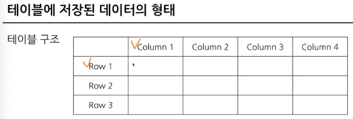
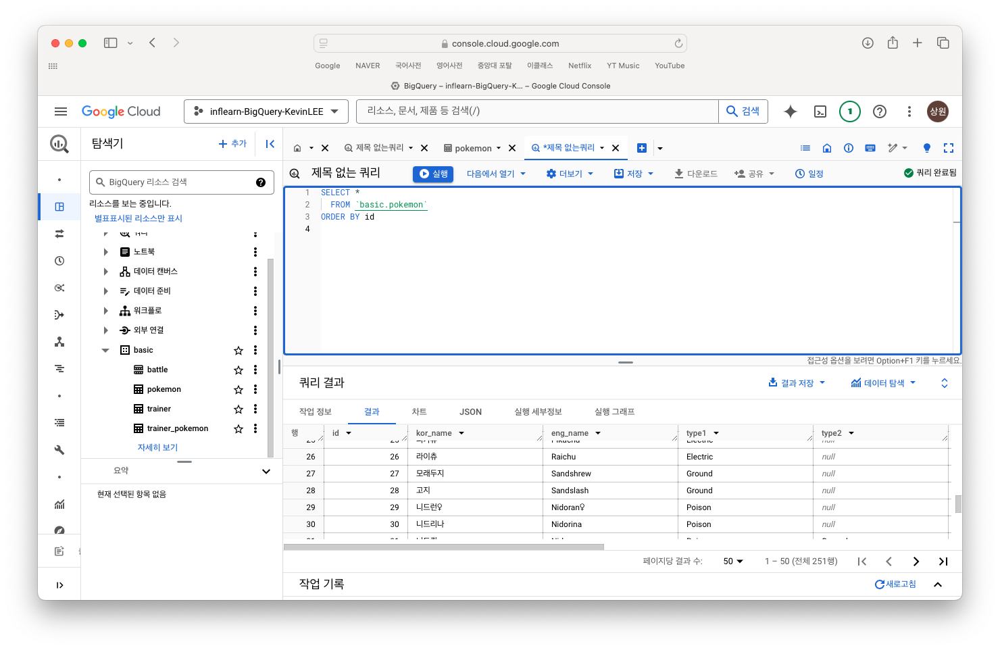

# Big Query 기초지식
데이터는 데이터베이스(DB)의 테이블에 저장됨.  
이 테이블에 저장된 데이터를 사용해서 분석함  

데이터가 저장 되는 장소 = MySQL, Oracle, PostgreSQL  
얘네의 특징은 거래를 하기 위해 사용되는 데이터베이스 (OLTP, Online Transaction Processing)  
이 친구들의 분석을 위해 만든 데이터베이스가 아니기 때문에 분석 시 쿼리 처리 속도가 느려질 수 있음  

SQL : 데이터베이스에서 데이터를 가지고 올 때 사용하는 언어.  

- Row -> 데이터 한 개, 가로로 한 줄  
- Column -> 데이터의 특정 속성값, 세로  

-> 엑셀, 스프레드시트와 유사함

다시 `OLTP` -> 데이터분석 속도, 기능이 부족함  
이러한 이슈를 해결하기 위해 `OLAP` 등장  
OLAP : Online Analytical Processing. 분석을 위한 기능 제공

### 따라서 Big Query란, Google Cloud의 OLAP + Data Warehouse를 의미.
"Google Cloud의 데이터 웨어하우스"
- 장점
    - SQL를 사용해 쉽게 데이터 추출 가능
    - 속도가 빠름(유료)
    - Firebase, Google Analytics4의 데이터를 쉽게 추출할 수 있음
    - 데이터 웨어하우스를 사용하기에 서버를 띄울 필요 없음
- 사용하는 이유
    - 적은 비용으로 운영하기 위해
    - 쏘카, 당근, 컬리, 마이리얼트립 등 많은 기업들에서 사용
- 비용 (US기준)
    - 쿼리비용 = 1TB당 $6 정도
    - 저장비용 = 1GB당 $0.02/월 정도  

# Big Query 환경설정
### 빅쿼리 환경구성요소
1. 프로젝트
    - 하나의 큰 건물.
    - 하나의 프로젝트에 여러 데이터셋 존재 가능
2. 데이터셋
    - 건물 속의 창고 공간.
    - 판매 데이터, 고객 데이터 등 별도 데이터를 저장할 수 있음
3. 테이블
    - 창고에 있는 선반.
    - 행과 열로 이뤄진 테이블에 데이터 저장

# 데이터 탐색

