# 2-3 데이터 탐색 - 조건과 추출
- 데이터셋 &rarr; 포켓몬 데이터셋  

### SQL 쿼리문 기본 구조
```sql
SELECT
    Col1 as new_name, /*어떤 칼럼을 추출할 것인가?*/
    Col2,
    Col3
  FROM Dataset.Table /*어떤 테이블에서 데이터를 확인?*/
 WHERE /*원하는 조건이 있다면 어떤 조건?*/
    Col1 = 1
```

`*` : "모든 칼럼을 추출하겠다"는 의미  
`* EXCEPT(제외할 칼럼)` &rarr; 이런 형태로도 가능

### 집합처럼 생각해보기
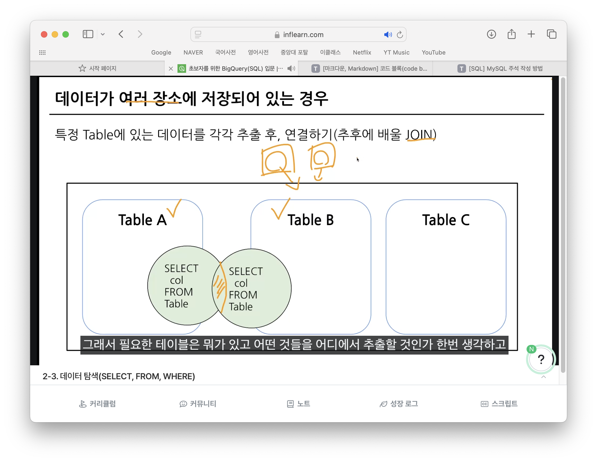

### 기본 쿼리문법 실습
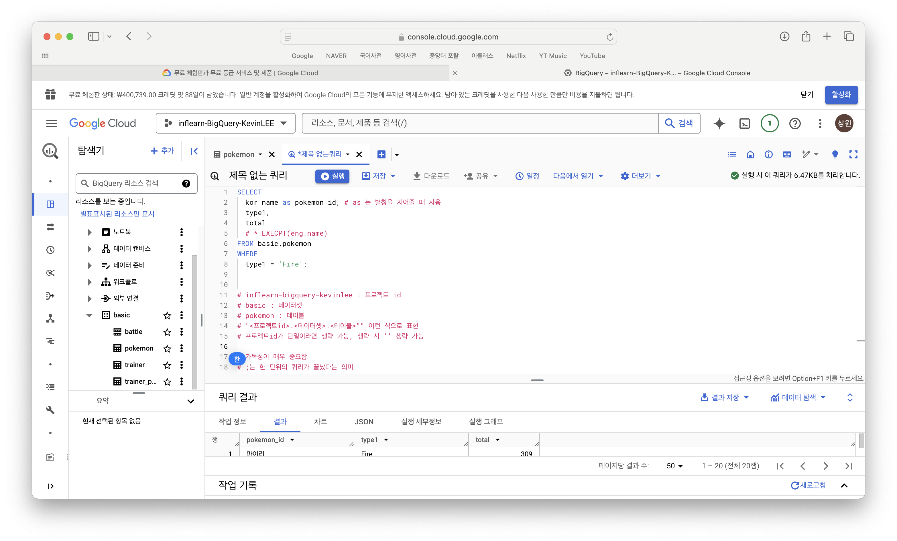

### SQL 문법 핵심정리
- FROM
    - 데이터를 확인할 시 Table 명시
    - 이름이 너무 길거나 필요 시, as로 "별칭" 지정 가능
    - FROM Table1 as T1
- WHERE
    - FROM에 명시된 Table에 저장된 데이터를 필터링(조건 설정)
    - Table에 있는 칼럼을 조건 설정
- SELECT
    - Table에 저장되어 있는 칼럼 선택
    - 여러 칼럼 선택 가능
    - col1 as "별칭"으로 칼럼의 이름도 별칭 지정 가능

### 실행순서 : SELECT &rarr; FROM &rarr; WHERE  
<br>
<br>


# 2-4 연습문제
#### 1. trainer 테이블에 있는 모든 데이터를 보여주는 쿼리
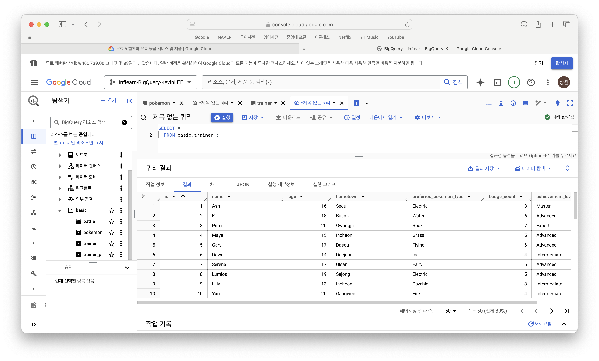

#### 2. trainer 테이블에 있는 트레이너의 name을 출력하는 쿼리
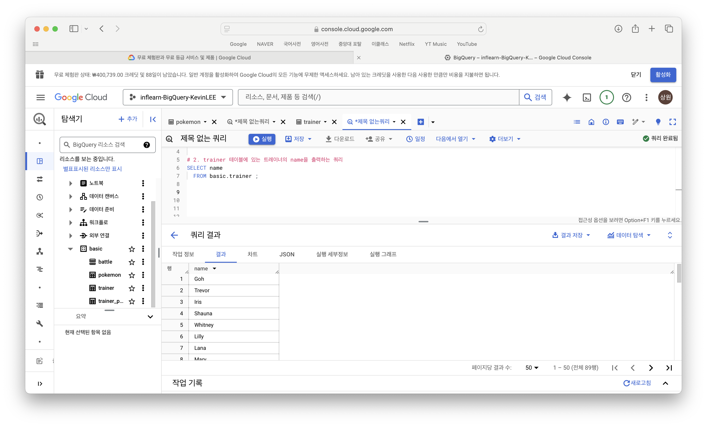

#### 3. trainer 테이블에 있는 트레이너의 name, age를 출력하는 쿼리
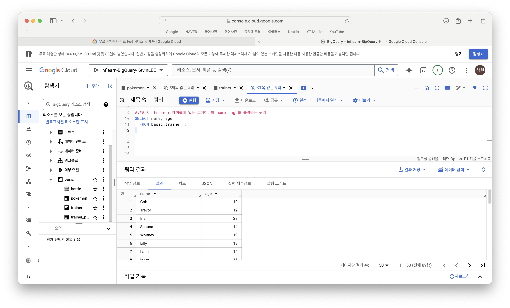

#### 4. trainer 테이블에서 id가 3인 트레이너의 name, age, hometown을 출력하는 쿼리
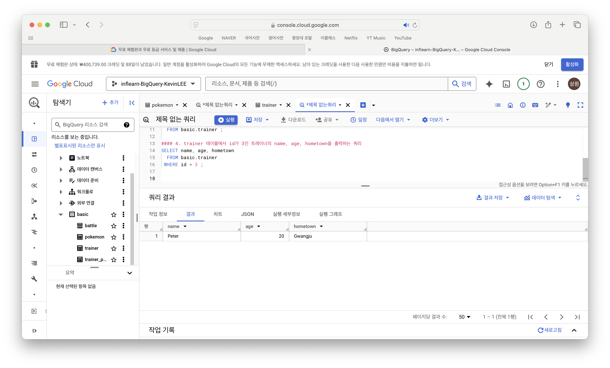

#### 5. pokemon 테이블에서 "피카츄"의 공격력과 체력을 알 수 있는 쿼리
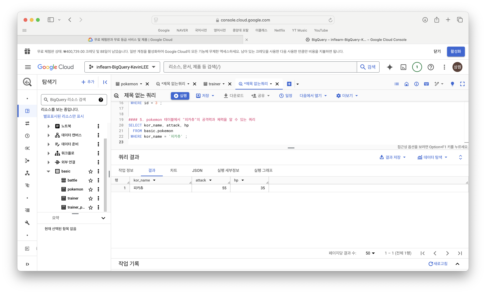

<br>
<br>

# 2-5 데이터 탐색 : 요약 (집계, 그룹화)
- COUNT, DISTINCT, GROUP BY  
<br>

### GROUP BY : 같은 값끼리 모아서 그룹화한다.
- 특정 칼럼을 기준으로 모으면서 다른 칼럼에선 집계 가능(mean, avg, max, min 등)

#### SQL로 표현해보기
```sql
SELECT
    집계할_칼럼1,
    집계함수(COUNT, MAX, MIN 등)
FROM Table
GROUP BY
    집계할_칼럼1
```

- 집계할 칼럼을 SELECT에 명시하고,
- 그 칼럼을 꼭 GROUP BY에 작성


### DISTINCT : 고유값을 알고 싶은 경우
- 여러 값 중에 Unique한 것만 보고싶은 경우 사용
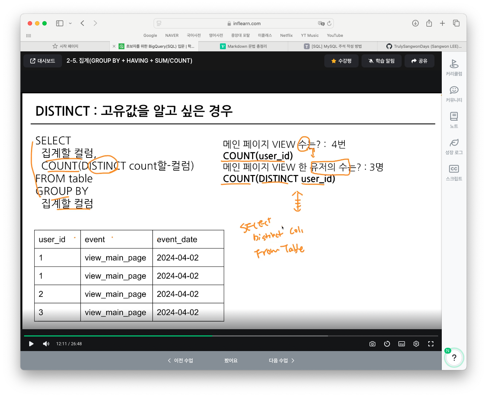

<br>

# GROUP BY 연습문제
#### 1. pokemon 테이블에 있는 포켓몬 수를 구하는 쿼리
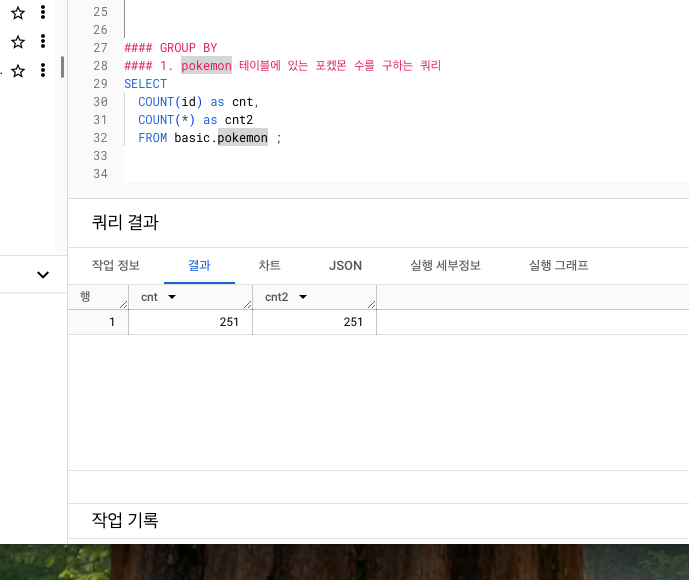

#### 2. 포켓몬의 수가 세대별로 얼마나 있는지 알 수 있는 쿼리
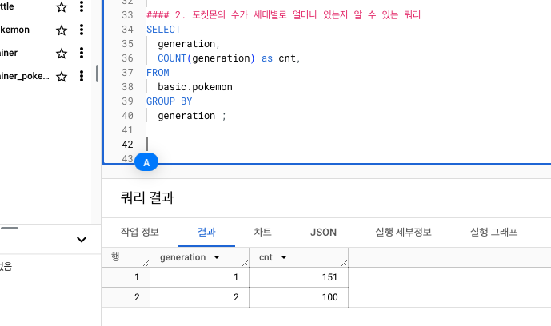

#### 3. 포켓몬의 수를 타입별로 집계하고, 포켓몬의 수가 10 이상인 타입만 남기는 쿼리 작성. 포켓몬의 수가 많은 순으로 정렬
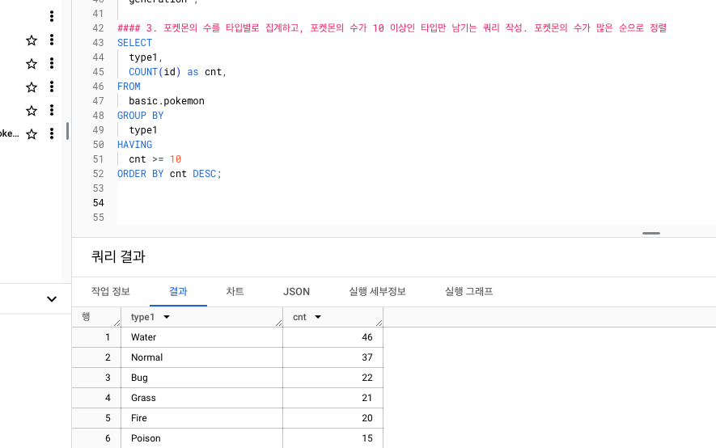


<br>

- 그룹화(집계) 활용 포인트
    - 일자별 집계 -> 원본데이터는 특정시간에 어떤 유저가 한 행동이 기록
    - 연령대별 집계 -> 특정 연령대에서 더 많이 구매했는가?
    - 특정 타입별 집계 -> 특정 제품 타입을 많이 구매했는가?
    - 앱 화면별 집계 -> 어떤 화면에 유저가 많이 접근했는가?

### 조건을 설정하고 싶은 경우
1. WHERE : Table에 바로 조건을 설정하고 싶은 경우
2. HAVING : GROUP BY한 후 조건을 설정하고 싶은 경우


# ORDER BY : 정렬하기
- 쿼리의 맨 마지막(아럐)에 두고,
- 쿼리의 맨 마지막에만 작성하면 됨(중간에 필요없음)
- 오름차순이 디폴트값

# LIMIT : 출력 개수 제한
- 쿼리문의 결과 row수를 제한하고 싶은 경우 사용

```sql
SELECT
    col
FROM Table
 LIMIT 10
```

