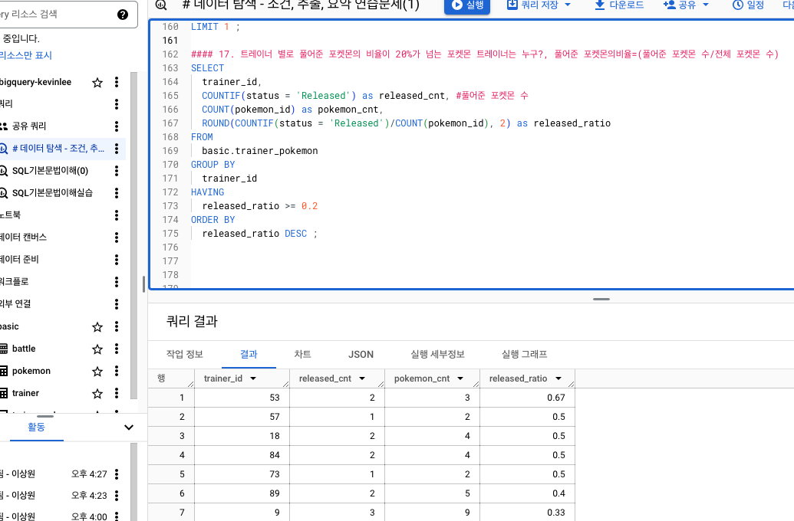

# 데이터 탐색 - 조건, 추출, 요약 연습문제(1)
#### 1. 포켓몬 중에 type2가 없는 포켓몬 수를 알 수 있는 쿼리
- ~가 없다 : `칼럼 IS NULL`
    - NULL은 =연산자를 안 씀 -> IS 연산자를 씀


#### 2. type2가 없는 포켓몬의 type1과 type1의 포켓몬 수를 알려주는 쿼리. 단, type1이 포켓몬 수가 큰 순으로 정렬


#### 3. type2에 상관없이 type1의 포켓몬 수를 알 수 있는 쿼리


#### 4. 전설 여부에 따른 포켓몬 수를 알 수 있는 쿼리
- GROUP BY 1 : SELECT의 첫 칼럼을 의미!


#### 5. 동명이인이 있는 이름은 무엇일까?
- 서브쿼리를 사용하면 HAVING을 사용하지 않고 실행가능


#### 6. trainer 테이블에서 "Iris" 트레이너의 정보를 알 수 있는 쿼리


#### 7. trainer 테이블에서 "Iris", "Whitney", "Cynthia" 트레이너의 정보를 알 수 있는 쿼리

```sql
WHERE
  name in ("Iris", "Whitney", "Cynthia")
```
```sql
WHERE
  (name = "Iris")
  OR (name = "Whitney")
  OR (name = "Cynthia")
```


#### 8. 전체 포켓몬 수는 얼마나 되나?


#### 9. 세대(generation) 별로 포켓몬 수가 얼마나 되는지 알 수 있는 쿼리


#### 10. type2가 존재하는 포켓몬 수?


#### 11. type2가 있는 포켓몬 중에 제일 많은 type1은 무엇인가?


#### 12. 단일(하나의 타입만 있는) 타입 포켓몬 중 많은 type1은 무엇인가?


#### 13. 포켓몬 이름에 "파"가 들어가는 포켓몬은?
- `칼럼 LIKE "파%"` : "파"로 시작하는 단어
- `칼럼 LIKE "%파"` : "파"로 끝나는 단어
- `칼럼 LIKE "%파%"` : "파"가 들어간 단어


#### 14. 뱃지가 6개 이상인 트레이너는 몇 명이 있나요?


#### 15. 트레이너가 보유한 포켓몬(trainer_pokemon)이 제일 많은 트레이너는 누구?


#### 16. 포켓몬을 많이 풀어준 트레이너는 누구?


#### 17. 트레이너 별로 풀어준 포켓몬의 비율이 20%가 넘는 포켓몬 트레이너는 누구?, 풀어준 포켓몬의비율=(풀어준 포켓몬 수/전체 포켓몬 수)
- COUNTIF(조건)


<br> <br>

# 데이터 탐색 - 조건/추출/요약 `정리`


<br>

# 2-8. 새로운 집계함수 (GROUP BY ALL)

<br> <br> <br>

# 3-1 Intro : SQL 쿼리 잘 작성하기
,,,

<br>

# 3-2. SQL 쿼리 작성하는 흐름


<br>

# 3-3. 쿼리 작성 템플릿과 생산성 도구


