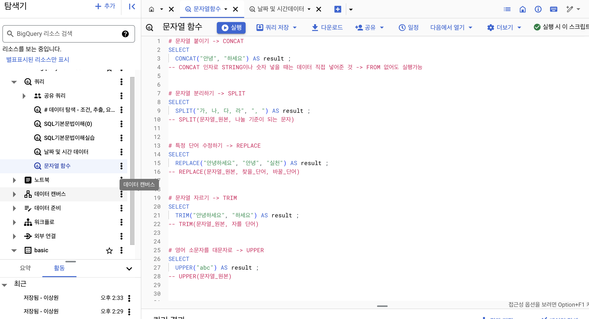
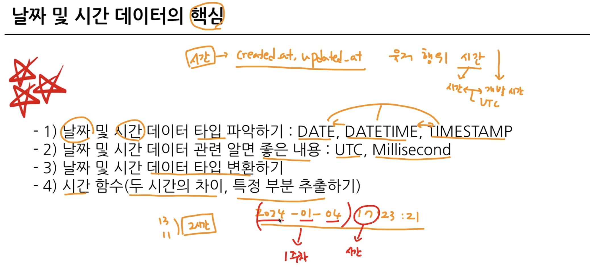
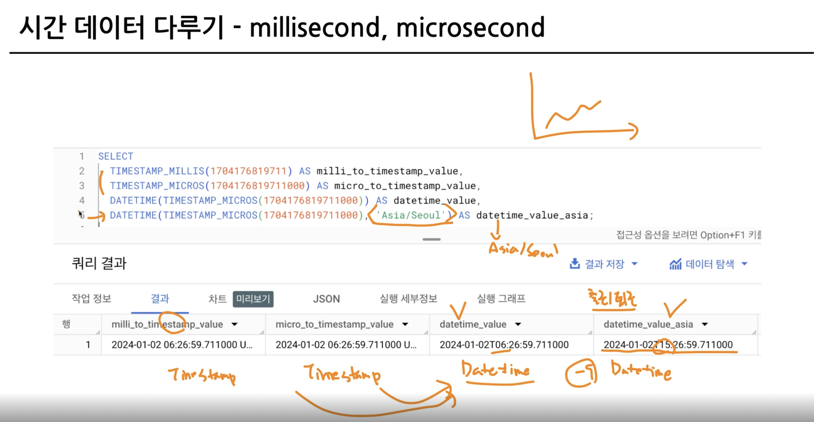

# 3-4 오류를 디버깅 하는 방법
### 대표적인 오류 카테고리 : Syntax Error (문법 오류)
- 문법 지키지 않아서 발생
- 에러 메시지 확인 후 -> 구글링, ChatGPT, 지인 등

 <br>

[8:1] : "8번째 줄 1번째칸"을 의미하고 그 주위에서 에러가 발생했다

# 4-1 Intro 데이터탐색 - `변환`
- 테이터 탐색 : `변환`
- 자료형에 따른 여러 함수
- 조건문 함수
- BigQuery 공식 문서 확인법

# 4-2 데이터 변환
### 데이터 타입
- 숫자 : 1, 2, 3.14 ..
- 문자 : "나", "데이터" ..
- 시간, 날짜 : 2024-01-01, 2024-01-01 23:59:10 ..
- Bool : 참/거짓
- array, json 등 기타..

### 데이터 타입이 중요한 이유
- 보이는 것과 저장된 것의 차이가 존재
- 숫자가 문자열 타입일 수도 있음
- 자료 타입 변경 함수 : CAST

```sql
SELECT
    CAST(1 AS STRING) #숫자 1을 문자 1롤 변경하겠다
```
```sql
SELECT
    CAST("이상원" AS INT64) #문자열을 숫자로 변경 불가능이기에 오류발생

SELECT
    SAFE_CAST("이상원" AS INT64) #변환 실패할 경우 NULL 반환
```

- 수학 함수 (평균, 표준편차, 코사인 등)


# 4-3 문자열 함수


```sql
# 1. 문자열 붙이기 -> CONCAT
SELECT
  CONCAT("안녕", "하세요") AS result ;
-- CONCAT 인자로 STRING이나 숫자 넣을 때는 데이터 직접 넣어준 것 -> FROM 없어도 실행가능
```

```sql
# 2. 문자열 분리하기 -> SPLIT
SELECT
  SPLIT("가, 나, 다, 라", ", ") AS result ;
-- SPLIT(문자열_원본, 나눌 기준이 되는 문자)
```

```sql
# 3. 특정 단어 수정하기 -> REPLACE
SELECT
  REPLACE("안녕하세요", "안녕", "실천") AS result ;
-- REPLACE(문자열_원본, 찾을_단어, 바꿀_단어)
```

```sql
# 4. 문자열 자르기 -> TRIM
SELECT
  TRIM("안녕하세요", "하세요") AS result ;
-- TRIM(문자열_원본, 자를 단어)
```

```sql
# 5. 영어 소문자를 대문자로 -> UPPER
SELECT
  UPPER("abc") AS result ;
-- UPPER(문자열_원본)
```




<br> <br>

# 날짜 및 시간 데이터 이해하기


### 시간 데이터 다루기
- DATE : DATE만 표시하는 데이터 ex) 2023-12-31
- DATETIME : DATE와 TIME까지 표시하는 데이터 ex) 2023-12-31 14:00:00
- TIME : 날짜와 무관하게 시간만 표시하는 데이터 ex) 23:59:59.00

  ### `타임존`
  - GMT : Greenwich Mean Time (한국시간: GMT+9)
  - UTC : Universal Time Coordinated (한국시간: UTC+9)

- millisecond(ms)
  - 시간 단위 : 1/1000초 (1000ms = 1초)
  - 눈을 깜빡이는 시간 : 약 100ms
- microsecond(us)
  - 1/1000ms or 1/1,000,000초

<br>


- 많은 회사에서 Table에 시간을 TIMESTAMP로 저장하는 경우 많음(혹은 DATETIME)
- 따라서, TIMESTAMP <-> DATETIME 변환을 해야할 수 있음


