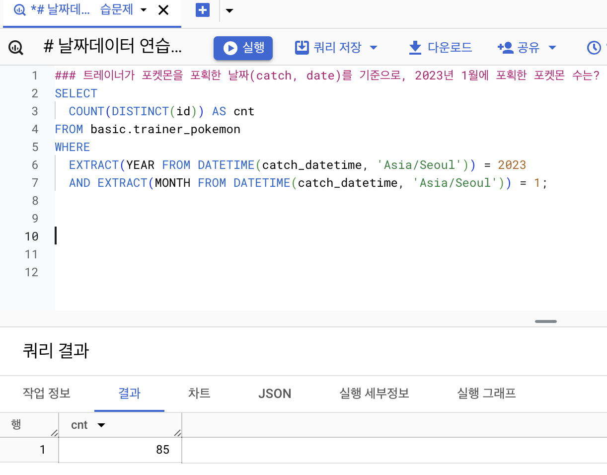
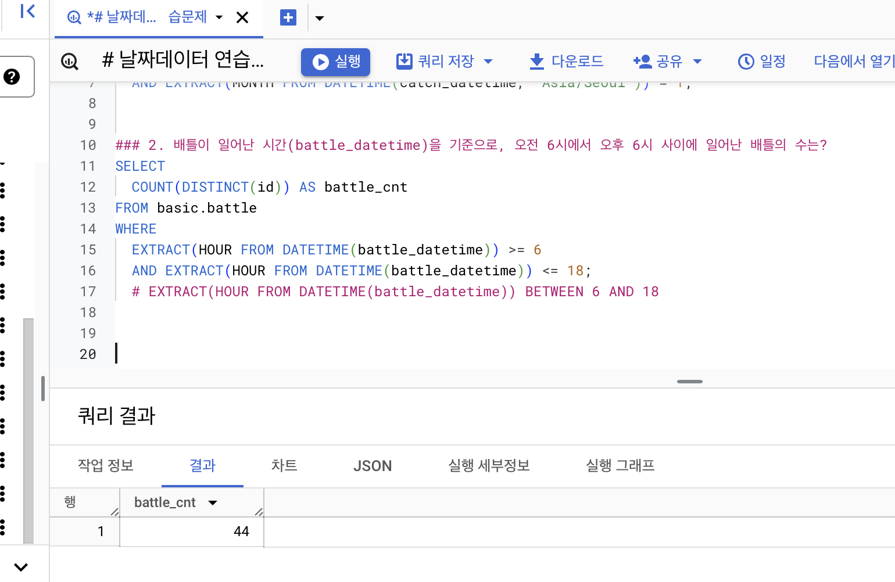
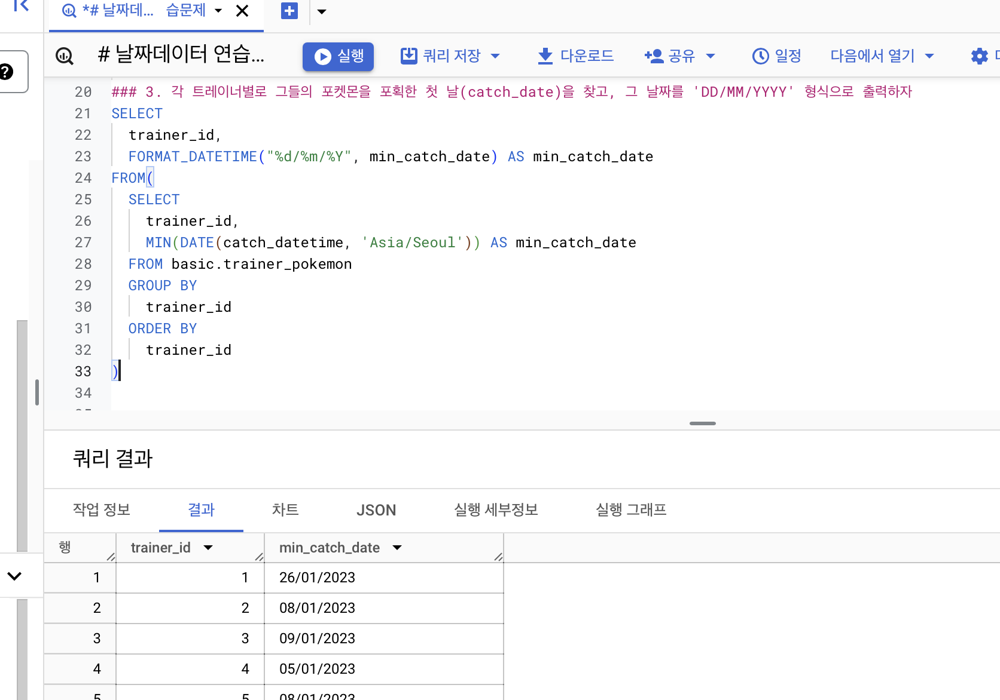
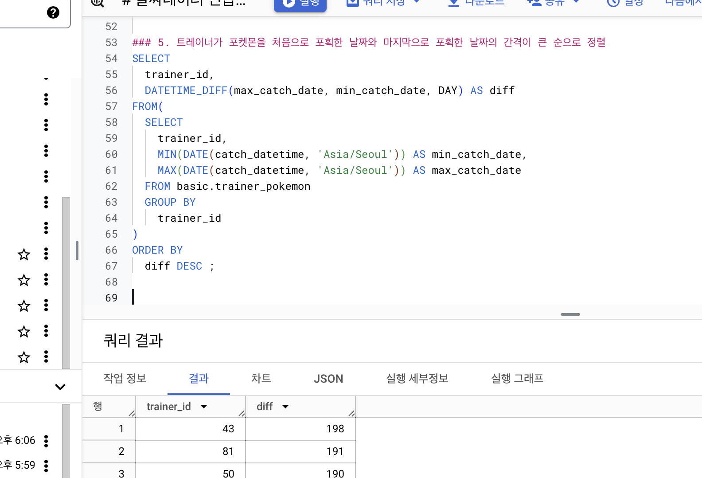

# 4-4 DATETIME 함수 (2)

<br>

### EXTRACT
: 시간의 특정 부분만 추출하고 싶은 경우
```sql
SELECT
    EXTRACT(DATE FROM DATETIME "2024-01-02 14:00:00") AS date,
    EXTRACT(DATE FROM DATETIME "2024-01-02 14:00:00") AS year,
    EXTRACT(DATE FROM DATETIME "2024-01-02 14:00:00") AS month,
    EXTRACT(DATE FROM DATETIME "2024-01-02 14:00:00") AS day,
    EXTRACT(DATE FROM DATETIME "2024-01-02 14:00:00") AS hour,
    EXTRACT(DATE FROM DATETIME "2024-01-02 14:00:00") AS minute ;
```


<br>

### 요일도 가능 DAYOFWEEL
```sql
SELECT EXTRACT(DAYOFWEEK FROM datetime_col) ;
```
&rarr; 한 주의 첫날이 일요일인 [1,7] 범위의 값 반환


<br>

### DATETIME_TRUNC
```sql
SELECT
    DATETIME "2024-01-02 14:00:00" AS original_data,
    DATETIME_TRUNC(DATETIME "2024-01-02 14:00:00", DAY) AS day_trunc,
    DATETIME_TRUNC(DATETIME "2024-01-02 14:00:00", YEAR) AS year_trunc,
    DATETIME_TRUNC(DATETIME "2024-01-02 14:00:00", MONTH) AS month_trunc,
    DATETIME_TRUNC(DATETIME "2024-01-02 14:00:00", HOUR) AS hour_trunc ;
```


<br>

### PARSE_DATETIME
: 문자열 DATETIME &rarr; DATETIME 타입으로 변환

```sql
PARSE_DATETIME('문자열 형태', 'DATETIME 문자열') AS datetime

PARSE_DATETIME('%Y-%m-%d %H:%M:%S', '2024-01-11 12:30:45') AS datetime
```
- 파싱이란, string을 분석해서 변환해주는 과정...
- Format Elements 문서!!


<br>

### FORMAT_DATETIME
: DATETIME 타입 &rarr; 문자열 데이터로 변환

```sql
SELECT
    FORMAT_DATETIME("%c", DATETIME "2024-01-11  12:35:35") AS formatted ;
```


<br>

### LAST_DAY
: 마지막 날을 알고 싶은 경우

```sql
SELECT
    LAST_DAY(DATETIME '2024-01-03 14:34:00') AS last_day,
    LAST_DAY(DATETIME '2024-01-03 14:34:00', MONTH) AS last_day_month,
    LAST_DAY(DATETIME '2024-01-03 14:34:00', WEEK) AS last_day_week,
    LAST_DAY(DATETIME '2024-01-03 14:34:00', WEEK(SUNDAY)) AS last_day_sun ;
```


<br>

### DATETIME_DIFF
: 두 DATETIME의 차이를 알고 싶은 경우
```sql
SELECT
    DATETIME_DIFF(first_datetime, second_datetime, DAY) AS day_diff
FROM (
    SELECT
        DATETIME "2024-04-02 10:20:00" AS first_datetime,
        DATETIME "2021-01-01 15:00:00" AS second_datetime
) ;
```


<br><br><br>


# 4-5 시간 데이터 연습분제
### 1. 트레이너가 포켓몬을 포획한 날짜(catch, date)를 기준으로, 2023년 1월에 포획한 포켓몬 수는?



### 2. 배틀이 일어난 시간(battle_datetime)을 기준으로, 오전 6시에서 오후 6시 사이에 일어난 배틀의 수는?



### 3. 각 트레이너별로 그들의 포켓몬을 포획한 첫 날(catch_date)을 찾고, 그 날짜를 'DD/MM/YYYY' 형식으로 출력하자.



### 4. 배틀이 일어난 날짜(battle_datetime)를 기준으로, 요일별로 배틀이 얼마나 자주 일어나는지 비교하라.


### 5. 트레이너가 포켓몬을 처음으로 포획한 날짜와 마지막으로 포획한 날짜의 간격이 큰 순으로 정렬



