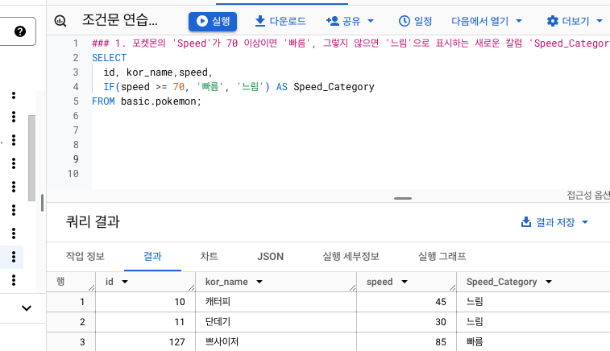

# 4-4 DATETIME 함수 (2)

<br>

### EXTRACT
: 시간의 특정 부분만 추출하고 싶은 경우
```sql
SELECT
    EXTRACT(DATE FROM DATETIME "2024-01-02 14:00:00") AS date,
    EXTRACT(DATE FROM DATETIME "2024-01-02 14:00:00") AS year,
    EXTRACT(DATE FROM DATETIME "2024-01-02 14:00:00") AS month,
    EXTRACT(DATE FROM DATETIME "2024-01-02 14:00:00") AS day,
    EXTRACT(DATE FROM DATETIME "2024-01-02 14:00:00") AS hour,
    EXTRACT(DATE FROM DATETIME "2024-01-02 14:00:00") AS minute ;
```


<br>

### 요일도 가능 DAYOFWEEL
```sql
SELECT EXTRACT(DAYOFWEEK FROM datetime_col) ;
```
&rarr; 한 주의 첫날이 일요일인 [1,7] 범위의 값 반환


<br>

### DATETIME_TRUNC
```sql
SELECT
    DATETIME "2024-01-02 14:00:00" AS original_data,
    DATETIME_TRUNC(DATETIME "2024-01-02 14:00:00", DAY) AS day_trunc,
    DATETIME_TRUNC(DATETIME "2024-01-02 14:00:00", YEAR) AS year_trunc,
    DATETIME_TRUNC(DATETIME "2024-01-02 14:00:00", MONTH) AS month_trunc,
    DATETIME_TRUNC(DATETIME "2024-01-02 14:00:00", HOUR) AS hour_trunc ;
```


<br>

### PARSE_DATETIME
: 문자열 DATETIME &rarr; DATETIME 타입으로 변환

```sql
PARSE_DATETIME('문자열 형태', 'DATETIME 문자열') AS datetime

PARSE_DATETIME('%Y-%m-%d %H:%M:%S', '2024-01-11 12:30:45') AS datetime
```
- 파싱이란, string을 분석해서 변환해주는 과정...
- Format Elements 문서!!


<br>

### FORMAT_DATETIME
: DATETIME 타입 &rarr; 문자열 데이터로 변환

```sql
SELECT
    FORMAT_DATETIME("%c", DATETIME "2024-01-11  12:35:35") AS formatted ;
```


<br>

### LAST_DAY
: 마지막 날을 알고 싶은 경우

```sql
SELECT
    LAST_DAY(DATETIME '2024-01-03 14:34:00') AS last_day,
    LAST_DAY(DATETIME '2024-01-03 14:34:00', MONTH) AS last_day_month,
    LAST_DAY(DATETIME '2024-01-03 14:34:00', WEEK) AS last_day_week,
    LAST_DAY(DATETIME '2024-01-03 14:34:00', WEEK(SUNDAY)) AS last_day_sun ;
```


<br>

### DATETIME_DIFF
: 두 DATETIME의 차이를 알고 싶은 경우
```sql
SELECT
    DATETIME_DIFF(first_datetime, second_datetime, DAY) AS day_diff
FROM (
    SELECT
        DATETIME "2024-04-02 10:20:00" AS first_datetime,
        DATETIME "2021-01-01 15:00:00" AS second_datetime
) ;
```


<br><br><br>


# 4-5 시간 데이터 연습분제
### 1. 트레이너가 포켓몬을 포획한 날짜(catch, date)를 기준으로, 2023년 1월에 포획한 포켓몬 수는?


### 2. 배틀이 일어난 시간(battle_datetime)을 기준으로, 오전 6시에서 오후 6시 사이에 일어난 배틀의 수는?


### 3. 각 트레이너별로 그들의 포켓몬을 포획한 첫 날(catch_date)을 찾고, 그 날짜를 'DD/MM/YYYY' 형식으로 출력하자.


### 4. 배틀이 일어난 날짜(battle_datetime)를 기준으로, 요일별로 배틀이 얼마나 자주 일어나는지 비교하라.


### 5. 트레이너가 포켓몬을 처음으로 포획한 날짜와 마지막으로 포획한 날짜의 간격이 큰 순으로 정렬


<br><br><br>


# 4-6 조건문 함수 CASE WHEN, IF
- 특정 조건이 충족되면, 어떤 행동을 하자
- 조건에 따라 다른 값을 표시하고 싶을 때 사용

### 조건문 사용하는 이유
- 특정 카테고리를 하나로 합치는 전처리가 필요할 수 있음
- 데이터를 처리하는 방식이 다른데, 특정 카테고리를 합쳐서 보고싶거나, 쪼개서 보고싶을 때 조건문을 상요함

### CASE WHEN
```sql
SELECT
  CASE
    WHEN 조건1 THEN 조건1이 참일 경우 결과
    WHEN 조건2 THEN 조건2가 참일 경우 결과
    ELSE 그 외 조건일 경우 결과
END AS 새로운_칼럼_이름
FROM 
```

### CASE WHEN `순서`
- 첫번째 조건에 걸리면 바로 다음으로 넘어김.
- 따라서, CASE WHEN의 순서에 따라 결과값이 달라짐


<br>

### IF
- 사용법은 엑셀과 유사함.

<br>

---
## IF는 단일조건일 경우 유용, CASE WHEN은 여러조건일 경우 유용


<br><br><br>


# 4-7 조건 문 함수 연습문제


### 1. 포켓몬의 'Speed'가 70 이상이면 '빠름', 그렇지 않으면 '느림'으로 표시하는 새로운 칼럼 'Speed_Category' 만들기



### 2. 포켓몬의 'type1'에 따라 'Water', 'Fire', 'Electric' 타입은 각각 '물', '불', '전기'로, 그 외 타입은 '기타'로 분류하는 새 칼럼 'type_Korean' 만들기


### 3. 각 포켓몬의 총점(total)을 기준으로, 300 이하면 'Low', 301에서 500 사이면 'Medium', 501 이상이면 'High'로 분류하기


### 4. 각 트레이너의 배지 개수(badge_count)를 기준으로, 5개 이하면 'Beginner', 6개에서 8개 사이면 'Intermediate', 그 이상이면' Advanced'로 분류하기


### 5. 트레이너가 포켓몬을 포획한 날짜(catch_date)가 '2023-01-01' 이후이면 'Recent', 그렇지 않으면 'Old'로 분류하기


### 6. 배틀에서 승자(winner_id)가 player1_id와 같으면 'Plauer 1 Wins', player2_id와 같으면 'Plauer 2 Wins', 그렇지 않으면 'Draw'로 결과가 나오게 하기


<br><br><br>


# 4-8 정리
칼럼 변환하기 정리  
    - 데이터 타입 : 숫자, 문자, 시간/날짜, 부울Bool


<br><br><br>


# 4-9 BigQuery 공식문서 확인하는 법
- 개발 공식문서
    - 해당 기술을 어떻게 사용하면 좋을지에 대한 문서를 제공함
    - 익숙해지면 빠르게 파악할 수 있음
- 찾는 법
    - "기술명 + documentation"으로 검색
    - 예) 구글에  `BigQuery documentation`로 검색


