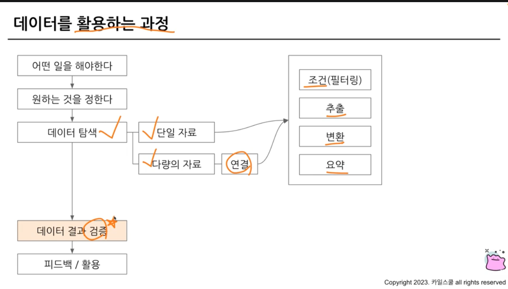

# 6-1 Intro 데이터 결과 검증
- 가독성 챙기기 위한 SQL 스타일 가이드
- 데이터 결과 검증

- 데이터 결과 검증 예시

# 6-2 가독성 채기기 위한 SQL 스타일 가이드
- 실수는 언제 발생하는가?
    - 문법을 잘못 아는 경우
    - 데이터를 파악하지 않고 쿼리 작성하는 경우
    - 쿼리가 복잡한 경우..
- 타인이 작성한 쿼리를 봐야하는 경우가 있음
    - 누구나 이해하기 쉽게 작성된 쿼리를 만드는 게 중요함ㅎ
### 예약어는 대문자로!!!
- SELECT, FROM, WHERE

### 칼럼 이름은 snake_case로 작성!
- 

