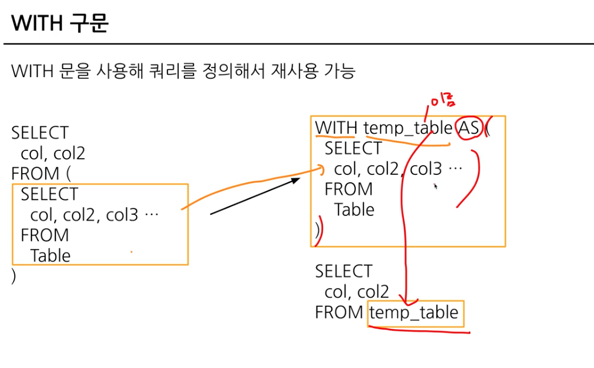
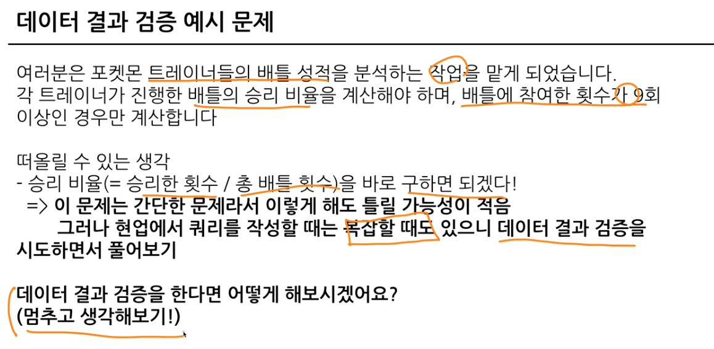

# 6-1 Intro 데이터 결과 검증
- 가독성 챙기기 위한 SQL 스타일 가이드
- 데이터 결과 검증

- 데이터 결과 검증 예시


<br>
<br>

# 6-2 가독성 채기기 위한 SQL 스타일 가이드
- 실수는 언제 발생하는가?
    - 문법을 잘못 아는 경우
    - 데이터를 파악하지 않고 쿼리 작성하는 경우
    - 쿼리가 복잡한 경우..
- 타인이 작성한 쿼리를 봐야하는 경우가 있음
    - 누구나 이해하기 쉽게 작성된 쿼리를 만드는 게 중요함ㅎ
### 예약어는 대문자로!!!
- SELECT, FROM, WHERE

### 칼럼 이름은 snake_case로 작성!
- CamelCase도 가능하지만
- 조직에 따라 "일관성"이 중요함

### 명시적 vs. 암시적인 이름
- Alias로 별칭 지을 때는 명시적 이름 사용!

### 예약어 왼쪽 정렬

### 예약어난 칼럼은 한 줄에 하나씩!!!

### 쉼표는 칼럼 바로 뒤어


<br>
<br>

# 6-3 WITH 구문
- SQL 쿼리 작성하다 생기는 일
    - 서브쿼리 반복적으로 복붙해서 써넣으니까 점점 쿼리가 복잡해짐

### 이를 방지하기 위해 WITH문 사용

- WITH 구문
```sql
WITH name_a AS (
    SELECT
        col
    FROM Table
), name_b AS (
    SELECT
        col2
    FROM Table2
)

SELECT
    col
FROM name_a
```
- 테이블 저장!도 가능 VEIW도 있음

### Table엔 PARTITION이라는 것도 있음
- 창고에 수많은 물건이 매일 많이 들어옴
- 특정 시기에 들어온 물건을 찾고 싶다면?
- 처음부터 일자별로 장리해두면 됨!
- 쿼리 성능 향상
- 데이터 관리 용이성
- 비용 효율


<br>
<br>

# 6-4 데이터 결과 검증 정의
- 데이터 결과 검증 실수는 할 수 있지만, 반복하지 않는 것이 중요함

### SQL 쿼리 결과가 예상과 일치하는 지 확인하는 과정
- 목적 : 분석 결과의 정확성, 신뢰성 확보
- 방법은 간단하다
    - 내가 기대하는 예상 결과를 정의 
    - 쿼리 작성
    - 두 개가 일치하는지 비교
- 문제를 잘 정의하자!
- 도메인 특수성 잘 파악하기

### 데이터 결과 검증하는 흐름
1. 문제 정의 확인 : 구체적인 문제 정의. 요청사항에도 구체적으로 확인
2. Input/Output : 데이터의 Input과 (원하는 형태의) Output 작성하기 > Input에서 Output으로 가는 중간과정도 생각하기
3. 쿼리 작성 : 가독성 있게
4. 결과 비교 : 예상과 실제 쿼리 결과의 차이가 있는지 확인

### 데이터 결과 검증 시, 자주 사용하는 SQL쿼리
- COUNT(*) : 행 수 확인. 의도한 데이터의 행 개수 맞는가?
- NOT NULL : 특정 칼럼에 NULL이 존재하는가? 필수 필드 비어있지 않은가?
- DISTINCT : 데이터의 고유값을 확인해 중복 여부 확인
- IF문, CASE WHEN : 의도와 같다면 TRUE, 아니면 FALSE

```sql 
SELECT COUNT(DISTINCT col), COUNT(col)
# 두 칼럼을 보고 개수를 비교
```


<br>
<br>

# 6-5 데이터 결과 검증 예시

1. 전체 데이터 파악
2. 특정 user_id 선정
3. 승률 직접 COUNT : 결과 예상
4. 쿼리 작성
5. 실제와 비교
6. 맞다면 특정 유저 조건 제외


<br>
<br>

# 6-6 정리


