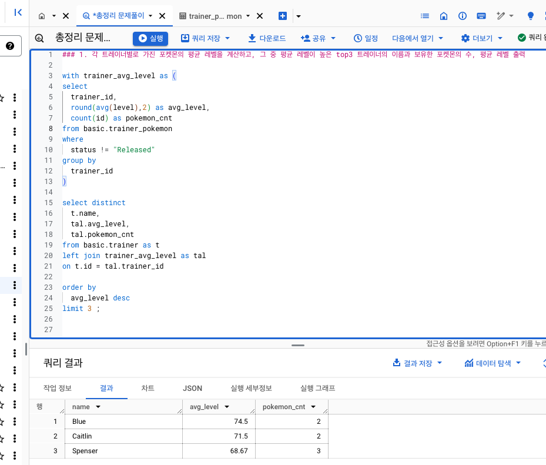
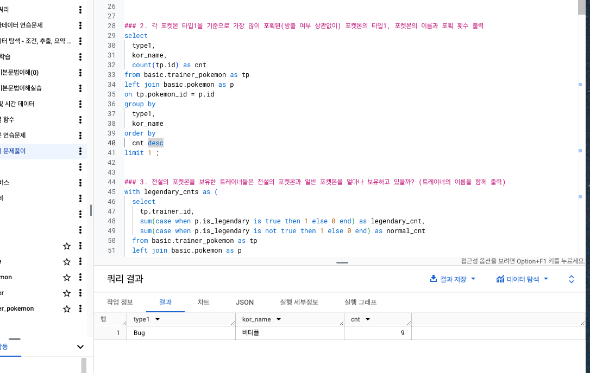
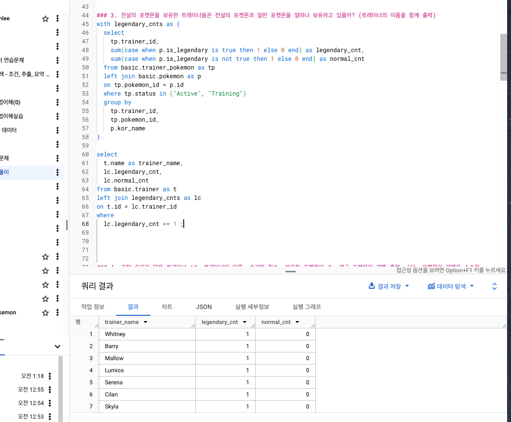
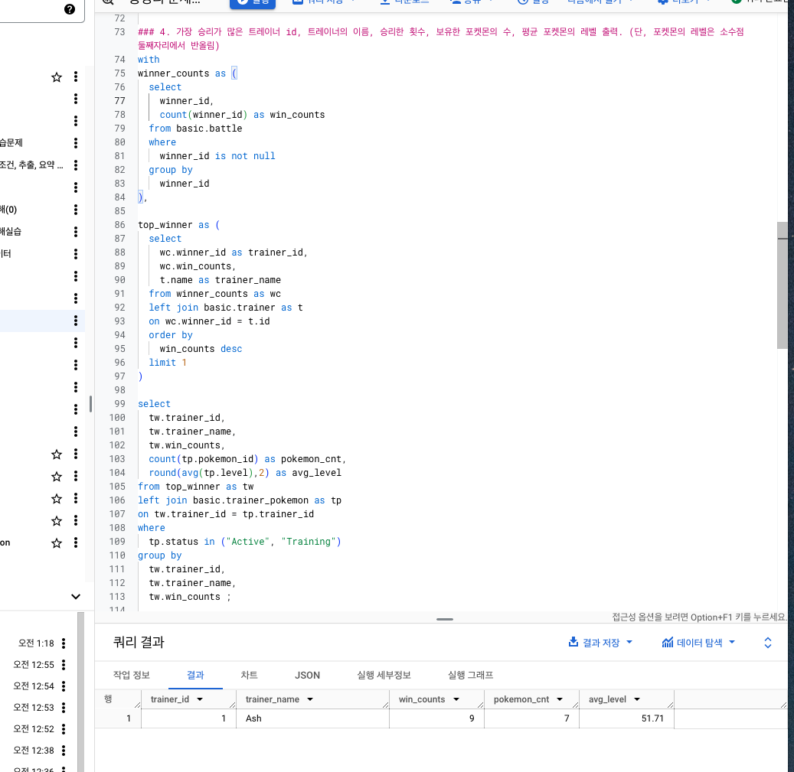
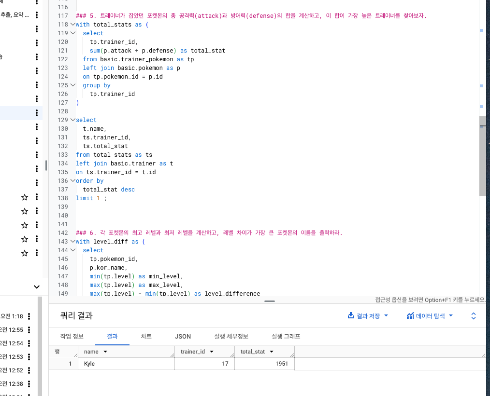
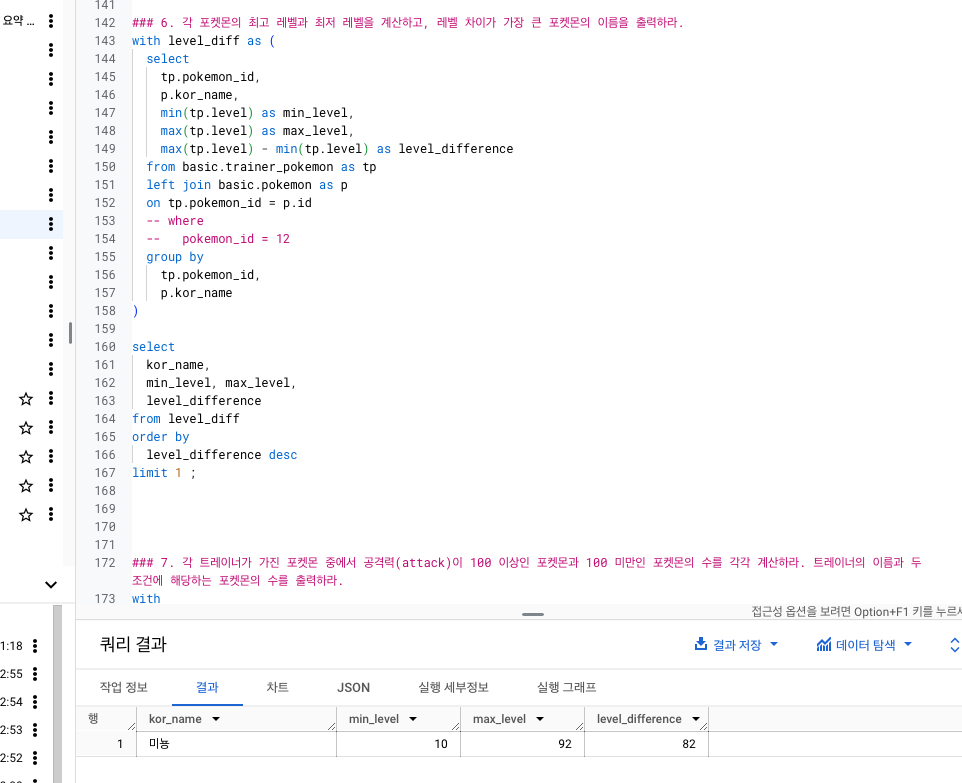
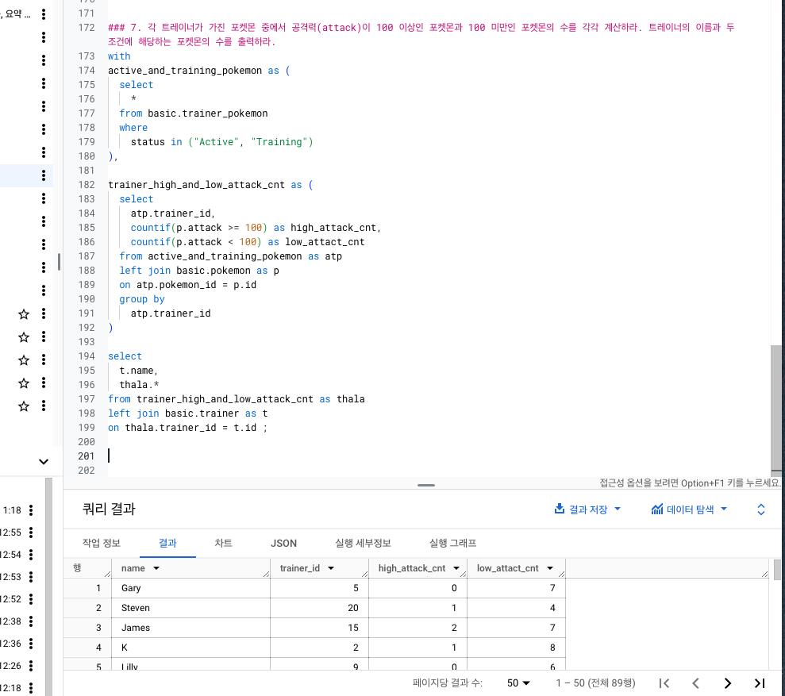
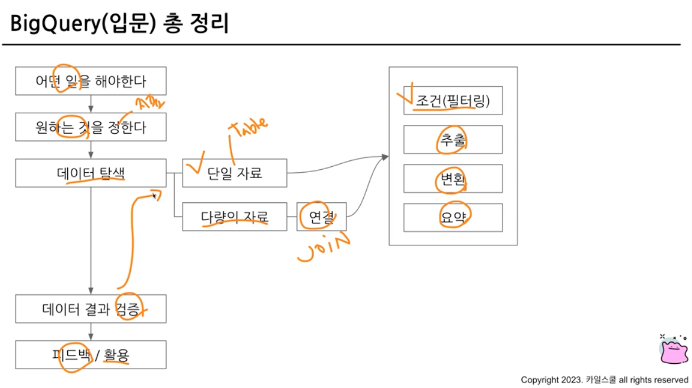

# 총정리 문제풀이

### 1. 각 트레이너별로 가진 포켓몬의 평균 레벨을 계산하고, 그 중 평균 레벨이 높은 top3 트레이너의 이름과 보유한 포켓몬의 수, 평균 레벨 출력



### 2. 각 포켓몬 타입1을 기준으로 가장 많이 포획된(방출 여부 상관없이) 포켓몬의 타입1, 포켓몬의 이름과 포획 횟수 출력



### 3. 전설의 포켓몬을 보유한 트레이너들은 전설의 포켓몬과 일반 포켓몬을 얼마나 보유하고 있을까? (트레이너의 이름을 함께 출력)



### 4. 가장 승리가 많은 트레이너 id, 트레이너의 이름, 승리한 횟수, 보유한 포켓몬의 수, 평균 포켓몬의 레벨 출력. (단, 포켓몬의 레벨은 소수점 둘째자리에서 반올림)



### 5. 트레이너가 잡았던 포켓몬의 총 공격력(attack)과 방어력(defense)의 합을 계산하고, 이 합이 가장 높은 트레이너를 찾아보자.



### 6. 각 포켓몬의 최고 레벨과 최저 레벨을 계산하고, 레벨 차이가 가장 큰 포켓몬의 이름을 출력하라.



### 7. 각 트레이너가 가진 포켓몬 중에서 공격력(attack)이 100 이상인 포켓몬과 100 미만인 포켓몬의 수를 각각 계산하라. 트레이너의 이름과 두 조건에 해당하는 포켓몬의 수를 출력하라.



# 강의 총정리
- 데이터 활용 과정
- 데이터 탐색 : 조건과 추출
- 데이터 탐색 : 요약과 집계
- SQL 쿼리 작성 흐름
    - 쿼리 작성 템플릿, 생산성 도구
    - 오류 디버깅하는 법
- 데이터 탐색 : 변환
    - 데이터 타입과 타입별 함수
    - BigQuery 공식 문서 확인하는 법
- 다양한 자료 연결 : `JOIN`
- 데이터 결과 검증
    - 가독성 챙기기 위한 SQL 스타일 가이드



<br>

### 쿼리 기본 구조
```sql
WITH CTE AS (
    SELECT
        col1,
        col2
    FROM Tabel
)

SELECT
    a.col3,
    b.col4,
    COUNT(DISTINCT a.id) AS cnt
FROM table_a AS a
LEFT JOIN table_b AS b
ON a.id = b.id
WHERE
    a.col3 >= 3
GROUP BY
    a.col3,
    b.col4
HAVING
    cnt >= 2
ORDER BY cnt DESC
LIMIT 10
```

### 데이터 타입
- 숫자
- 문자
- 시간, 날짜
- 부울(Bool)

### 쿼리 작성 템플릿
- 쿼리 작성 목표, 확인할 지표 :
- 쿼리 계산 방법 :
- 데이터의 기간 :
- 사용할 테이블 :
- JOIN Key :
- 데이터의 특징 :


<br>

---
# 끝 ㅎ.ㅎ
