# Third Study Week

- 20강: [파이와 도넛차트](#20강-파이와-도넛차트)

- 21강: [워드와 버블차트](#21강-워드와-버블차트)

- 22강: [이중축과 결합축](#22강-이중축과-결합축)

- 23강: [분산형 차트](#23강-분산형-차트)

- 24강: [히스토그램](#24강-히스토그램)

- 25강: [박스플롯](#25강-박스플롯)

- 26강: [영역차트](#26강-영역차트)

- 27강: [간트차트](#27강-간트차트)

- 28강: [필터](#28강-필터)

- 29강: [그룹](#29강-그룹)


- 문제1 : [문제1](#문제1)

- 문제2 : [문제2](#문제2)

- 참고자료 : [참고자료](#참고-자료)


## Study Schedule

| 강의 범위     | 강의 이수 여부 | 링크                                                                                                        |
|--------------|---------|-----------------------------------------------------------------------------------------------------------|
| 1~9강        |  ✅      | [링크](https://youtu.be/3ovkUe-TP1w?si=CRjj99Qm300unSWt)       |
| 10~19강      | ✅      | [링크](https://www.youtube.com/watch?v=AXkaUrJs-Ko&list=PL87tgIIryGsa5vdz6MsaOEF8PK-YqK3fz&index=75)       |
| 20~29강      | ✅      | [링크](https://www.youtube.com/watch?v=Qcl4l6p-gHM)      |
| 30~39강      | 🍽️      | [링크](https://www.youtube.com/watch?v=e6J0Ljd6h44&list=PL87tgIIryGsa5vdz6MsaOEF8PK-YqK3fz&index=55)       |
| 40~49강      | 🍽️      | [링크](https://www.youtube.com/watch?v=AXkaUrJs-Ko&list=PL87tgIIryGsa5vdz6MsaOEF8PK-YqK3fz&index=45)       |
| 50~59강      | 🍽️      | [링크](https://www.youtube.com/watch?v=AXkaUrJs-Ko&list=PL87tgIIryGsa5vdz6MsaOEF8PK-YqK3fz&index=35)       |
| 60~69강      | 🍽️      | [링크](https://www.youtube.com/watch?v=AXkaUrJs-Ko&list=PL87tgIIryGsa5vdz6MsaOEF8PK-YqK3fz&index=25)       |
| 70~79강      | 🍽️      | [링크](https://www.youtube.com/watch?v=AXkaUrJs-Ko&list=PL87tgIIryGsa5vdz6MsaOEF8PK-YqK3fz&index=15)       |
| 80~89강      | 🍽️      | [링크](https://www.youtube.com/watch?v=AXkaUrJs-Ko&list=PL87tgIIryGsa5vdz6MsaOEF8PK-YqK3fz&index=5)        |


<!-- 여기까진 그대로 둬 주세요-->
<!-- 이 안에 들어오는 텍스트는 주석입니다. -->

# Third Study Week


## 20강: 파이와 도넛차트
<!-- 파이와 도넛차트에 관해 배우게 된 점을 적어주세요 -->
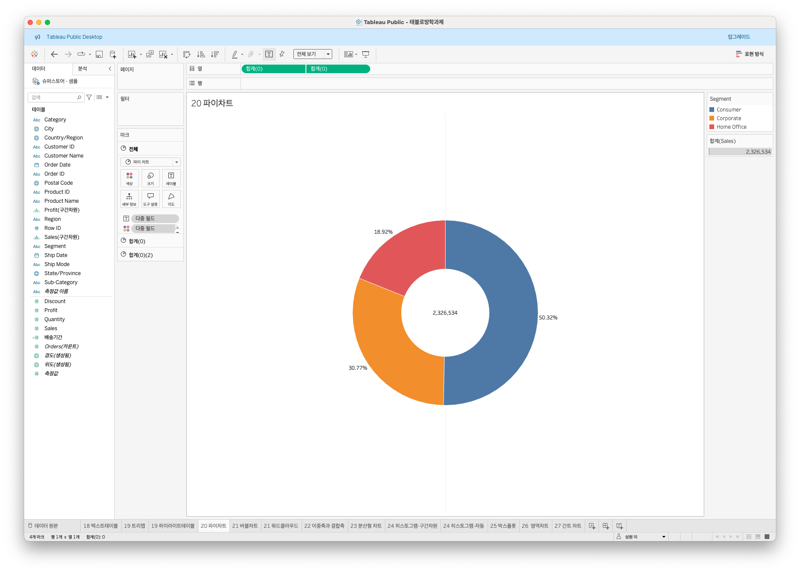

.png)
전체에 대한 비율을 표시할 때 사용함


> **🧞‍♀️ 도넛차트를 생성하는 법을 기록해주세요.**


## 21강: 워드와 버블차트
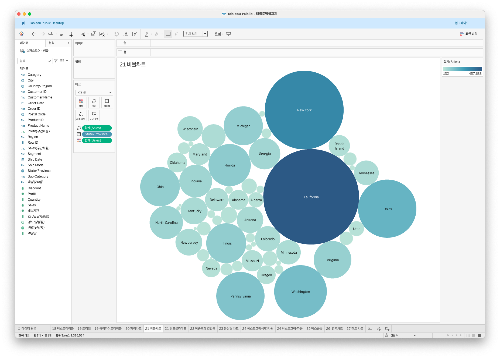
- 버블차트
    - 수치적 데이트 → 원의 크기로 표현하는 방법

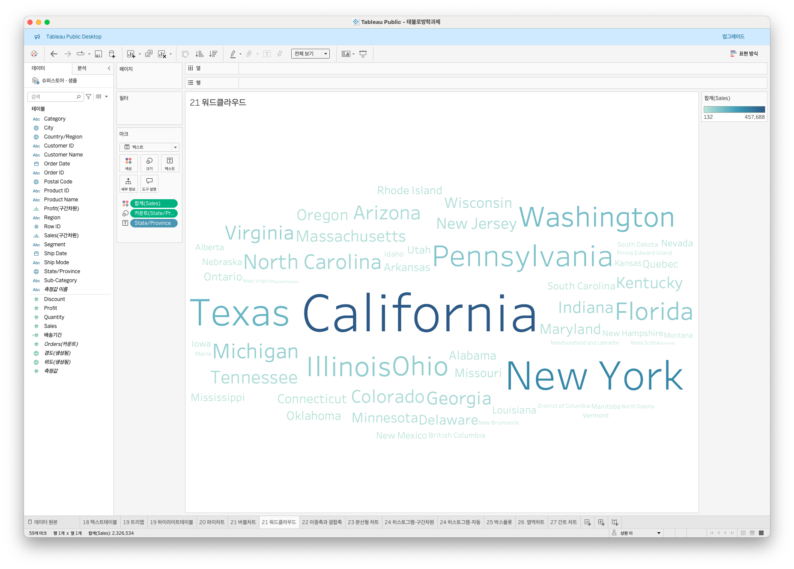
- 워드클라우드
    - 문서 내에서 등장하는 텍스트가 얼마나 자주 등장하는지를 측정


## 22강: 이중축과 결합축
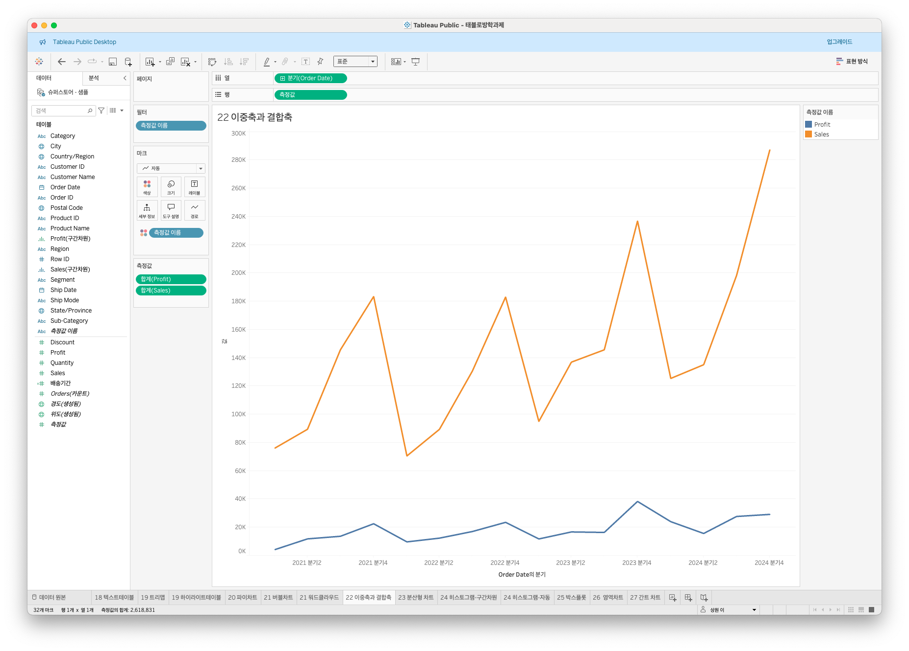
- 이중축 : 하나의 뷰 안에서 축을 이중으로 사용하는 것
- 결합축 : 하나의 축을 공유하는 차트


## 23강: 분산형 차트
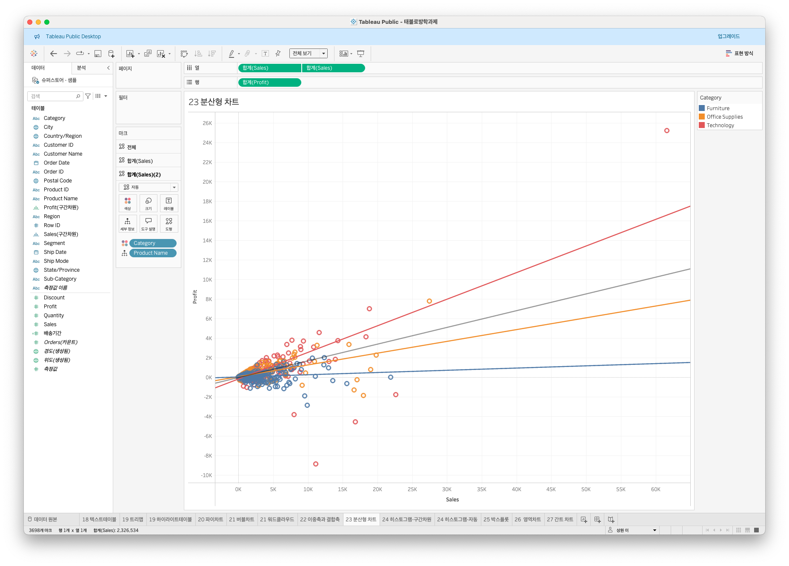
- 파라미터 간 상관관계를 파악하는 데에 유용한 그래프


## 24강: 히스토그램
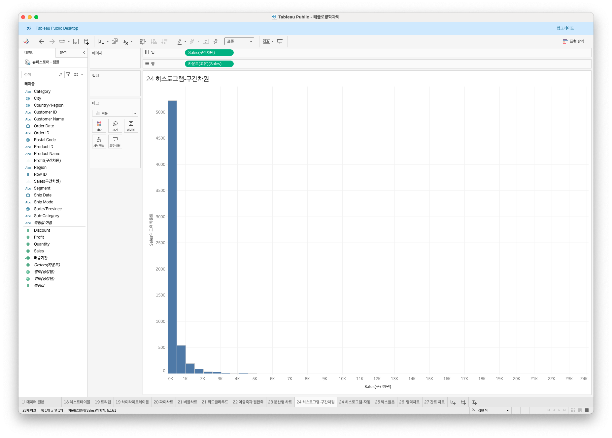
.png)
- 분포형태를 표시하는 그래프, 연속형 측정값을 범위,구간차원으로 그룹화한다는 특징
- 히스토그램 → 연속형 측정값을 통해 수치 데이터의 빈도를 표시하는 양적 그래프, 막대 간 붙어있음
- 막대그래프 → 불연속형 범주형 데이터를 비교하기 위해 사용, 막대 간 이격


## 25강: 박스플롯
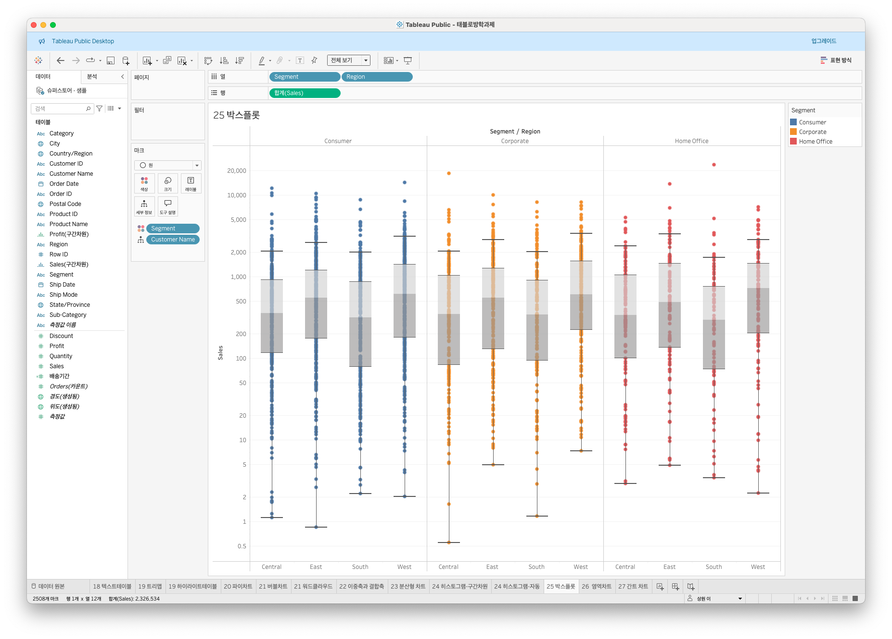

다섯개의 구간범위를 그림으로 표현해 분포와 이상치를 한눈에 표현 가능
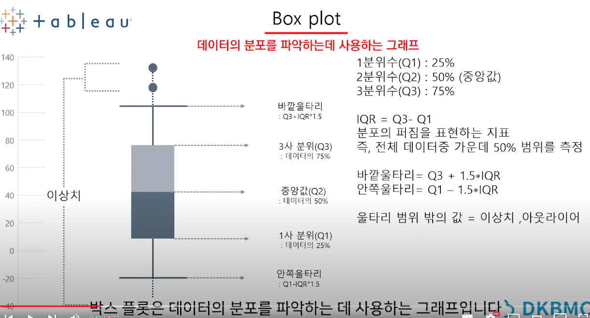


## 26강: 영역차트
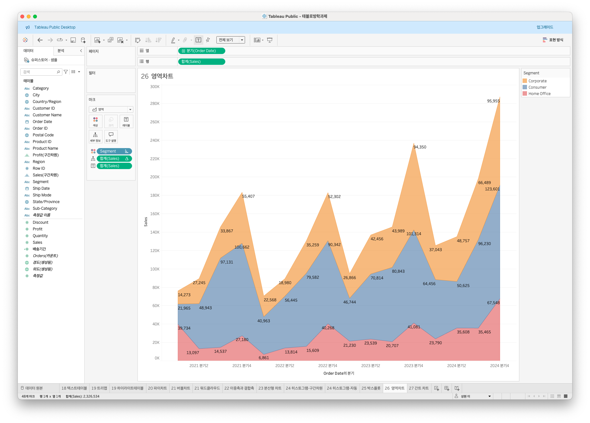
- 라인과 축 사이의 공간이 색상으로 채원진 라인차트
- 연속형 데이터의 누계를 표시하는 데에 활용


## 27강: 간트차트

- 시간 경과에 따른 기간을 시각화 하는 데에 사용


## 28강: 필터
- 태블로는 추출 > 데이터원본 > 컨텍스트 > 차원 > 측정값 > 필터값 순서로 작동됨
- 추출필터 : 데이터원본 우측 상단 필터 “추가”
- 데이터원본필터 : 데이터원본 우측 상단 필터 “추가”
- 컨택스트필터 : 모든 행에 액세스 하게 작동됨
    - 기술에서 매출 상위 10개 제품만 보고싶다 → 시트에서 범주, 제품이름, 매출을 더블클릭 → 제품이름을 필터로 드래그 → 메뉴탭 중 상위 클릭 → 해당 설정 → 범주필터 우클릭 → “컨택스트” 체크


## 29강: 그룹
- 그룹, 계층, 집합 → 데이터를 표시하는 방법들임. 그중에서 그룹 ㄱㄱ
- 먼저, 제품과 수익을 보여주는 막대차트를 만들어본다
- 삼성회사 제품들끼리, Acco회사 제품끼리 한 그룹으로 묶어서 보고싶다
- 뷰에서 그룹 만들기 : 뷰에서 해당 회사 제품들을 드래그 → 우클릭 → 그룹 → 데이터패널에 새 필드가 추가됨
- **항목별로 묶을 필드를 선택해 만들기 : 제품이름 우클릭 → 만들기 → 그룹 만들기**  
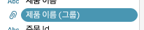
.png)


## 문제 1.

```js
유정이는 superstore 데이터셋에서 '주문' 테이블을 보고 있습니다.
1) 국가/지역 - 시/도- 도시 의 계층을 생성했습니다. 계층 이름은 '위치'로 설정하겠습니다.
2) 날짜의 데이터 타입을 '날짜'로 바꾸었습니다.

코로나 시기의 도시별 매출 top10을 확인하고자
1) 배송 날짜가 코로나시기인 2021년, 2022년에 해당하는 데이터를 필터링했고
2) 위치 계층을 행으로 설정해 펼쳐두었습니다.
이때, 매출의 합계가 TOP 10인 도시들만을 보았습니다.
```


```
겉보기에는 전체 10개로, 잘 나온 결과처럼 보입니다. 그러나 유정이는 치명적인 실수를 저질렀습니다.
오늘 배운 '컨텍스트 필터'의 내용을 고려하여 올바른 풀이 및 결과를 구해주세요.
```
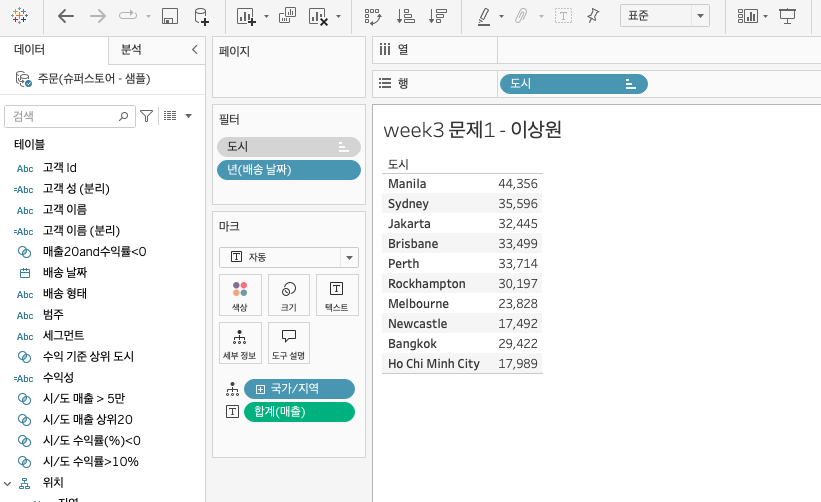


## 문제 2.

```js
태영이는 관심이 있는 제품사들이 있습니다. '제품 이름' 필드에서 '삼성'으로 시작하는 제품들을 'Samsung group'으로, 'Apple'으로 시작하는 제품들을 'Apple group'으로, 'Canon'으로 시작하는 제품들을 'Canon group'으로, 'HP'로 시작하는 제품들을 'HP group', 'Logitech'으로 시작하는 제품들을 'Logitech group'으로 그룹화해서 보려고 합니다. 나머지는 기타로 설정해주세요. 이 그룹화를 명명하는 필드는 'Product Name Group'으로 설정해주세요.

(이때, 드래그보다는 멤버 찾기 > 시작 문자 설정하여 모두 찾아 한번에 그룹화해 확인해보세요.)
```


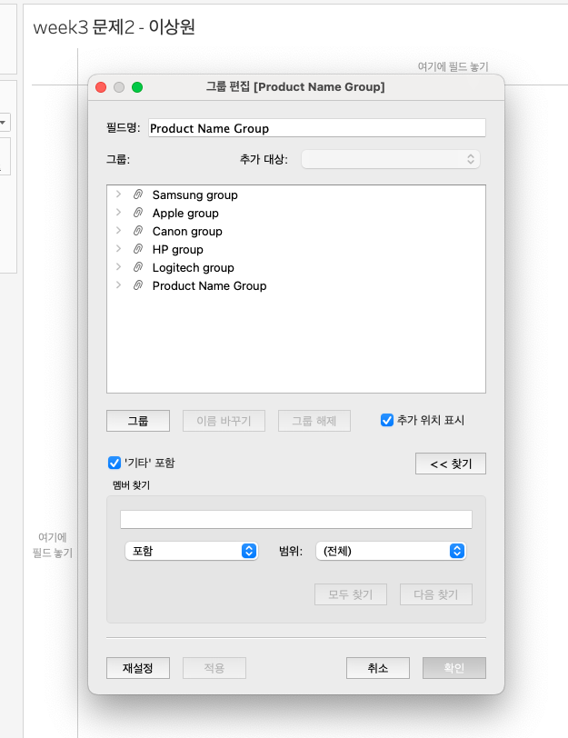

```js
해당 그룹별로 어떤 국가/지역이 주문을 많이 차지하는지를 보고자 합니다. 매출액보다는 주문량을 보고 싶으므로, 주문Id의 카운트로 계산하겠습니다.

기타를 제외하고 지정한 5개의 그룹 하위 목들만을 이용해 아래와 같이 지역별 누적 막대그래프를 그려봐주세요.
```


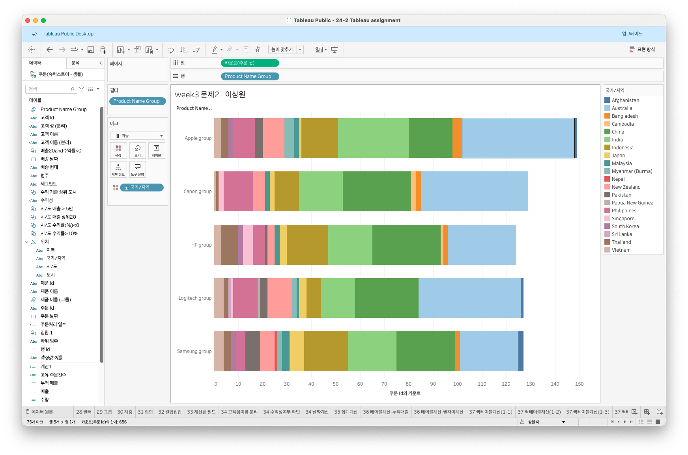


