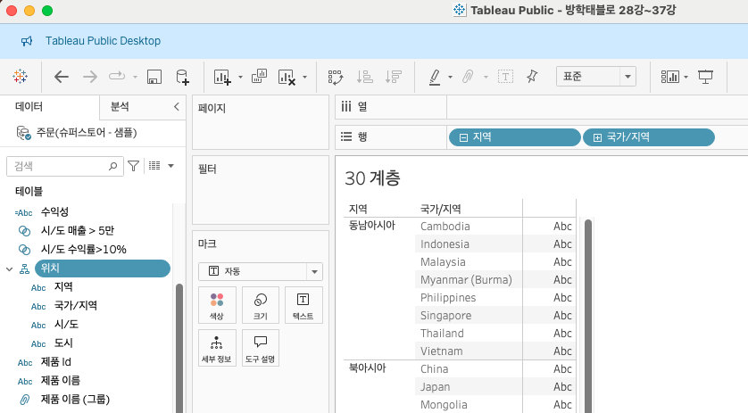
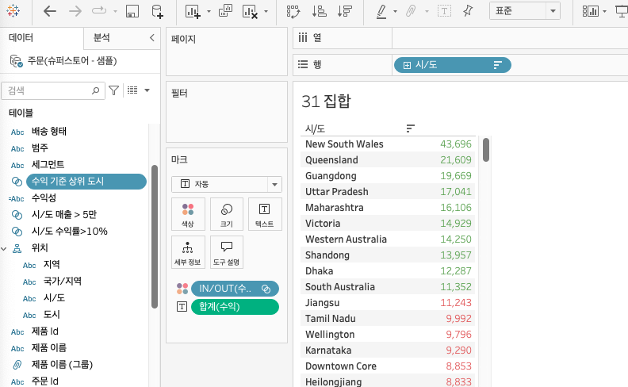
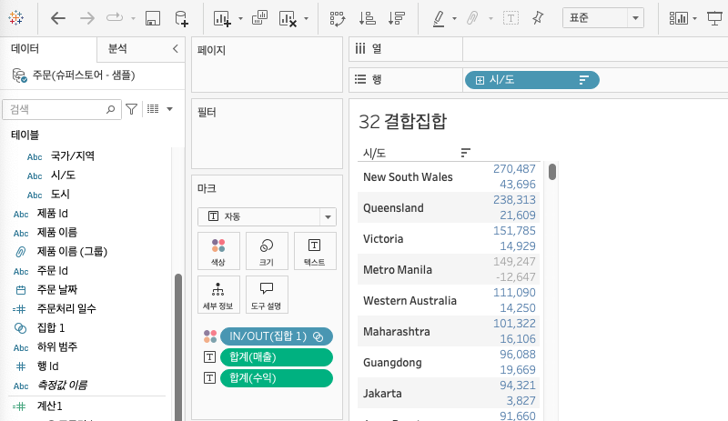
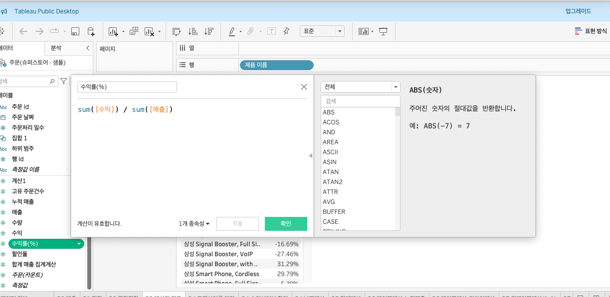
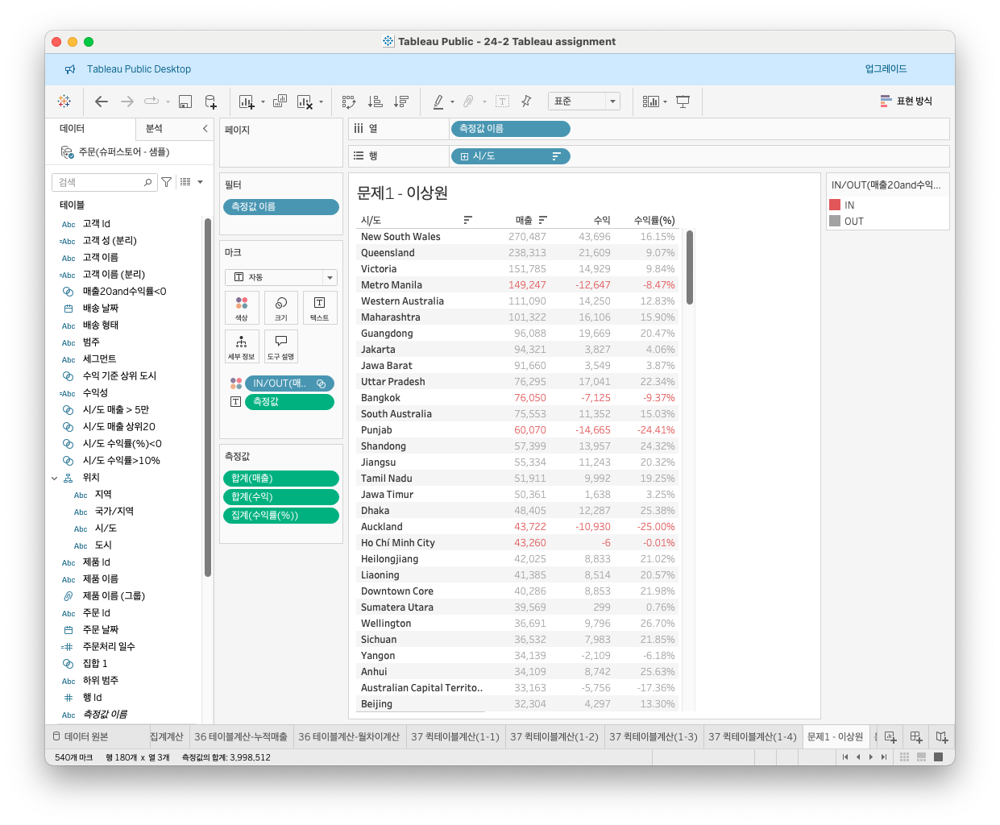

# Fourth Study Week

- 30강: [계층](#30-계층)

- 31강: [집합](#31-집합)

- 32강: [결합집합](#32-결합집합)

- 33강: [계산된 필드](#33-계산된-필드)

- 34강: [행수준계산](#34-행수준계산)

- 35강: [집계계산](#35-집계계산)

- 36강: [테이블계산](#36-테이블계산)

- 37강: [퀵테이블계산(1)](#37-퀵테이블계산1)

- 38강: [퀵테이블계산(2)](#38-퀵테이블계산2)

- [문제1](#문제-1)

- [문제2](#문제-2)

- [문제3](#문제-3)

## Study Schedule

| 강의 범위     | 강의 이수 여부 | 링크                                                                                                        |
|--------------|---------|-----------------------------------------------------------------------------------------------------------|
| 1~9강        |  ✅      | [링크](https://www.youtube.com/watch?v=AXkaUrJs-Ko&list=PL87tgIIryGsa5vdz6MsaOEF8PK-YqK3fz&index=84)       |
| 10~19강      | ✅      | [링크](https://www.youtube.com/watch?v=AXkaUrJs-Ko&list=PL87tgIIryGsa5vdz6MsaOEF8PK-YqK3fz&index=75)       |
| 20~29강      | ✅      | [링크](https://www.youtube.com/watch?v=AXkaUrJs-Ko&list=PL87tgIIryGsa5vdz6MsaOEF8PK-YqK3fz&index=65)       |
| 30~38강      | ✅      | [링크](https://youtu.be/e6J0Ljd6h44?si=nhGbB7GsdOCqj15f)       |
| 39~49강      | 🍽️      | [링크](https://www.youtube.com/watch?v=AXkaUrJs-Ko&list=PL87tgIIryGsa5vdz6MsaOEF8PK-YqK3fz&index=45)       |
| 50~59강      | 🍽️      | [링크](https://www.youtube.com/watch?v=AXkaUrJs-Ko&list=PL87tgIIryGsa5vdz6MsaOEF8PK-YqK3fz&index=35)       |
| 60~69강      | 🍽️      | [링크](https://www.youtube.com/watch?v=AXkaUrJs-Ko&list=PL87tgIIryGsa5vdz6MsaOEF8PK-YqK3fz&index=25)       |
| 70~79강      | 🍽️      | [링크](https://www.youtube.com/watch?v=AXkaUrJs-Ko&list=PL87tgIIryGsa5vdz6MsaOEF8PK-YqK3fz&index=15)       |
| 80~89강      | 🍽️      | [링크](https://www.youtube.com/watch?v=AXkaUrJs-Ko&list=PL87tgIIryGsa5vdz6MsaOEF8PK-YqK3fz&index=5)        |

<!-- 여기까진 그대로 둬 주세요-->

> **🧞‍♀️ 오늘의 스터디는 지니와 함께합니다.**


## 30. 계층

<!-- 계층 구조와 관련된 개념, 사용 방법 등을 적어주세요. -->

### 계층 : 뷰에서 데이터를 "Drill Down" 해 값을 세부적으로 찾을 때 유용함  
- 예) 날짜별로 매출을 보고자 하는 경우,
    - [매출] -> 마크카드-텍스트  
    - [배송날짜] -> 행선반  
    - [배송날짜] +버튼 -> 분기별, 월별, 일별로 보기 가능

### 계층 만들기
- 계층을 만들고자 하는 필드들을 모두 선택한 후 우클릭 -> 계층만들기  
- 드래그하여 순서 정렬 가능



## 31. 집합

<!-- 집합의 정의 및 활용 방법에 대해 알게 된 점을 적어주세요. -->

### 집합 : 사용자가 어떤 조건을 설정하고 그 조건을 기반으로 데이터를 구분하는 방법
- 예) 수익을 많이 낸 상위 10개 도시들을 표현하고자 하는 경우,  
    - "위치" 계층의 [시/도] 필드 -> 행선반  
    - [수익] 필드 -> 마크카드-텍스트  
    - 내림차순 정렬 후, "수익을 많이 낸 상위 10개 도시들을 구분하기 위해" 집합을 만들어보겠다
    - [시/도] 필드 우클릭 -> 집합 ->
        - 일반:그룹처럼 수동으로 묶기
        - 조건:사용자가 설정한 조건이 충족되면 묶임
        - 상위:필드 기준별로 상위or하위 순서로 묶어줌
    - 수익 많이낸 상위10개 도시이기 때문에 "상위"탭 사용
    - 생성한 집합 필드 -> 마크카드-색상  




## 32. 결합집합

<!-- 결합집합의 개념 및 사용 사례를 적어주세요. -->

### 결합집합 : 두 가지의 조건을 적용하고 싶을 때 사용
- 예) 매출이 5만원 이상이고, 수익률이 10% 이상인 도시의 데이터를 구분해보고 싶다면,
    - 두 개의 집합을 만들어야 함
    - ㄱ) 5만원 이상 도시 구분하는 집합 만들기
    - ㄴ) 수익률 10% 이상인 도시 구분하는 집합 만들기
    - ㄱ) 집합 우클릭 -> 결합된 집합 만들기
    - 팝업창에서 결합하고자 집합에 ㄴ)으로 추가
    - 집합 결합의 네가지 옵션 중 선택 (교집합)
        - 합집합, 교집합, 차집합
    - 결합된 집합 필드 -> 마크카드-색상




## 33. 계산된 필드

<!-- 계산된 필드를 사용하는 방법과 예시를 적어주세요. -->

### 계산된 필드 : 기존데이터 이외에 계산해야 할 데이터가 추가로 필요할 경우 사용
### 계산된 필드 만드는 방법 3가지
1. 데이터패널을 통해 생성
2. 분석 탭을 활용해 생성
3. 활용하고자 하는 필드 우클릭 -> 만들기 -> 계산된 필드


- 계산식에 필드를 드래그&드랍 해도 됨
- 필드이름은 [대괄호] 안에 해야 함
- 문자열을 입력할 때에는 '작은 따옴표' 안에 해야 함
- 주석은 // 슬래시 두개 작성 후 쓰기

<br>

- 예) 제품별로 어느 정도 수익을 냈는지, 백분율(%)로 나타내고자 할 경우  
    - 계산된 필드 창 열기
    - 계산된 필드명 -> 수익률(%)
    
    - 해당 필드 -> 기본속성 -> 숫자형식 -> %로 변경


## 34. 행수준계산

<!-- 행수준 계산의 의미와 적용 방법을 적어주세요. -->

### 계산된 필드 종류
1. 기본 계산
2. 테이블 계산
3. LOD 표현식

### 1. 기본계산 : 데이터원본에 대한 행수준 계산 or 집계 계산
- 행수준 계산 : 각 레코드를 통해 계산하는 방식
- 집계 계산 : 현재 뷰에서 보이는 기준으로 계산하는 방식

### 행수준 계산
- 실습1 - [고객 이름]을 성과 이름으로 분리해보자
    - 계산된 필드 창 열기
    - 필드이름은 "고객이름(분리)"로 설정
    - SPLIT([고객 이름], ' ', 1)
    - 빈칸을 기준으로 나누겠다, 나눈 것 중 첫번째 것을 의미
    - 고객 성을 원한다면 1 대신 2 입력
- 실습2 - 수익성이 있는 제품이 무엇인지 확인해보자
    - [제품 이름] -> 행선반
    - [수익] -> 마크카드-텍스트
    - "수익성" 필드를 만들어보자
    - 계산된 필드 창 열기
    - IF [수익]>0 THEN '수익성 있음'
    - ELSEIF [수익]<0 THEN '수익성 없음'
    - ELSE '손익 평형'
    - END
- 실습3 - 두 날짜 사이의 일수 찾기
    - 주문한 날과 배송된 날까지 일수 찾기 위해
    - 계산된 필드 창 열기
    - "주문 처리 일수" 필드명
    - DATEDIFF('day', [주문 날짜], [배송 날짜])
    - 생성된 필드는 `차원값`에서 사용해야 정상 작동함


## 35. 집계계산

<!-- 집계계산의 정의 및 활용 사례에 대해 알게 된 점을 적어주세요. -->

### 집계 계산 : 현재 뷰에서 보이는 기준으로 계산하는 방식
- 기본으로 설정되어 있는 집계 계산을 변경하려면
- 해당 필드 우클릭 -> "기본 속성" -> 집계 -> 원하는 집계 선택
- 계산된 필드에서는 드롭다운 메뉴를 통해 집계 클릭 -> 해당 집계함수를 사용가능

<br>

- 실습1 - 연도별 주문건수가 보고싶은 경우
    - 게산된 필드 창 열기
    - 필드명 "고유 주문 건수"
    - COUNTD([주문 id])


## 36. 테이블계산

<!-- 테이블 계산의 개념 및 사용 방법을 적어주세요. -->

### 테이블 계산 : 뷰에 보이는 내용을 바탕으로 데이터 계산  

- 실습1
    - [주문날짜], [매출] 필드 더블클릭
    - [주문날짜] 필드 -> 행선반 -> [월] 필드만
    - 계산된 필드 창 열기 -> 드롭다운 메뉴 -> 테이블 계산
    - 예를 들어, 월마다 연도 따라 누적매출 찾으려면,
    - RUNNING_SUM(SUM([매출]))
    - 필드명은 "누적 매출"
    - 생성된 필드 -> 마크카드-텍스트
    - 생성된 필드 세모 표시 = 테이블계산 필드를 의미
    - 계산 방향 기본적으로 "옆으로" 자동설정
    - 변경법 2가지
        - 하나, 해당 필드 우클릭 -> 다음을 사용하여 계산
        - 마크카드 테이블 계산된 필드 우클릭 -> 테이블계산 편집 옵션
- 실습2 - 현재월과 전월의 매출 차이
    - [주문날짜] 필드의 [년], [월] -> 행선반
    - [매출] 더블클릭
    - 계산된 필드 창 열기
    - 현재달 매출 - 전월 매출
    - SUM([매출]) - LOOKUP(SUM([매출]), -1)
    - 생성된 필드 더블클릭 -> 결과값을 보여줌


## 37. 퀵테이블계산(1)

<!-- 퀵테이블 계산의 원리 및 예제에 대해 알게 된 점을 적어주세요. -->

### 사용하는 방법
- 사용하고자 하는 필드 우클릭 -> 퀵테이블 계산
- 관련 테이블계산 유형들이 나열됨

<br>

- 실습1
    - 누계는 집계한 값을 누적한 값으로, 한번더 집계해주는 계산 유형
    - 분기별 누적매출 & 월별 매출 차트를 만들어 보자
    - [주문날짜] 우클릭 유지 -> 열선반 -> 필드 놓기 창
    - 연속형 "분기(주문날짜)" 더블클릭
    - [매출] -> 행선반, 하나더 복제하기
    - 복제한 [매출] 우클릭 -> 퀵테이블계산 -> 누계(세모표시 나타남)
    - Y축 우클릭 -> 이중축 적용
- 실습2 - 퀵테이블 계산의 "차이"를 통해 각 제품에 대한 연도별 매출 차이 알아보기
    - [주문날짜] -> 열선반
    - [범주] -> 행선반
    - [매출] -> 마크카드-텍스트
    - [매출] 필드 우클릭 -> 퀵테이블 계산 -> 차이
    - 차이 : 측정값이 기준값가 어느정도 차이 나는지 구하는 계산 유형
    - 예를 들어, 월별 수익차이를 %로 보려고 한다면,
    - [주문날짜] 우클릭 유지 -> 열선반 -> 연속형 "월(주문날짜)" 더블클릭
    - [수익] -> 행선반 -> 우클릭 -> 퀵테이블 계산 -> 비율 차이
    - 마크카드 -> 라인그래프를 막대그래프로 변경
    - 색상 표현할 경우, 행선반의 [수익] 필드를 command 유지 -> 마크카드-색상 드래그
    - 범례 색상 변경 : 뷰 기준 오른쪽 상단 범례 더블클릭 -> 색상편집


## 38. 퀵테이블계산(2)

<!-- 이동평균, YTD 총계, 전년 대비 성장률, YTD 성장률 등 본 강의에서 알게 된 점을 적어주세요. -->

### 이동평균 : 이전의 값부터 현재까지 값에 대한 평균을 냄
- 실습
    - 연속형 "분가(주문날짜)" -> 열선반
    - [매출] -> 행선반, 하나더 복제하기
    - 복제한 [매출] -> 우클릭 -> 퀵테이블계산 -> 이동평균
    - 매출합계를 기준으로 이동평균한 값을 라인차트로 표현 가능
    - 뷰에 값들을 표시하려면, [매출] 필드를 command유지 -> 마크카드-레이블
    - 테이블계산된 [매출] 필드 우클릭 -> 테이블계산 편집 -> 편집창 확인해보면 평균 이전2 다음0으로 설정됨을 확인

### YTD : 해당 연도 초부터 특정 시점까지 총계
- 실습
    - [주문날짜] -> 행선반 -> [년], [월]만 남김
    - [매출] 더블클릭 -> 연, 월 별 매출 확인
    - 마크카드에 있는 [매출] 우클릭 -> 퀵테이블계산 -> YTD총계
    - 그러면, 각 년도 안에서 매출 합계가 누적되어 데이터가 표현됨

### 통합성장률
- 실습
    - [주문날짜] -> 행선반 -> [년], [분기]만 남김
    - [매출] 더블클릭 -> 연, 분기 별 매출 확인
    - 마크카드에 있는 [매출] 우클릭 -> 퀵테이블계산 -> 통합성장률


## 문제 1.

규석이는 이제껏 매출을 올리는 데에 힘썼었지만, 왠지 모르게 주머니에 들어오는 돈이 없어 속상합니다. 

그래서 매출이 상위 20곳에 속하지만, 수익률(%)이 마이너스인 시/도를 확인하려고 합니다.

> 수익률은 SUM([수익]) / SUM([매출])로 정의합니다.

어떤 집합을 만들었고, 어떤 결합을 하였는지를 중심으로 기술하고, 결과 자료를 첨부해주세요. 

(텍스트 표 형태이며, 색상으로 위 집합을 구분할 수 있게 만들어주세요.)

<!-- 아래 예시 이미지를 삭제하고, 직접 만든 시트 사진을 올려주세요. 시트의 이름은 본인 이름으로 기입해주세요-->



#### [ 풀이 ]
1. 계산된 필드 [수익률(%)] 생성
2. "매출 상위 20곳인 시/도" 집합 생성
3. "수익률이 마이너스인 시/도" 집합 생성
4. 두 집합을 사용해 "매출20and수익률<0" 결합된 집합 생성
5. 범례 색상 조정


<br> <br> <br> <br> <br> 


## 문제 2.
선희는 주문 Id별로 주문에서 배송까지에 걸리는 날짜 일수가 궁금했습니다. 
그래서 주문 ID별로 주문에서 배송까지 걸리는 일자를 '배송까지 걸린 일수'라는 계산된 필드로 만들고, 이를 마크에 올린 후 확인해보았습니다. 
이때, 계산된 필드의 식은 'DATEDIFF' 함수를 이용하였습니다.

배송까지 걸린 일수 계산을 위한 DATEDIFF 함수 수식을 적어주세요.

```
DATEDIFF('day', [주문 날짜], [배송 날짜])
```


그런데 위 그림처럼 '주문 날짜'와 '배송 날짜'를 함께 행에 올려 확인해보니, 주문날짜와 배송날짜의 차이가 '배송까지 걸린 일수'와 다릅니다.

ID-2021-11126을 보니, 11월 26일 배송에 11월 30일 배송이면 4일 차이인데, 12일이 걸렸다고 하네요. 왜 이런 문제가 생긴걸까요?

```
해당 계산된 필드이 "측정값"으로 분류되어있기 때문이다.
```

그리고 이를 해결하기 위해서는 어떻게 해야 할까요?

```
해당 필드를 "차원값"에서 사용해야 정상 작동한다.
```


<br> <br> <br> <br> <br> 


## 문제 3.

다음은 Tableau의 다양한 계산을 사용할 수 있는 경우를 빈칸으로 두고 문제를 작성한 것입니다. 각 빈칸에 적합한 계산 유형을 채워보세요.

보기
> **누계, 차이, 비율 차이, 구성 비율, 순위, 백분위수, 이동 평균, YTD 총계, 통합 성장률, 전년 대비 성장률, YTD 성장률**

| 계산 유형               | 설명                                                                 | 사용 예시                                                                                          |
|-------------------------|----------------------------------------------------------------------|-----------------------------------------------------------------------------------------------------|
| 누계           | 데이터의 누적 합계를 계산                                             | 한 기업이 월별 매출 데이터를 누적하여 연간 매출 추이를 보고 싶을 때 사용                                      |
| 차이            | 연속 데이터 포인트 간의 차이를 계산                                    | 한 기업이 월별 매출 데이터에서 전월 대비 매출 증감량을 분석하고 싶은 경우                                        |
| 비율 차이            | 연속 데이터 포인트 간의 비율 변화를 계산                               | 한 기업이 월별 매출 데이터에서 전월 대비 매출 증감률(%)을 분석하고 싶은 경우                                      |
| 구성 비율            | 전체에서 각 데이터 포인트의 비율을 계산                                | 한 기업이 전체 매출에서 각 제품군이 차지하는 비율을 보고 싶을 때 사용                                           |
| 순위            | 데이터의 순위를 매깁니다                                              | 한 기업이 제품별 매출 데이터를 순위별로 정렬하여 상위 10개 제품을 분석하고 싶은 경우                              |
| 백분위수            | 데이터의 백분위를 계산                                               | 한 기업이 고객별 구매 금액 데이터를 백분위수로 나누어 상위 25% 고객을 분석하고 싶은 경우                          |
| 이동 평균            | 일정 기간의 평균을 계산                                               | 한 기업이 주간 매출 데이터에서 4주 이동 평균을 계산하여 트렌드를 분석하고 싶은 경우                              |
| YTD 총계            | 연초부터 현재까지의 총계를 계산                                      | 한 기업이 월별 매출 데이터를 연초부터 현재까지 누적하여 연간 매출 목표 달성 여부를 분석하고 싶은 경우             |
| 통합 성장률            | 일정 기간 동안의 연평균 성장률을 계산                                  | 한 기업이 5년 간 매출 데이터를 바탕으로 연평균 성장률(CAGR)을 계산하고 싶은 경우                                  |
| 전년 대비 성장률            | 전년 동기간 대비 성장률을 계산                                        | 한 기업이 월별 매출 데이터에서 전년 동월 대비 매출 성장률을 분석하고 싶은 경우                                    |
| YTD 성장률            | 연초부터 현재까지의 성장률을 계산                                     | 한 기업이 올해 연초부터 현재까지의 매출이 전년 동기 대비 얼마나 성장했는지 분석하고 싶은 경우                     |

> 사용 예시를 참고하여 실제 경우처럼 생각하며 고민해보아요!


