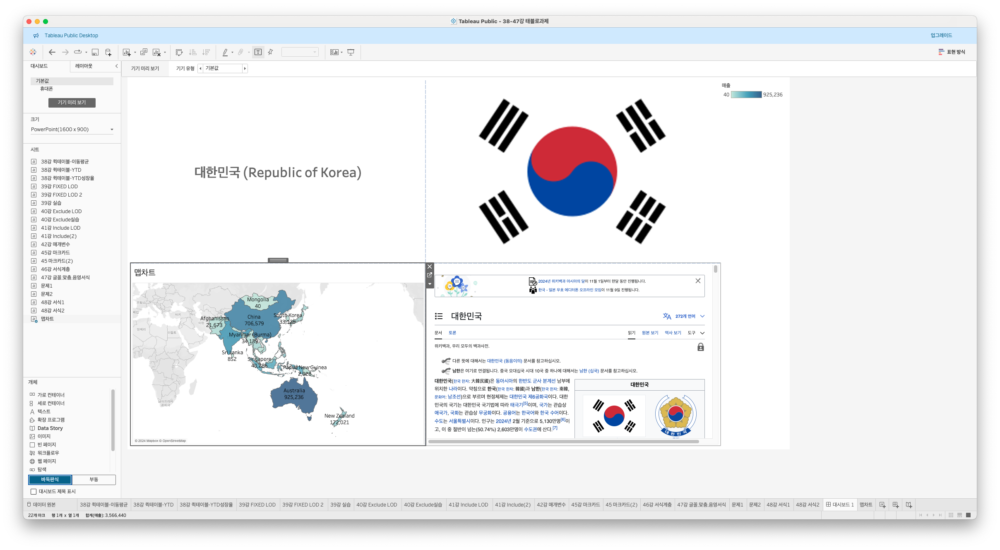
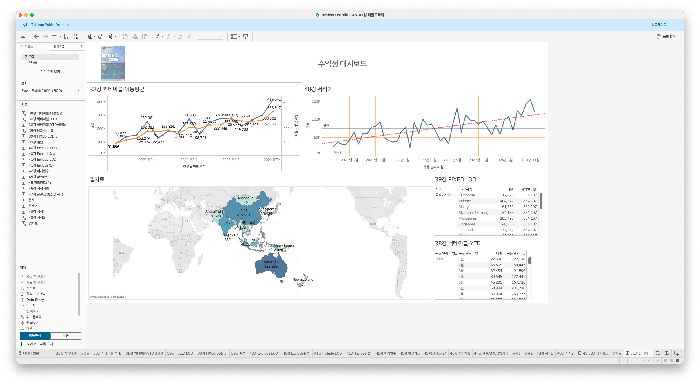
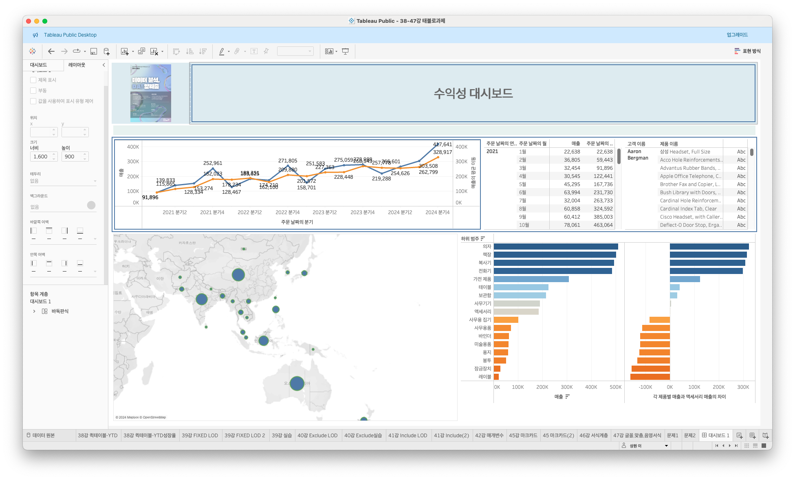

# Sixth Study Week


## Study Schedule
<br>

| 회차 | 강의 범위   | 강의 이수 여부 | 링크                                                                                                     |
|------|-------------|----------------|--------------------------------------------------------------------------------------------------------|
| 1    | 1~7강       | ✅              | [링크](https://www.youtube.com/watch?v=AXkaUrJs-Ko&list=PL87tgIIryGsa5vdz6MsaOEF8PK-YqK3fz&index=84)    |
| 2    | 8~17강      | ✅              | [링크](https://www.youtube.com/watch?v=AXkaUrJs-Ko&list=PL87tgIIryGsa5vdz6MsaOEF8PK-YqK3fz&index=75)    |
| 3    | 18~27강     | ✅              | [링크](https://www.youtube.com/watch?v=AXkaUrJs-Ko&list=PL87tgIIryGsa5vdz6MsaOEF8PK-YqK3fz&index=65)    |
| 4    | 28~37강     | ✅              | [링크](https://www.youtube.com/watch?v=e6J0Ljd6h44&list=PL87tgIIryGsa5vdz6MsaOEF8PK-YqK3fz&index=55)    |
| 5    | 38~47강     | ✅              | [링크](https://www.youtube.com/watch?v=AXkaUrJs-Ko&list=PL87tgIIryGsa5vdz6MsaOEF8PK-YqK3fz&index=45)    |
| 6    | 48~57강     | ✅              | [링크](https://www.youtube.com/watch?v=AXkaUrJs-Ko&list=PL87tgIIryGsa5vdz6MsaOEF8PK-YqK3fz&index=35)    |
| 7    | 58~67강     | 🍽️             | [링크](https://www.youtube.com/watch?v=AXkaUrJs-Ko&list=PL87tgIIryGsa5vdz6MsaOEF8PK-YqK3fz&index=25)    |
| 8    | 68~77강     | 🍽️             | [링크](https://www.youtube.com/watch?v=AXkaUrJs-Ko&list=PL87tgIIryGsa5vdz6MsaOEF8PK-YqK3fz&index=15)    |
| 9    | 78~85강     | 🍽️             | [링크](https://www.youtube.com/watch?v=AXkaUrJs-Ko&list=PL87tgIIryGsa5vdz6MsaOEF8PK-YqK3fz&index=5)     |
---

<br/>
<!-- 여기까진 그대로 둬 주세요-->

> **🧞‍♀️ 오늘은 강의보다 실습과 대시보드 직접 만들기가 더 중요하니, 기록보다는 사고하며 강의를 들어주세요.**


<br>
<br>

## 48. 워크시트 서식(2)

### 테두리
- 테이블, 패널, 셀, 머리글을 둘러싸는 라인을 설정
- 지역 > 행선반
- 범주 > 열선반
- 매출 > 더블클릭
- 테두리 탭 > 테두리 유형, 두께, 색상 설정
- 행 구분선, 열 구분선 : 왼쪽=러프하게, 오른쪽=세세하게

.png)


### 라인
- 표시된 데이터의 축에 대한 라인 모양 설정
- 주문날짜 > 열선반
- 매출 > 행선반
- 서식 탭 > 라인 > 라인의 유형, 두께, 색상 설정
- 차트에 추세선과 참조선을 추가하여 각 라인들의 서식을 별도 설정 가능

.png)


<br>
<br>

## 49강. 대시보드패널
- 대시보드 열기
- 크기 항목 : 대시보드 크기 설정 가능, 드롭다운메뉴 열면 -> 크기범위 설정 가능 > 파워포인트 크기로 설정!
- 새로운 워크시트를 만들면 > 자동으로 대시보드 시트 칸에 추가됨
- 시트 뿐만 아니라 태블로가 지원하는 "개체" 항목 사용 가능




<br>
<br>

## 50. 대시보드 구성방식

> **🧞‍♀️ 부동과 바둑판식 방식을 차이를 중점으로 기술해보세요**
```
1. 바둑판식
- 격자무늬 구조에 따라 개체들을 구성할 수 있음
- 대시보드의 크기가 자주 변경되는 경우에 개체를 추가하는 경우 유용

2. 부동
- 개체를 자유롭게 배치 가능. 사용자가 원하는대로 드래그앤 그랍 가능
- 개치를 부동식으로 추가하면 해당 개체의 위치 또는 형식이 달라질 수 있음
- shift를 누른 상태로 드래그앤드랍 하면 부동식으로 추가됨
```


<br>
<br>

## 51. 대시보드 컨테이너
- 개체를 대시보드에 배치하기 전, 컨테이너를 먼저 배치할 수 있음
- 컨테이너 : 대시보드 개체들과 워크시트들을 그룹화하고 구성할 수 있는 공간
- 가로형 : 내부 개체들을 수평공간으로 배치할 때 사용
- 사로형 : 내부 개체들을 수직공간으로 배치할 때 사용




<br>
<br>

## 52. 레이아웃 패널
- 대시보드 디자인 변경하고자 할 때, 몇가지 인터페이스가 있는데, 그중 레이아웃이 있음
- 레이아웃 패널에서
    - 시트 이름 제거 여부
    - 개체를 부동으로 변경
    - 위치와 크기를 픽셀 단위로 변경 가능
    - 테두리 옵션
    - 백그라운드 옵션




<br>
<br>

## 53. 필터 동작

<!-- 필터 동작에 대해 알게 된 점을 적어주세요 -->


<br>
<br>

## 54. 대시보드 하이라이터 동작

<!-- 하이라이터에 대해 알게 된 점을 적어주세요 -->


<br>
<br>

## 55. 대시보드 URL

<!-- URL에 대해 알게 된 점을 적어주세요 -->


<br>
<br>

## 56. 대시보드 시트에 이동 동작

<!-- 대시보드 시트에 이동에 대해 알게 된 점을 적어주세요!-->


<br>
<br>

## 57. 매개변수 변경 동작

<!-- 매개변수 변경 동작에 대해 알게 된 점을 적어주세요!-->


<br>
<br>

## 문제

오늘은 별도의 문제가 없습니다. 


여러 대시보드를 참고하시어, superstore 데이터를 사용해 나만의 대시보드를 제작해주세요.

**단, 워크시트 3개 이상의 그래프를 표시해야 하며 각 시트 간 상호작용성 필터 or 하이라이트 동작은 꼭 추가되어야 합니다**

어떤 부분에 가중을 두었는지, 어떤 사용자 편의성을 고려하였는지에 대한 설명이 필요합니다.