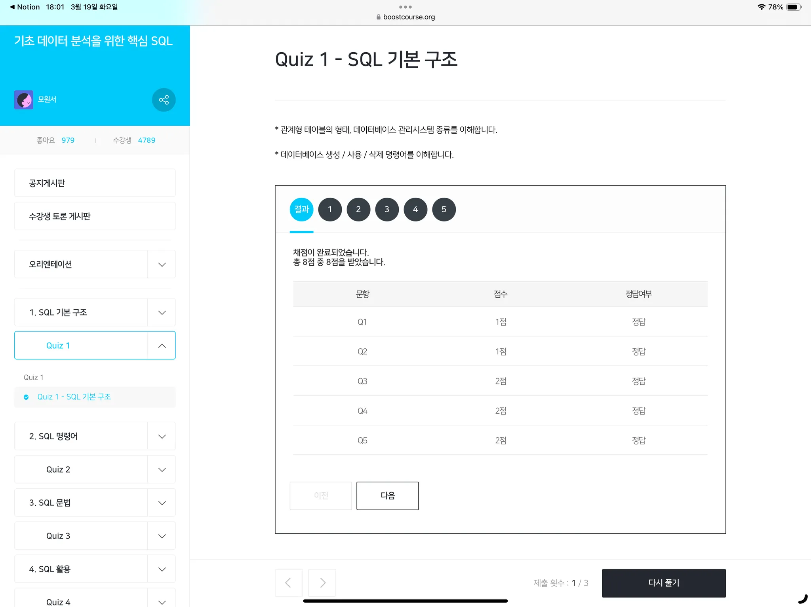

# 1. SQL 기본 구조

### 학습목표 1.
- SQL 및 관계형 데이터베이스 개념에 대해 안다

핵심 키워드
- SQL
- 관계형 데이터베이스

---
- SQL : Structured Query Language. 관계형 데이터베이스가 이해할 수 있는 구조화된 질의어.
- 관계형 데이터베이스 : RDB. 행과 열로 구성된 테이블이 다른 테이블과 관계를 맺고 모여있는 집합체
- 관계형 테이블 : 관계형 데이터베이스에 저장되는 데이터의 집합. 행(row)과 열(column)로 구성
- 관계형 테이블 간의 관계(Relationship) : 1:1 , 1:N, N:N 세 가지 형태로 테이블 간의 연결이 가능하다는 것을 의미

### 학습목표 2.

- SQL을 사용할 수 있는 실습환경 이해하기

1. MySQL : 오라클에서 관리 및 지원하는 오픈소스 관계형 데이터베이스
2. Workbench : MySQL Server를 관리하기 위한 소프트웨어

SQL은 국제표준화된 언어임.

→ MySQL, MSSQL, Oracle, PostgreSQL 등 데이터베이스 관리시스템 종류에 얽매이지 않고 사용가능.

### 학습목표 3.

- Workbench 살펴보기

데이터베이스 생성 : `CREATE DATABASE TEST;`

해당 데이터베이스 사용 : `USE TEST;`

데이터베이스 삭제 : `DROP DATABASE TEST;`

 

---

