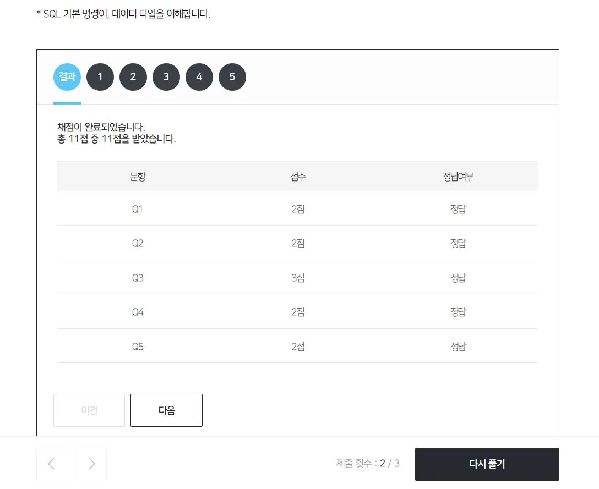

# SQL 기본 명령어는 4가지
- 데이터 정의어(DDL) : 데이터 생성, 변경, 삭제
- 데이터 조작어(DML) : 데이터 삽입, 조회, 수정, 삭제
- 데이터 제어어(DCL) : 데이터 접근 권한 부여, 제거
- 트랜젝션 제어어(TCL) : 데이터 조작어(DML) 명령어 실행, 취소, 임시저장
- DBA(DataBase Administrator) 역할 : 데이터베이스 관리자. 기업 내에서 데이터베이스를 관리
- Data Analyst 역할 : 데이터 분석을 통해, 새로운 인사이트 도출
- DBA와 Ddata Analyst는 긴밀한 상호작용이 필요함

---

### 데이터 정의어(DDL) - 테이블을 정의한다
- 테이블은 각 열마다 반드시 1가지 데이터 타입으로 정의됨 (숫자형, 문자형, 날짜형, 숫자형)
- 테이블은 각 열마다 “제약조건”을 정의할 수 있다.
- PK(Primary Key) : 중복되어 나타날 수 없는 단일값
- NOT NULL : NULL 허용하지 않음
- 테이블 생성, 열데이터 타입 변경, 열 추가, 테이블명 변경, 테이블 삭제


### 데이터 조작어(DML) - 데이터를 다루자
- 데이터를 삽입, 조회, 수정, 삭제할 때 사용하는 명령어
- 삽입 : 제약조건 위반, 문자 및 날짜형(’ ‘)
- 조회 : 모든 열(*), 특정 열 이름 변경(as)
- 수정 : 특정 조건 (where)
- 삭제 : 특정 조건 (where)


### 데이터 제어어(DCL) - 데이터 권한을 제어하자
- 데이터 접근 권한 부여 및 제거할 때 사용하는 명령어
- 데이베이스관리자(DBA)가 특정사용자(User)에게.
- 사용자 확인 : USE MYSQL
- 사용자 추가 및 삭제 : CREATE, DROP
- 권한 부여 및 삭제 : GRANT, REVOKE
- 트랜젝션 제어어(TCL) - 데이터 조작어를 관리하자
- 데이터조작어(DML) 명령어 실행, 취소, 임시저장할 때 사용하는 명령어
- 트랜젝션(Transaction)은 분할할 수 없는 최소 단위이며 논리적인 작업단위
- 실행(commit) : 모든 작업을 최종 실행
- 취소(rollback) : 모든 작업을 되돌림
- 임시저장(savepoint) : rollback 저장점을 지정하는 명령어


<br>
<br>
<br>


# SQL 명령어

### 데이터 정의어(DDL) - 테이블 정의
```sql
-- 테이블 생성
create table 회원테이블 (
회원번호 int primary key,
이름 varchar(20),
가입일자 date not null,
수신동의 bit
);
```
```sql
-- 테이블 열이름 변경
alter table 회원테이블 change 성별 성 varchar(20);
```
```sql
-- 테이블명 변경
alter table 회원테이블 rename 회원정보;
```
```sql
-- 테이블 열 데이터타입 변경
alter table 회원테이블 modify 성별 varchar(20);
```
```sql
-- 테이블 조회
select * from 회원테이블;
```
```sql
-- 테이블 열 추가
alter table 회원테이블 add 성별 varchar(2);
```

### 데이터 조작어(DML) - 데이터 다루기
```sql
-- 데이터 삽입
insert into 회원테이블 values (1001, ‘홍길동’, ‘2020-01-02’, 1);
insert into 회원테이블 values (1002, '이순신', '2020-01-03', 0);
insert into 회원테이블 values (1003, '장영실', '2020-01-04', 1);
insert into 회원테이블 values (1004, '유관순', '2020-01-05', 0);
```
```sql
-- primary key 제약조건 위반
insert into 회원테이블 values (1004, '장보고', '2020-01-06');
-- 실행 시, 적용 안 됨
```
```sql
-- not null 제약조건 위반
insert into 회원테이블 values (1005, '장보고', null, 0);
-- 실행 시, 적용 안 됨
```
```sql
-- 데이터 타입 조건 위반
insert into 회원테이블 values (1005, '장보고', 1, 0);
-- 실행 시, 적용 안 됨
```
```sql
-- 데이터 조회
/* 모든 열 조회 */
select *
from 회원테이블;
/* 특정 열 조회 */
select 회원번호, 이름
from 회원테이블;
/* 특정 열 이름 변경하여 조회 */
select 회원번호,
이름 as 성명
from 회원테이블;
```
```sql
-- 데이터 수정
/* 모든 데이터 수정 */
update 회원테이블
set 수신동의 = 0;
select *
from 회원테이블;
/* 특정 조건 데이터 수정 */
update 회원테이블
set 수신동의 = 1
where 이름 = '홍길동';
select *
from 회원테이블;
/* 특정 데이터 삭제 */
delete
from 회원테이블
where 이름 = '홍길동';
select *
from 회원테이블;
/* 모든 데이터 삭제 */
delete
from 회원테이블;
select *
from 회원테이블; 
```

### 데이터 제어어(DCL) - 데이터 권한 제어
```sql
-- 사용자 추가
/* 사용자 ID 및 PW 생성 */
create user 'test' @localhost identified by 'test';
select *
from user;
/* 사용자 PW 변경 */
set password for 'test' @localhost = '1234';
사용자 삭제
/* 사용자 삭제 */
drop user 'test'@localhost;
/* 사용자 확인 */
select *
from user;
```
```sql
-- 권한 부여 및 제거
/** 권한 : CREATE, ALTER, DROP, INSERT, DELETE, UPDATE, SELECT 등 **/

/* 특정 권한 부여 */
grant select, delete on practice.회원테이블 to 'test'@localhost;
/* 특정 권한 삭제 */
revoke delete on practice.회원테이블 from 'test'@localhost;
/* 모든 권한 부여 */
grant all on practice.회원테이블 to 'test'@localhost;
/* 모든 권한 삭제 */
revoke all on practice.회원테이블 from 'test'@localhost;
```

### 트랜젝션 제어어(TCL) - 데이터조작어 관리
```sql
/* 트랜젝션 시작 */
begin;
/* 취소 */
rollback;
/* 실행 */
commit;
/* savepoint 지정 */
savepoint s1;
/* savepoint s1 저장점으로 rollback */
rollback to s1;
select * from 회원테이블;
```


<br>


---



