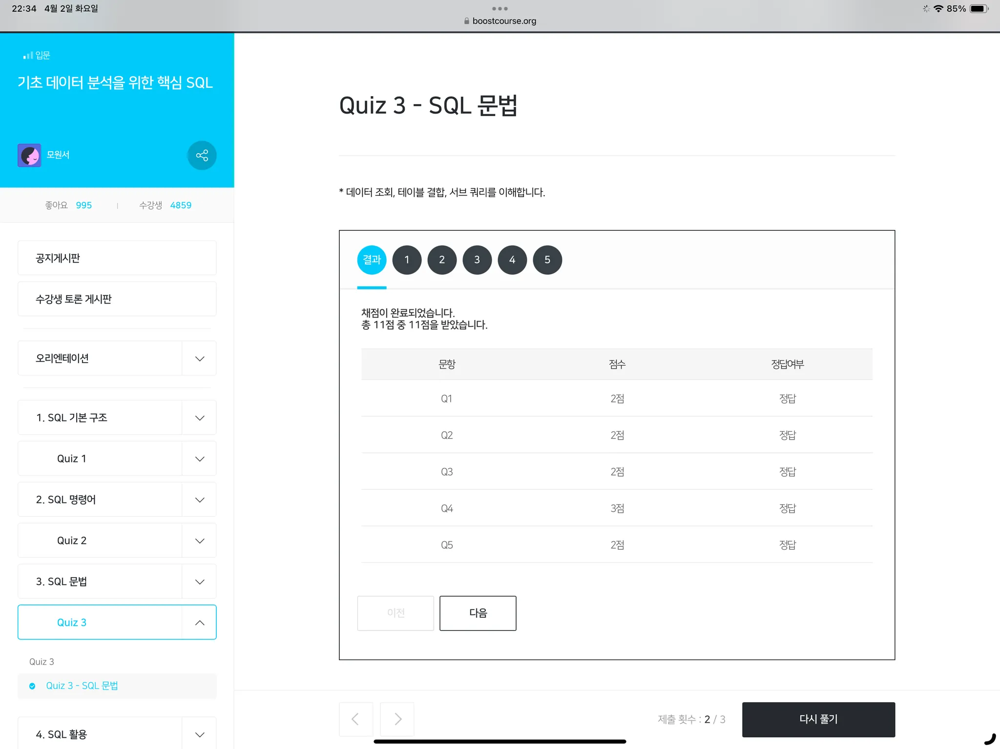

# 데이터 조회 (SELECT)
- 데이터조작어(DML)이며, 데이터 분석에서 가장 많이 사용되는 명령어
- 절: from, where, group by, having, order by 총 다섯가지
    - from : 테이블 확인
    - where : form절 테이블을 특정 조건으로 필터링
    - group by : 열 별로 그룹화
    - having : 그룹화된 새로운 테이블을 특정 조건으로 필터링
    - select 열 선택
- group by는 집계함수와 주로 사용되는 명령어
- group by에 있는 열들을 select에도 작성해야 원하는 분석결과를 확인할 수 있음

# 테이블 결합(JOIN)
- 관계는 1:1, 1:N, N:N 세 가지 가능
- 두 테이블 관계를 활용하여, 테이블을 결합하는 명령어
- ERM(Entitiy-Relationship Modelling) : 개체-관계 모델링, 관계형 데이터베이스에 테이블을 모델링할 때 사용됨
- ERD(Entity-Relationship Diagram) : 개체 간의 관계를 도표로 나타내는 것
    - inner join : 두 테이블 의 공통 값이 매칭되는 데이터만 결합
    - left join : 두 테이블의 공통 값이 매칭되는 데이터만 결합 + 왼쪽 테이블의 매칭되지 않는 데이터는 Null
    - right join : 두 테이블의 공통 값이 매칭되는 데이터만 결합 + 오른쪽 테이블의 매칭되지 않는 데이터는 Null
- join은 3가지 이상 테이블 결합이 가능하다


# 서브 쿼리(Sub Query)
- select문 안에 select문이 있는 명령어
    - select절 서브쿼리는 join보다 처리속도가 조금 느려서 잘 사용하지 않음
    - from절 서브쿼리는 from 명려문 안에 select명령문이 있는 쿼리문 → 가장 많이 사용됨
    - where절 서브쿼리는 where 명령문 안에 select 명령문이 있는 쿼리문


# SQL 문법 코드
```sql
SELECT
    [열1],
    [열2],
    [집계함수] AS [열이름]
FROM
    [테이블명]
WHERE
    [조건]
GROUP BY
    [열1],
    [열2]

HAVING
    [조건]
ORDER BY
    [열] ;
```
```sql
SELECT
    *,
    YEAR(JOIN_DATE) AS 가입연도,
    ADDR,
    COUNT(MEM_NO) AS 회원수
FROM
    CUSTOMER
GROUP BY
    YEAR(JJOIN_DATE),
    ADDR ;
```
```sql
SELECT
    *,
    YEAR(JOIN_DATE) AS 가입연도,
    ADDR,
    COUNT(MEM_NO) AS 회원수
FROM
    CUSTOMER
WHERE
    GENDER  = ‘MAN’
GROUP BY
    YEAR(JJOIN_DATE),
    ADDR
HAVING
    COUNT(MEM_NO) > 50 ;
```
```sql
SELECT
    *,
    YEAR(JOIN_DATE) AS 가입연도,
    ADDR,
    COUNT(MEM_NO) AS 회원수
FROM
    CUSTOMER
WHERE
    GENDER  = ‘MAN’
GROUP BY
    YEAR(JJOIN_DATE),
    ADDR
HAVING
    COUNT(MEM_NO) > 50
ORDER BY
    COUNT(MEM_NO) DESC ;
```
```sql
SELECT
    *
FROM
    SALES AS A
LEFT JOIN
    PRODUCT AS B ON A.PRODUCT_CODE = B.PRODUCT_CODE ;
```
```sql
SELECT
    B.BRAND,
    SUM(SALES_QTY)  AS  판매수량
FROM
    SALES AS A
LEFT JOIN
    PRODUCT AS B ON A.PRODUCT_CODE = B.PRODUCT_CODE
GROUP BY
    B.BRAND ;
```
```sql
SELECT
    COUNT(A.MEM_NO)
FROM
    CUSTOMER AS A
LEFT JOIN
    SALES AS B ON A.MEM_NO = B.MEM_NO
WHERE
    B.MEM_NO IS NULL ;
```
```sql
-- 서브쿼리
SELECT
    *
FROM(
    SELECT
        PRODUCT_CODE,
        SUM(SALES_QTY) AS 판매수량
    FROM
        SALES
    GROUP BY
        PRODUCT_CODE
    ) AS A ;
```
```sql
SELECT
    *
FROM(
    SELECT
        PRODUCT_CODE,
        SUM(SALES_QTY) AS 판매수량
    FROM
        SALES 
    GROUP BY
        PRODUCT_CODE
    ) AS A
LEFT JOIN
    PRODUCT AS B ON A.PRODUCT_CODE = B.PRODUCT_CODE ;
```
```sql
SELECT
    CATEGROY,
    BRAND,
    SUM(판매수량) AS 판매수량
FROM(
    SELECT
        PRODUCT_CODE,
        SUM(SALES_QTY) AS 판매수량
    FROM
        SALES 
    GROUP BY
        PRODUCT_CODE
    ) AS A
LEFT JOIN
    PRODUCT AS B ON A.PRODUCT_CODE = B.PRODUCT_CODE
GROUP BY
    CATEGORY,
    BRAND ;
```


br>


---
