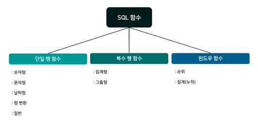
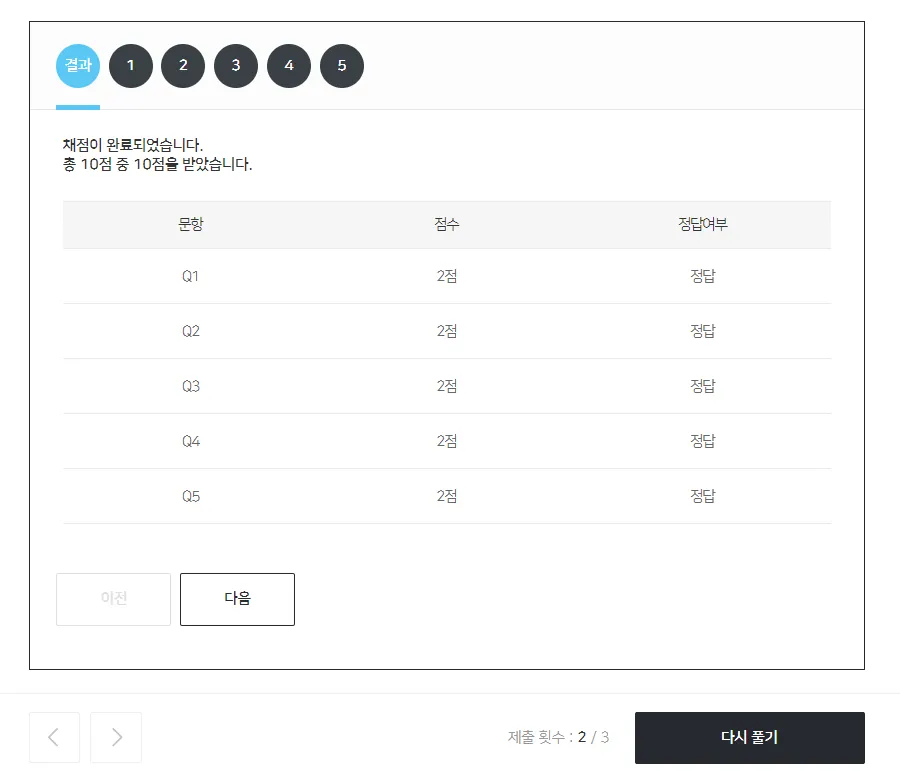

# 연산자 및 함수(1)
연산자는 비교, 논리, 특수, 산술, 집합 연산자로 나뉨
- 비교 연산자
    - = 같음
    - <> 같지않음
    - ≤, ≥,
    - <, >
- 논리 연산자
    - AND
    - NOT
    - OR
- 특수 연산자
    - (NOT) BETWEEN a AND b
    - (NOT) IN (List)
    - (NOT) LIKE ‘비교문자열’
    - IS NULL
    - IS NOT NULL
- 산술 연산자
    - *, /, +, -
- 집합 연산자
    - UNION : 2개 이상 테이블의 중복된 행들을 제거 후 집합
    - UNION ALL : 2개 이상 테이블의 중복된 행 제거 없이 집합

<br>
<br>

# 연산자 및 함수(2)
함수는 단일 및 복수 행, 윈도우 함수로 나뉘며, 특정 규칙에 의해 새로운 결과값으로 반환하는 명령어이다.


- 단일 행 함수 - 숫자형 문자형, 날짜형, 형변환, 일반 함수
    - 숫자형 함수
        - ABS : 절댓값
        - ROUND : N을 기준으로 반올림 반환
        - SQRT : 제곱근 값 반환
    - 문자형 함수
        - LOWER, UPPER
        - LEFT, RIGHT(문자, N) : 왼쪽/오른쪽부터 N개 반환
        - LENGTH(문자) : 문자길이 반환
    - 날짜형 함수
        - YEAR
        - MONTH
        - DAY
        - DATE_ADD(날짜, INTERVAL)
        - DATEIFF(날짜a, 날짜b)
    - 형변환 함수
        - DATE_FORMAT(날짜, 형식)
        - CAST(형식a, 형식b)
    - 일반 함수
        - `IFNULL(A, B)` : A가 NULL이면 B 출력, 아니면 그대로 A
        - ```sql
            CASE WHEN [조건1] THEN [반환1]
            WHEN [조건1] THEN [반환1]
            ELSE [나머지] END
            ```
- 복수 행 함수 - 집계, 그룹 함수로 나뉨
    - 집계 함수
        - COUNT
        - SUM
        - AVG
        - MAX
        - MIN
    - 그룹 함수
        - WITH ROLLUP : GROUP BY 열들을 오른쪽에서 그룹(소계, 합계)

- 윈도우 함수 - 행과 행간의 관계를 정의하여 결과값을 반환 : 순위, 집계(누적) 함수
    - 순위 함수
        - ROW_NUMBER() OVER (ORDER BY       ASC)  AS
        - RANK()                OVER (ORDER BY        ASC)  AS
        - DENSE_RANK()    OVER (ORDER BY        ASC)  AS
    - 집계 함수(누적)
        - COUNT(ORDER_NO)  OVER  (ORDER_DATE  ASC)  AS
        - SUM(ORDER_NO)  OVER  (ORDER_DATE  ASC)  AS
        - AVG(ORDER_NO)  OVER  (ORDER_DATE  ASC)  AS
        - MAX(ORDER_NO)  OVER  (ORDER_DATE  ASC)  AS
        - MIN(ORDER_NO)  OVER  (ORDER_DATE  ASC)  AS

<br>
<br>

# View 및 Procedure

- View : 하나 이상의 테이블들을 활용해서, 사용자가 정의한 가상태이블
    - JOIN 사용을 최소화 → 편의성 최대화
    - 가상테이블이기 → 중복되는 열이 저장될 수 없음
        - CREAT VIEW 테이블명 AS ← (VIEW 생성)
        - ALTER VEIW 테이블명 AS ← (VIEW수정)
        - DROP VIEW ← (VIEW삭제)

- Procedure : 매개변수를 활용해, 사용자가 정의한 작업을 저장
    - 매개변수 : IN, OUT, INOUT
        - DELIMITER //
        - CREATE PROCEDURE      (  IN     ,      )
        - BEGIN
        - 
        - 
        - END //
        - DELIMITER ;
        - 프로시저 삭제 : DROP PROCEDURE


<br>
<br>


# 데이터 마트

데이터 마트 : 분석에 필요한 데이터를 가공한 분석용 데이터

- 요약변수 : 수집된 데이터를 분석에 맞게 종합한 변수(기간별 구매금액, 횟수, 수량 등)
- 파생변수 : 사용자가 특정 조건 또는 함수로 의미를 부여한 변수(연령대, 선호 카테고리 등)
- 데이터 정합성 : 데이터가 서로 모순 없이 일관되게 일치함을 나타낼 때 사용


<br>

---
