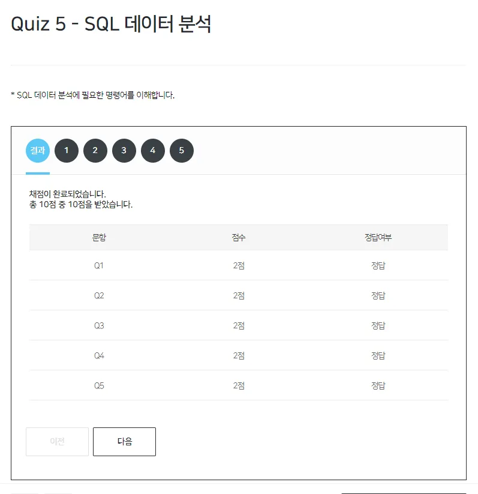

## 간단한 데이터 마트를 활용하여 분석 시작하기
```sql
CREATE TABLE CUSTOMER_PROFILE AS 가입연월
SELECT
    A.*,
    DATE_FORMAT(JOIN_DATE, ‘%Y-%m) AS 가입연월,
    CASE WHEN 2021 - YEAR(BIRTHDAY) + 1 < 20 THEN ‘10대 이하’,
        WHEN 2021 - YEAR(BIRTHDAY) + 1 < 30 THEN ‘20대 이하’,
        WHEN 2021 - YEAR(BIRTHDAY) + 1 < 40 THEN ‘30대 이하’,
        WHEN 2021 - YEAR(BIRTHDAY) + 1 < 50 THEN ‘40대 이하’
        ELSE
            ‘50대 이상’
        END AS 연령대,
    CASE WHEN B.MEN_NO IS NOT NULL THEN ‘구매’
    ELSE
        ‘미구매’
    END AS 구매여부

FROM
    CUSTOMER AS A
LEFT JOIN(
    SELECT DISTINCT
        MEN_NO
    FROM
        SALES
    ) AS B ON A.MEN_NO = B.MEN_NO;
```

### 가입연월별 회원수
```sql
SELECT
    가입년월,
    COUNT(MEN_NO) AS 회원수
FROM
    CUSTOMER_PROFILE
GROUP BY
    가입년월;
```

### 성별 평균 연령 / 성별 및 연령대별 회원수
```sql
SELECT
    GENDER AS 성별,
    AVG(나이) AS 평균나이
FROM
    CUSTOMER_PROFILE
GROUP BY
    GENDER;
```
```sql
SELECT
    GENDER AS 성별,
    연령대,
    COUNT(MEN_NO) AS 회원수
FROM
    CUSTOMER_PROFILE
GROUP BY
    GENGER,
    연령대
ORDER BY
    GENDER,
    연령대;
```

### 성별 및 연령대별 회원수
```sql
SELECT
    GENDER AS 성별,
    연령대,
    구매여부,
    COUNT(MEN_NO) AS 회원수
FROM
    CUSTOMER_PROFILE
GROUP BY
    GENDER,
    연령대,
    구매여부
ORDER BY
    구매여부,
    GENDER,
    연령대;
```

<br>
<br>

# RFM분석
- Recency 최근성
- Frequency 구매빈도
- Monetary 구매금액

```sql
CREATE TABLE RFM AS
SELECT
    A.*,
    B.구매금액,
    B.그매횟수
FROM
    CUSTOMER AS A
LEFT JOIN(
    SELECT
        A.MEN_NO,
        SUM(A.SALES_QTY  B.PRICE) AS 구매금액,
        COUNT(A.ORDER_NO) AS 구매횟수
    FROM
        SALES AS A
    LEFT JOIN
        PRODUCT AS B ON A.PRODUCT_CODE = B.PRODUCT_CODE
    WHERE
        YEAR(A.ORDER_DATE) = ‘2020’
    GROUP BY
        A.MEN_NO
    ) AS B ON A.MEN_NO = B.MEN_NO;
SELECT
    *
FROM
    RFM;
```

### RFM 세분화별 회원수
```sql
SELECT
    *,
    CASE WHEN 구매금액 > 5000000 THEN ‘VIP’
    WHEN 구매금액 > 1000000 OR 구매횟수 > 3 THEN ‘우수회원’
    WHEN 구매금액 > 0 THEN ‘일반회원’
    ELSE ‘잠재회원’
    END AS 회원세분화
FROM RFM;
```
```sql
SELECT
    회원세분화,
    COUNT(MEM_NO) AS 회원수
FROM(
    SELECT
        *,
        CASE WHEN 구매금액 > 5000000 THEN ‘VIP’
        WHEN 구매금액 > 1000000 OR 구매횟수 > 3 THEN ‘우수회원’
        ELSE ‘잠재회원’
        END AS 회원세분화
    FROM RFM
    ) AS A
GROUP BY
    회원세분화
ORDER BY
    회원수 ASC ;
```
### RFM 세분화별 매출액
```sql
SELECT
    회원세분화,
    SUM(구매금액) AS 구매금액
FROM(
    SELECT
        *,
        CASE WHEN 구매금액 > 5000000 THEN ‘VIP’
        WHEN 구매금액 > 1000000 OR 구매횟수 > 3 THEN ‘우수회원’
        ELSE ‘잠재회원’
        END AS 회원세분화
    FROM
        RFM
    ) AS A
GROUP BY
    회원세분화
ORDER BY
    회원수 ASC ;
```

### RFM 세분화별 인당 구매금액
```sql
SELECT
    회원세분화,
    SUM(구매금액) / COUNT(MEM_nO) AS 인당 구매금액
FROM(
    SELECT
        *,
        CASE WHEN 구매금액 > 5000000 THEN ‘VIP’
        WHEN 구매금액 > 1000000 OR 구매횟수 > 3 THEN ‘우수회원’
        ELSE ‘잠재회원’
        END AS 회원세분화
    FROM RFM
    ) AS A
GROUP BY
    회원세분화
ORDER BY
    회원수 ASC ;
```

### 재구매율 및 구매주기 분석
```sql
CREATE TABLE RE_PU_CYCLE AS
SELECT
    *,
    CASE WHEN DATE_ADD(최초구매일자, INTERVAL +1 DAY) ≤ 최근구매일자 THEN ‘Y’
    ELSE ‘N’ END AS 재구매여부,
    DATEEIFF(최근구매일자, 최초구매일자) AS 구매간격,
    CASE WHEN 구매횟수 -1 = 0 OR DATEDIFF(최근구매일자, 최초구매일자) = 0 THEN 0
    ELSE DATEDIFF(최근구매일자, 최초구매일자) / (구매횟수 - 1)
    END AS 구매주
FROM(
    SELECT
        MEM_NO,
        MIN(ORDER_DATE) AS 최초구매일자,
        MAX(ORDER_DATE) AS 최근구매일자,
        COUNT(ORDER_NO) AS 구매횟수
    FROM
        SALES
    WHERE
        MEM_NO <> ‘9999999’
    GROUP BY
        MEM_NO
    ) AS A ;
```
```sql
SELECT
    *
FROM
    RE_PUR_CYCLE ;
```
```sql
/* 회원(1000021)의 구매정보 */
/* 최초구매일자: 2019-05-21 / 최근구매일자: 2019-05-07 / 구매횟수: 3 */
SELECT
    *
FROM
    RE_PUR_CYCLE
WHERE
    MEM_NO = ‘1000021’ ;
```
```sql
SELECT
    *
FROM
    SALES
WHERE
    MEM_NO = ‘1000021’ ;
```

### 재구매 회원수 비중(%)
```sql
SELECT
    COUNT(DISTINCT MEM_NO) AS 구매회원수,
    COUNT(DISTINCT CASE WHEN 재구매여부 = ‘Y’ THEN MEM_NO END) AS 재구매회원수
FROM
    RE_PUR_CYCLE ;
```

### 평균 구매주기 및 구매주기 구간별 회원수
```sql
SELECT
    AVG(구매주기)
FROM
    RE_PUR_CYCLE
WHERE
    구매주기 > 0 ;
```
```sql
SELECT
    *,
    CASE WHEN 구매주기 ≤ 7 THEN ‘7일 이내’
    WHEN 구매주기 ≤ 14 THEN ‘14일 이내’
    WHEN 구매주기 ≤ 21 THEN ‘21일 이내’
    WHEN 구매주기 ≤ 28 THEN ‘28일 이내’
    ELSE ‘29일 이후’
    END AS 구매주기_구간
FROM
    RE_PUR_CYCLE
WHERE
    구매주기 > 0 ;
```
```sql
SELECT
    구매주기_구간,
    COUNT(MEM_NO) AS 회원수
FROM(
    SELECT
        *,
        CASE WHEN 구매주기 ≤ 7 THEN ‘7일 이내’
        WHEN 구매주기 ≤ 14 THEN ‘14일 이내’
        WHEN 구매주기 ≤ 21 THEN ‘21일 이내’
        WHEN 구매주기 ≤ 28 THEN ‘28일 이내’
        ELSE ‘29일 이후’
        END AS 구매주기_구간
    FROM
        RE_PUR_CYCLE
    WHERE
        구매주기 > 0
    ) AS A
GROUP BY
    구매주기_구간 ;
```

### 제품 성장률 분석
```sql
CREATE TABLE PRODUCT_GROWTH AS
SELECT
    A.MEM_NO,
    B.CATEGORY,
    B.BRAND,
    A.SALES_QTY * B.PRICE AS 구매금액,
    CASE WHEN DATE_FORMAT(ORDER_DATE, ‘%Y-%m’)
        BETWEEN ‘2020-01’ AND ‘2020-03’ THEN ‘2020_1분기’
    WHEN DATE_FORMAT(ORDER_DATE, ‘%Y-%m’)
        BETWEEN ‘2020-04’ AND ‘2020-06’ THEN ‘2020_2분기’
    END AS 분기
FROM
    SALES AS A
LEFT JOIN
    PRODUCT AS B ON A.PRODUCT_CODE = B.PRODUCT_CODE
WHERE
    DATE_fORMAT(ORDER_DATE, ‘%Y-%m’) BETWEEN ‘2020-01’ AND ‘2020-06’ ;

SELECT
    *
FROM
    PRODUCT_GROWTH ;
```

### 카테고리별 구매금액 성장률(2020년 1분기 → 2020년 2분기)
```sql
SELECT
    *,
    (2020_2분기_구매금액 / 2020_1분기_구매금액) - 1 AS 성장률
FROM(
    SELECT
        CATEGORY,
        SUM(CASE WHEN 분기 = ‘2020_1분기’ THEN 구매금액 END) AS 2020_1분기_구매금액,
        SUM(CASE WHEN 분기 = ‘2020_1분기’ THEN 구매금액 END) AS 2020_1분기_구매금액
    FROM
        PRODUCT_GROWTH
    GROUP BY
        CATEGORY
    ) AS A
ORDER BY
    4 DESC ;
```

### Beauty 카테고리 중, 브랜드별 구매지표
```sql
SELECT
    BRAND,
    COUNT(DISTINCT MEN_NO) AS 구매자수,
    SUM(구매금액) AS 구매금액_합계,
    SUM(구매금액) / COUNT(DISTINCT MEM_NO) AS 인당_구매금액
FROM
    PRODUCT_GROWTH
WHERE
    CATEGORY = ‘beaty’
GROUP BY
    BRAND
ORDER BY
    4 DESC ;
```


<br>
<br>

---



