# 11장. 베이즈 통계

### 11.1 베이즈 통계의 사고방식
- 빈도주의에서 다룬 불확실성 → 모집단에서 표본을 추출할 때의 불확실성
- 베이즈 통계 → 확률을 “얼마나 확신하는지”로 해석하는 원리
    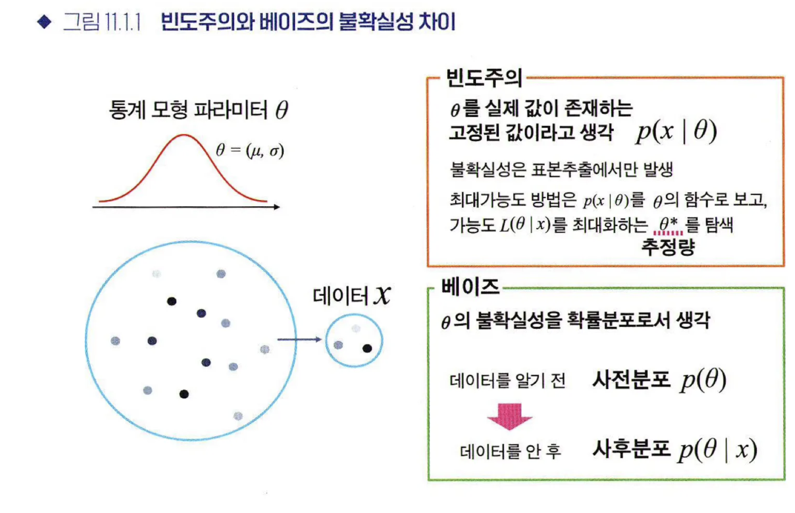
    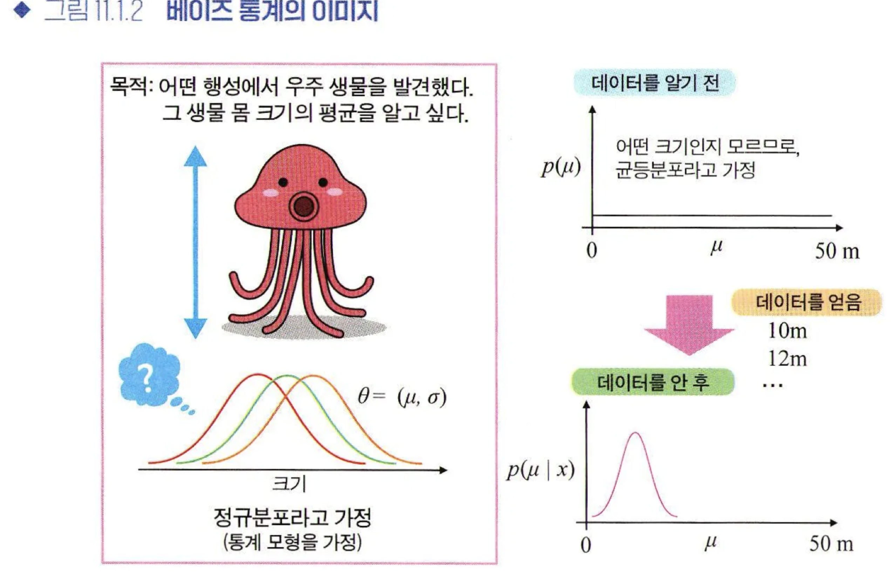

- 통계모형
    - 데이터의 발생원인 모집단의 실제 분포q(x)를 아는 것.
    - 통계적 추론(statistical inference)
    - 데이터를 이용해 추정한 통계모형 p(x)가 모집단의 실제 분포 q(x)와 어느 정도 들어맞는지를 정량화함으로써, 통계모형 p*(x)의 적합도를 평가할 수 있다.

- 베이즈 통계의 사고방식
    - 통계모형의 파라미터 세타를 확률변수로 취급하여, 그 확률분포를 생각함
    - p(x | 세타), 사전분포 p(세타)를 마련해두고, 사후분포 p(세타 | x)를 구하는 것이 바로 베이즈 통계에서의 추정임.
    - 베이즈 정리
    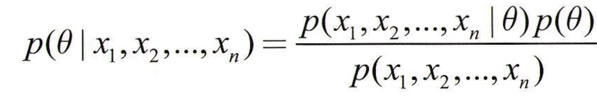

- 베이즈 통계의 이점
    - 추정 결과, 통계 모형의 파라미터를 분포로 얻을 수 있다는 점
    - → 가정한 통ㅇ계모형과 사전분포, 얻은 데이터를 이용하여 “파라미터가 이 범위에 있을 확률은 몇 %”와 같이 정량적 평가가 가능
    - MCMC 방법이 난수를 발생시켜 시뮬레이션으로서 사후분포를 따르는 파라미터를 얻기 때문에 복잡한 모형화가 가능함
        - 단, MCMC 방법은 난수를 이용한 시뮬레이션의 일종으로, 완전 동일한 데이터에 대해 똑같은 해석을 수행해도 그 해석 결과가 조금씩 달라지게 됨
        - 추정이 잘 되었을 때는 거의 무시해도 될 정도로 결과의 차이가 작지만, 모형의 가정이 부적절하거나 기타 사유로 분포를 제대로 파악하지 못하는 일도 있으므로 주의 필요

### 11.2 베이즈 통계 알고리즘

- MCMC 방법
    - Markov Chain Monte Carlo method
    - 특정 확률분포를 따르는 난수 발생 알고리즘
    - 이것을 이용해 사후분포를 따르는 난수를 발생시키고, 그 난수의 집합을 관찰함으로써 사후분포의 성질을 분석
    - 몬테카를로 분석 : 난수를 여러개 발생시켜 시뮬레이션해 근사값을 얻는 방법
    - 마르코프 연쇄 : 어떤 상태에서 다른 상태로 변화하는 현상을 확률로 표현한 모형의 일종
- MCMC 방법의 예
    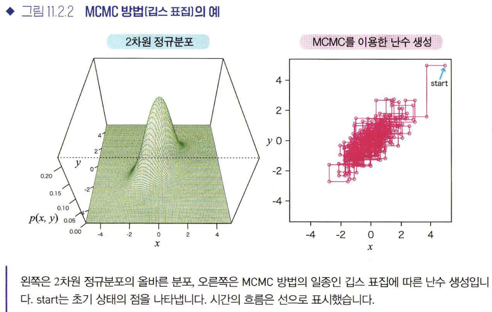
    - 깁스 표집(Gibbs sampling) : 구체적인 계산은 한쪽 변수를 고정한 뒤, 고정하지 않은 변수를 확률적으로 움직이는 작업을 번갈아 반복하는 순서로 이루어짐

### 11.3 베이즈 통계 사례
- 이표본 평균값 비교
    - 고혈압 환잔 20명 2집단으로 나누고 신약vs.위약 투여 → 신약 효과 평가
    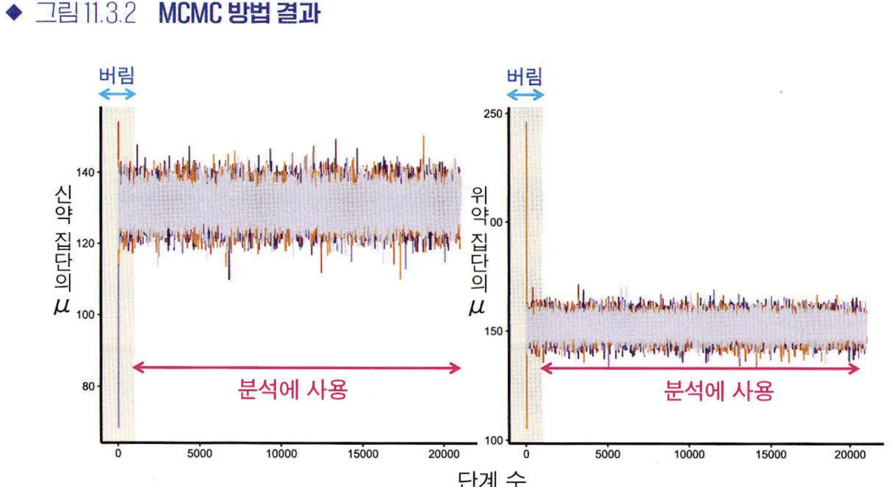
    - 사후기댓값(EAP, expected aposteriroi)이나 사후최빈값(MAP, maximum a posteriori probability)을 계산할 수 있다. 또 점추정이 아니라 폭을 이용해 추정해 (1-alpha)% 신뢰구간 또는 확신구간(CI, credible interval)을 얻을 수도 있음
    - alpha=0.05라면 95% 신뢰구간으로, 추정 결과 95% 확률로 통계 모형의 파라미터는 이 범위에 있음을 나타내는 것임

 
 
 

# 12장. 통계분석과 관련된 그 밖의 방법

### 12.1 주성분분석
- 변수의 차원
    - ‘차원이 높다’고 하면 정보량이 많으니 얼핏 좋은 것처럼 생각되지만, 실은 ‘쓸데없이 많기만’한 상황이 종종 발생.
    - 최대한 줄이는 것이 좋음
        - 고차원 데이터 해석의 어려움이 존재하기 때문
        - 다중회귀분석에서는 설명변수끼리 강한 상관이 있는 상황을 다중공선성이 있다고 하며, 회귀계수 추정이 불안정해지는 문제가 발생
        - 차원의 저주 : 표본크기 n이 충분하지 않은 상황이라면, 회귀계수를 올바르게 추정할 수 없는 문제가 생김
- 주성분분석(PCA, Principal Component Analysis)
    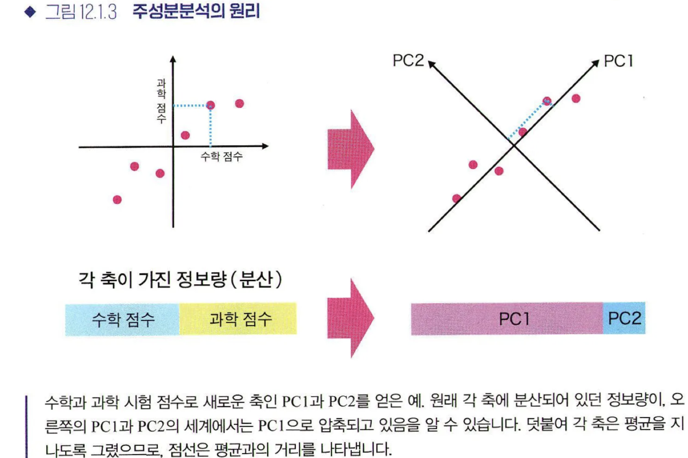
    - 기여율 : 각 주성분이 가진 정보(분산)의 비율
    - 누적기여율 : ‘제1부터 제k주성분까지 전체 정보의 몇 %가 포함되는지’
    

- 인자분석 : 각 변수에는 소수의 공통인자가 있으며, 이것이 원인이 되어 데이터의 각 변수가 구성되는 아이디어에 기반을 둔 방법
    - 분석 자체는 관측한 변수 사이의 상관관계에 기반을 두므로, 데이터에서 인과관계를 발견할 수 없다는 점에 주의

### 12.2 기계학습 입문

- 비지도 학습, 지도학습, 강화학습 종류가 있음
    
- 통계학 vs. 기계학습
    - 기계학습(지도학습)은 대량의 데이터를 대상으로 하고 예측을 중시하는 경향
    - 통계학의 선형회귀는 절편과 기울기를 가진 단순한 모형을 이용
    - 한편, 기계학습 모형은 복잡하여 대개 모형을 해석하기 쉽지 않음

### 12.3 비지도 학습
- 정답 데이터가 없으며, 데이터의 배후에 있는 구조를 올바르게 추출하려는 목적
- 군집 분석(Cluster analysis) : 각 데이터가 어느 군집에 속하는지 구하는 방법
    - k-means : 군집 개수 k를 정하며 시작. 각 데이터에 무작위로 군집을 할당하고, 각 군집의 중심 위치를 구함 → 데이터마다 가장 근접한 군집을 할당하고 중심 위치를 다시 계산
    - hierarchical clustering : 모든 데이터가 다른 군집에 속하는 상태에서 시작. 가장 거리가 가까운(비슷한) 군집끼리 순서대로 합쳐 나감 (feat. Dendrogram)
    - 결과에는 분석자의 자의성이 개입됨

### 12.4 지도 학습
- 특정 x값일 때, y가 어떤 값이 되는지에 관한 데이터를 바탕으로 그 관계를 학습해 나가는(함수를 구하는) 방법
    - 계산 방법은 모형의 출력과 실제 y의 차이를 **손실함수**로 정식화하고, 이를 최소화하는 파라미터를 구하는 것이 됨
    - 반응변수 y가 양적 변수 → Regression(회귀)
    - 반응변수 y가 질적 변수(범주형) → Classification(분류)

- 예측과 교차검증
    - 예측 : 동일 조건에서 얻을 수 있는 미지의 데이터에 대해 설명변수 x로 반응변수 y를 예측하는 것
    - 교차검증 : 한쪽 데이터를 사용해 학습을 진행하고, 나머지 한쪽 데이터는 예측이 얼마나 좋은지 평가하는 데 이용
    - Leave-one-out 교차검증 : k-means 교차검증에서 k=1인 경우, 데이터 하나만을 골라 검증 데이터로, 나머지는 전부 학습데이터로 삼는 방법.

- 과대적합(Overfiting) : 학습 데이터에 대한 예측 성능은 높지만, 검증 데이터에 대한 예측 성능은 낮을 때.
    - 모형의 복잡도를 조정하는 요소를 손실함수에 도입할 때가 있는데, 이를 정칙화(regularization)이라고 함

- 예측 성능 측정 (1) “이진 클래스 분류”
    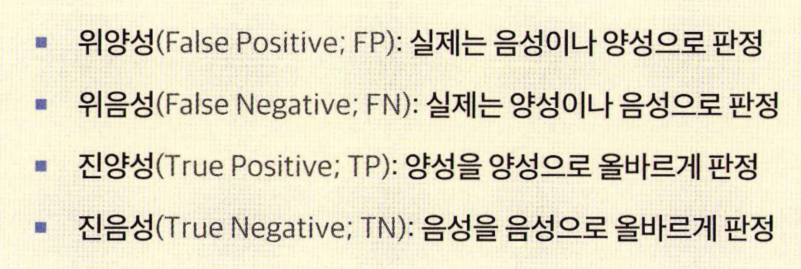    
    - 민감도(Sensitivity or Recall) : 양성을 양성이라 올바르게 판정할 비율
    - 특이도(Specificity) : 음성을 음성이라 올바르게 판정할 비율
    - 양성 적중률(Positive predictive value) : 양성이라 판정한 것이 실제 양성일 비율
    - 음성 적중률(Negative predictive value) : 음성이라 판정한 것이 실제 음성일 비율
    - 정답률(Accuracy) : 모든 판전 중 올바르게 예측한 것의 비율
    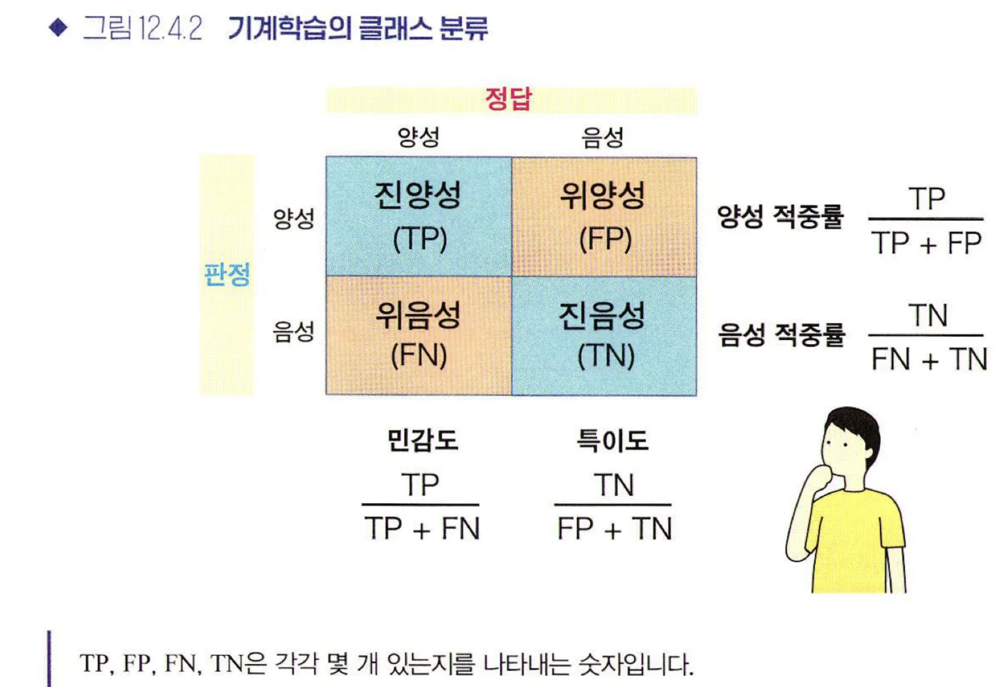    
    - 일반적으로 “민감도”와 “특이도”는 상충관계임

- ROC 곡선과 AUC
    - ROC(Receiver Operating Characteristic) 곡선 : 1-특이도를 가로축으로, 민감도를 세로축으로 하여 그려지는 곡선
    - AUC(Area Under te Curve) : ROC곡선 결과를 하나의 숫자로서 나타낼 때는, ROC 아랫부분의 넓이를 이용함
    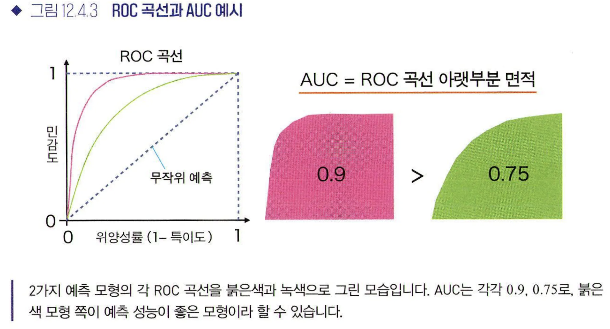

- 예측 성능 측정 (2)  “회귀”
    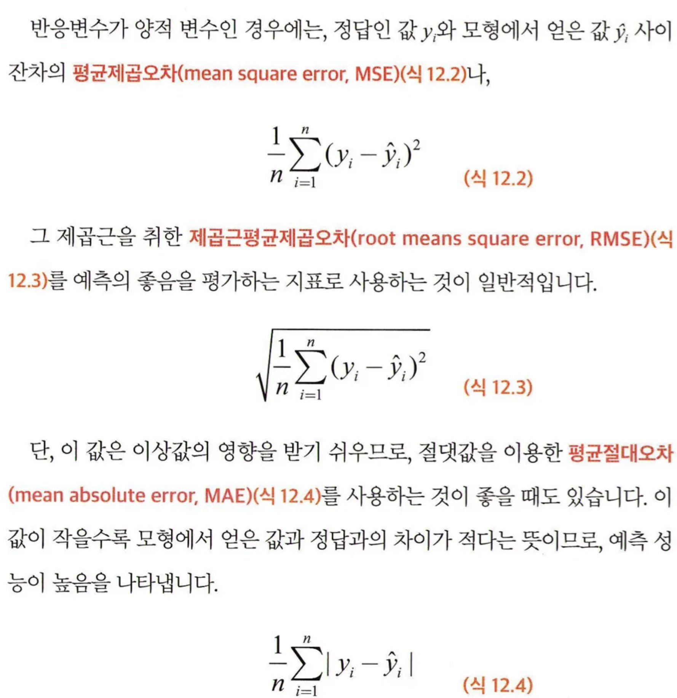

- 로지스틱 회귀 : 선형모형으로, 단순한 분류만 가능한 선형분류기
- 결정트리와 랜덤 포레스트
    - Decision Tree : 설명변수에 대해 x_i > 10이라면 가지A, 그렇지 않다면 가지B와 같은 조건 분기로 트리 구조를 만들어 데이터를 분류하는 방법. 분석 시, 미리 트리의 깊이를 지정해야 함
    - Random Forest : 결정 트리의 예측 성능을 향상시키기 위해 여러 개의 결정 트리를 구성하고, 이를 다수결로 수행하는 방식
- SVM (Support Vector Machine) : 각 데이터 점과의 거리가 최대가 되는 경계를 구하는 방법. → 데이터를 커널함수를 이용하여 변환함으로써, 비선형 분류도 가능함

- 신경망(Neural Network, 딥러닝)
    - 신경망 : 뇌의 신경세포(뉴런)의 네트워크를 인공적으로 구성한 모형.
    - → 여러 로지스틱 회귀의 출력이 또 다른 로지스틱 회귀의 입력이 되는 모형

- 분리의 특징
    - 선형분리가 가능한 문제
    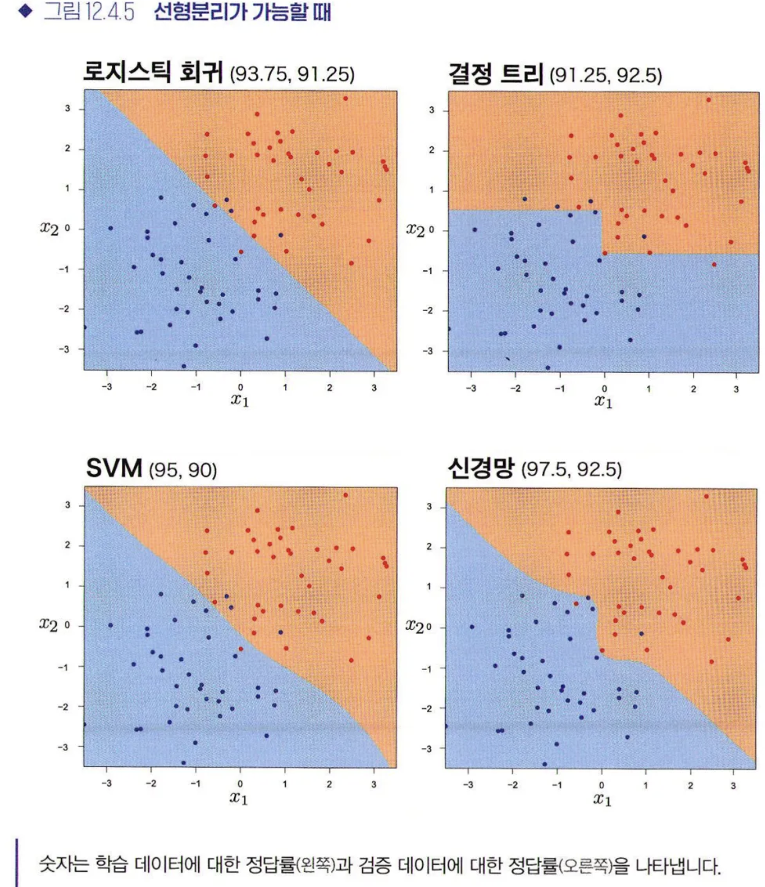

    - 선형분리가 불가능한 문제
    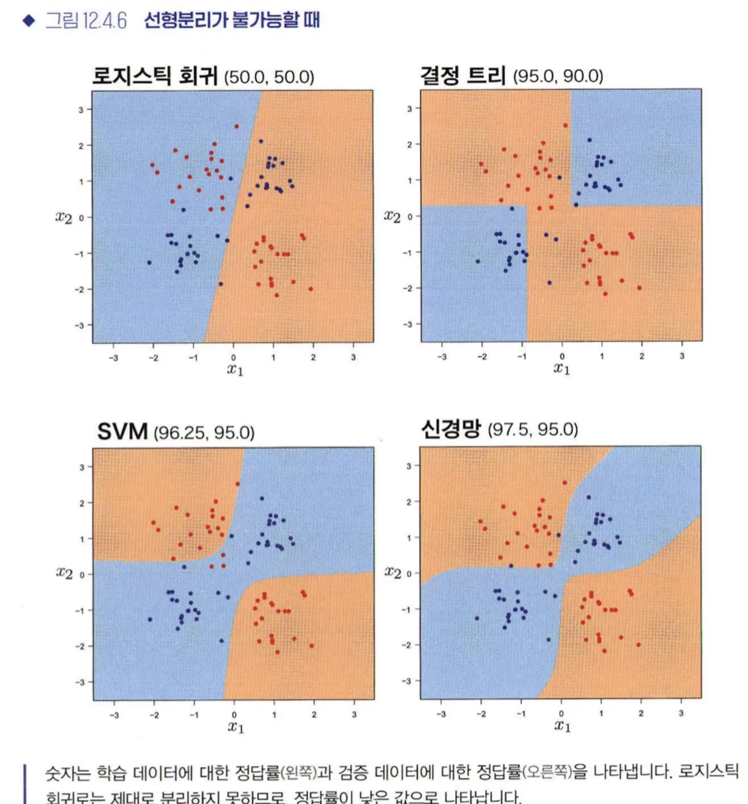

