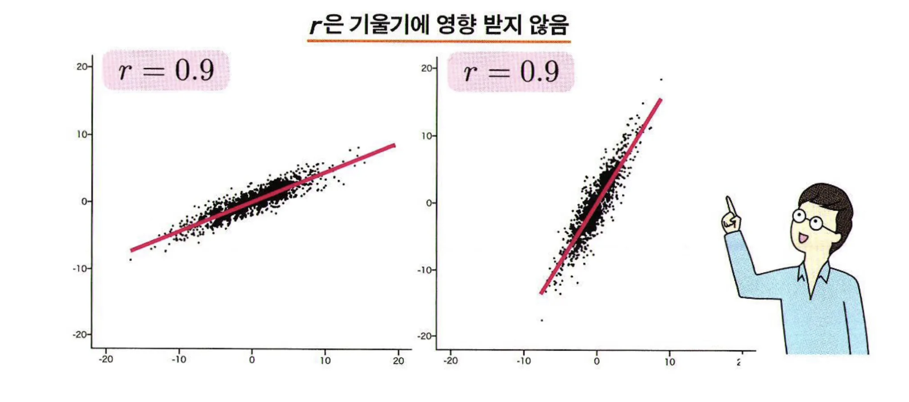
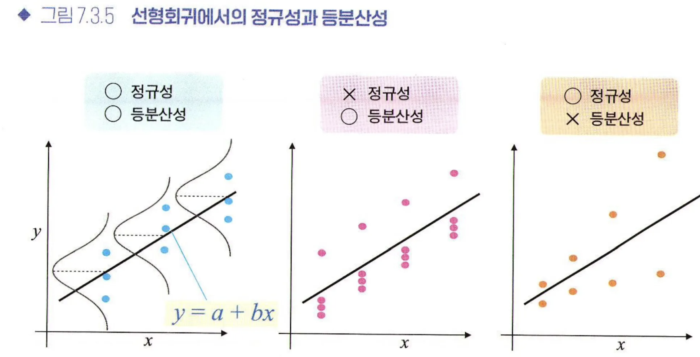
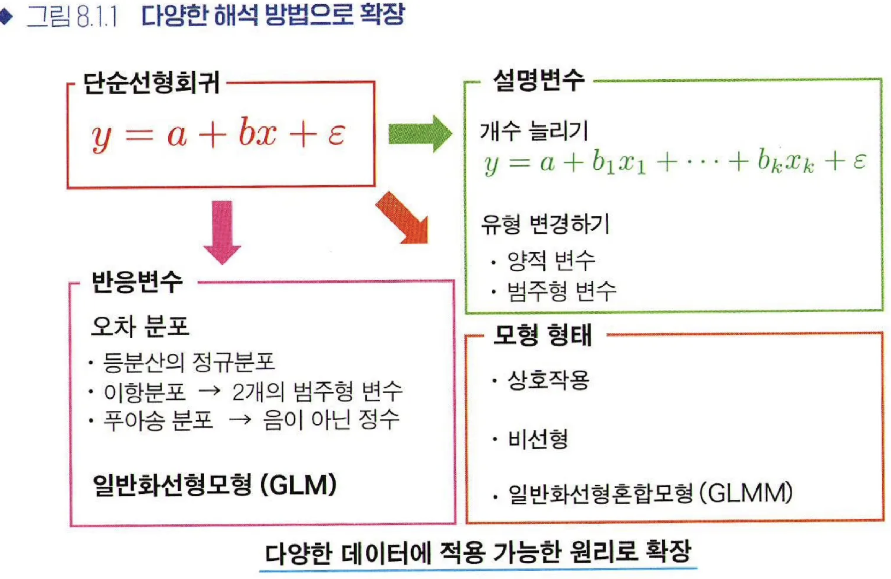
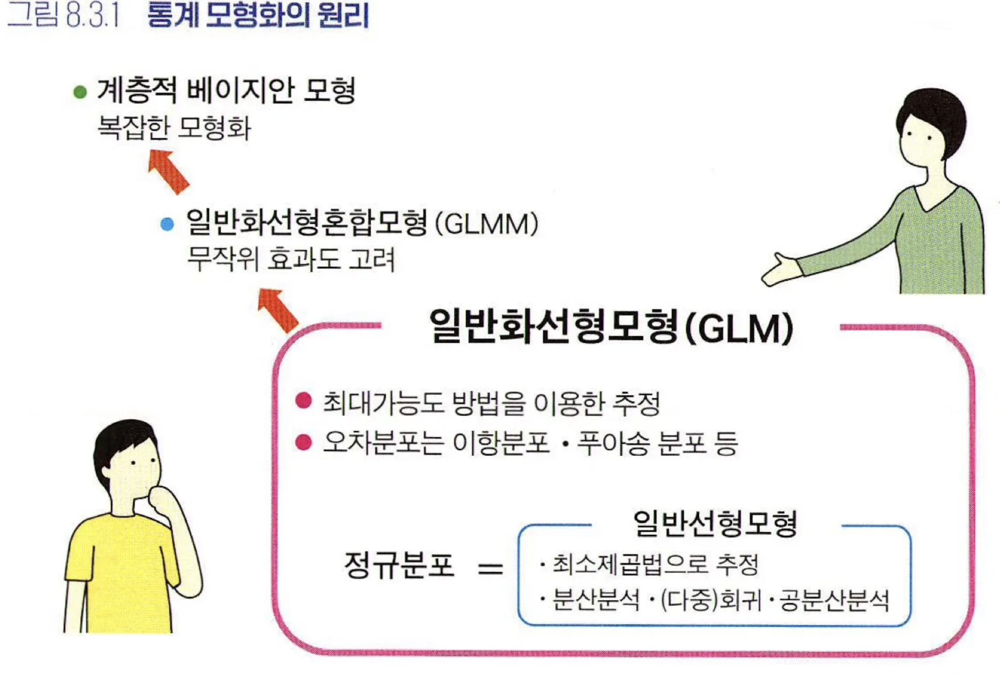
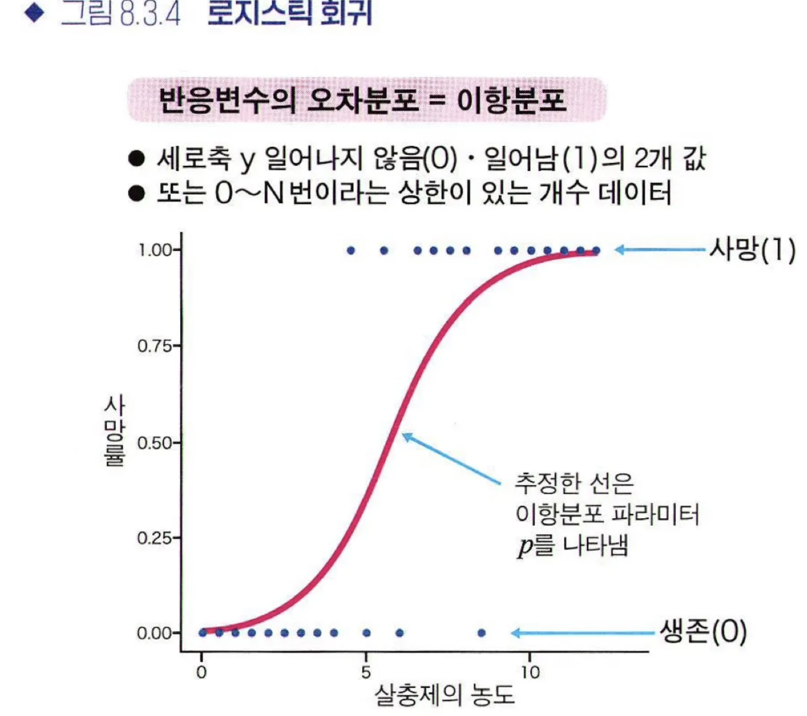
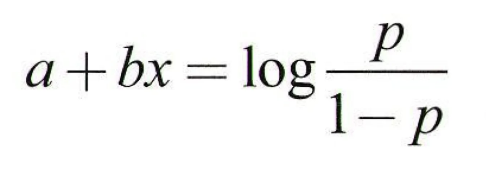
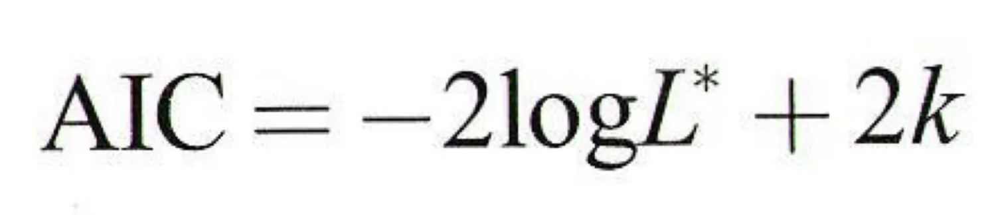
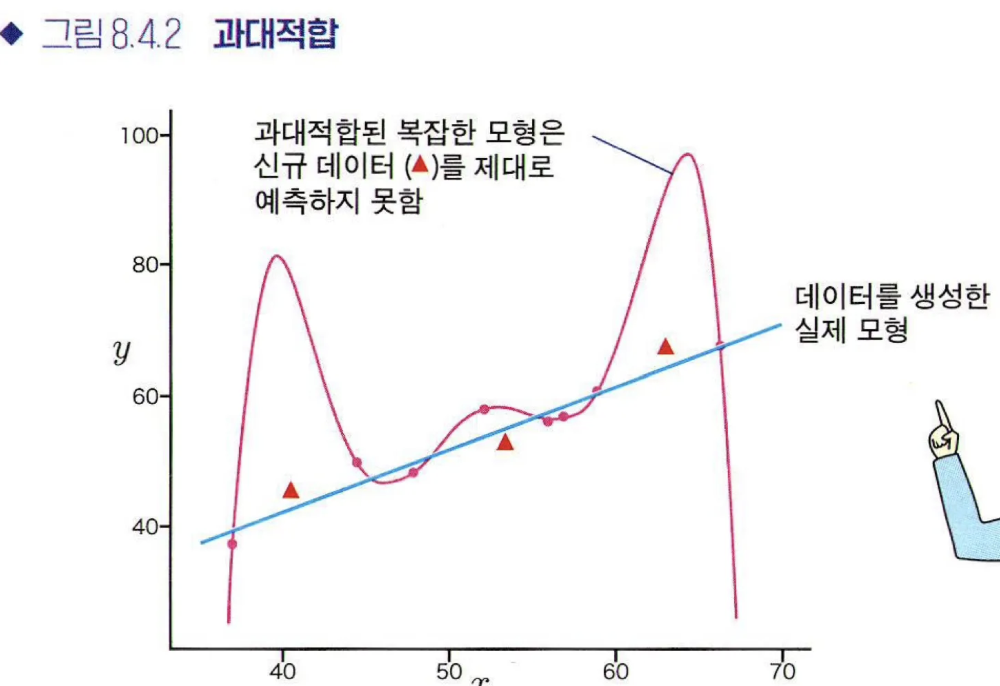
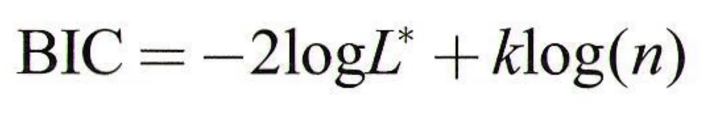

# 7장. 상관과 회귀

### 7.1 양적 변수 사이의 관계를 밝히다
- 상관
    - 2개의 변수 사이의 관계성을 상관(correlation)이라고 함.
    - 산점도(scatter plot)는 상관관계를 나타내는 그래프의 한 종류
    - 두 데이터 간 상관이 있다고 해서 원인과 결과를 뜻하는 것은 아님
- 회귀
    - X : 설명변수 or 독립변수
    - y : 반응변수 or 종속변수
    - y = f(X) + 앱실론(확률오차)
    - y = a + bX + 앱실론

### 7.2 상관관계
1. 피어슨의 상관계수(Pearson’s correlation coeifficient r)
    - -1 ≤ r ≤ 1, 선형관계가 얼마나 직선관계에 가까운지…
    - r이 양수 → 양의 직선관계
    - r이 음수 → 음의 직선관계
    - 0.7~1 → 강한 상관관계
    - 0.4~0.7 → 중간정도 상관관계
    - 0.2~0.4 → 약한 상관
    - 0.0~0.2 → 거의 상관없음
    - r은 기울기에 영향받지 않음
    
    - r을 계산만 하고 “전형적인 직선 산점도”라고 짐작하는 것음 매우 위험

2. 스피어만 순위상관계수 로 (Spearman’s rank correlation coeifficient 로)
    - -1 ≤ 로 ≤ 2
    - 켄달 순위상관계수 ?? (Kendal’s rank correlation coeifficient ??)

3. 비모수 상관계수
    - x축, y축 중 적어도 하나 이상에 정규성이 없을 때는, 비모수 상관계수인 스피어만 순위상관계수 ‘로’ 사용이 권장됨

4. 상관관계 주의사항
    - 2개 변수가 처음부터 종속관계라면, 관계성에 주의를 기울여야함.

### 7.3 선형회귀

회귀식 y =f(X)를 얻을 수 있다면,
- 설명변수와 반응변수 사이의 관계성을 알 수 있음
- 새롭게 얻은 설명변수에 의거한 반응변수 예측도 가능

 

- 설명변수 1개 → 단순회귀 ( y = a + bX)
- 설명변수 2개 이상 → 다중회귀
이때 a, b는 “회귀계수”(regression coefficinet)

 

모형의 성능평가 기준  = 최소제곱법
- 데이터에 가능한 한 들어맞는 회귀모형 = 좋은 모형    
    = “데이터와 회귀식의 차이가 가능한 한 작은”
- 잔차 : y햇 - y → 모두 더해 E를 구하고 E가 크면 Bad, 작으면 Good 모델

 

회귀계수
- 최량선형비편향추정량 : 최소제곱법으로 얻은 추정량은 가장 정밀도가 높음(분산이 작은)
- 회귀계수의 가설검정
    - 95% 신뢰구간
        - 모집단의 회귀계수를 추정
    - 95% 예측구간
        - 추정한 회귀모형을 기반으로 데이터 그 자체가 분포하는 구간을 그릴 수 있음

 

결정계수 R^2 (coefficinet of determination, R-squared)
- R^2 = (피어슨 상관계수 r)^2
- 1에 가까울수록 잘 들어맞음을 의미

 

오차의 등분산성

- 브루쉬-페이건 검정(Breusch-Pagon test, BP검정) 이용

 
 
 

# 8장. 통계 모형화

### 8.1 선형회귀 원리의 확장

- 설명변수 - 개수 늘리기 or 유형 변경하기
- 반응변수 - 유형 변경하기
- 회귀모형 - 형태 변형(상호작용, 비선형, 일반화선형혼합모형)

- 다중회귀 : 설명변수(X)가 여러 개인 회귀모델
- #편회귀계수 (partial regression coefficient)

#### 편회귀계수
- 회귀분석에서 구한 편회귀계수는 설명변수(X)의 데이터 퍼짐 정도나 단위에 따라 크게 달라지기 때문에 편회귀계수끼리 비교 불가능
- 따라서,  “표준화편회귀계수” 이용.
    - 회귀분석을 시행하기 전, 각각의 설명변수 평균0, 표준편차1로 변환
    - 회귀분석을 시행한 후, 구한 회귀계수

#### 범주형 변수 → 설명변수(X)로 이용할 경우
- 가변수(dummy variable)를 설명변수로 사용
- ‘운동이 좋다’ = 1, ‘운동이 싫다’ = 0
- 범주가 3개 이상일 경우는?
    - {범주의 개수-1}개의 가변수 준비
    - 000, 001, 010, 100 4가지를 각 범주에 할당

#### 공분산분석(ANOCOVA, analysis of covariance)
- 일반적인 분산분석에 사용하는 데이터와 함께 양적 변수 데이터가 있는 경우에 후보가 되는 방법
- 새로 추가한 양적 변수 : 공변량(covariate)
- 공분산분석 사용조건
    - 집단 간 회귀의 기울기가 서로 다르지 않다.
    - 회귀계수가 0이 아니어야 함

#### 고차원 데이터 문제
- 차원이 늘어날수록 파라미터 추정에 필요한 데이터 양이 폭발적으로 증가함.

#### 다중공선성
- 셜명변수(X)가 여러 개인 다중회귀에서 설명변수 사이에 강한 상관이 있는 경우, 다중공선성(multicollinearity)이 있다고 말함.
- 다중공선성을 측정하려면, 분산팽창인수 VIF(Variance inflation factor)을 계산해야 함.
    - VIF>10 이면, 2개 사이의 상관이 아주 강한 것

 

### 8.2 회귀모형의 형태 바꾸기

#### 상호작용
- 설명변수 간의 상승효과를 **상호작용**이라고 하며, 선형회귀모형안에서 곱셉으로 도입할 수 있다.
- 상호작용항을 넣는 적절한 시기
    - 상호작용이 있다는 것이 선행연구에서 밝혀지거나 기대되는 때
    - 데이터에 분명한 상호작용이 있을 때
    - 상호작용 유무에 관심이 있을 때

#### 이원배치 분산분석
- 2개의 요인을 고려함
    - 줄기길이(y)
    - 비료있음/없음(X_1)
    - 저온/고온(X_2)

 

### 8.3 일반화선형모형의 개념

- cf. 일반선형모형(general linear model) : 다중회귀(X:양적변수), 분산분석(X:범주형변수)
- 일반화선형모형 : 최소제곱법이 아닌 확률분포에 기반한 최대가능도 방법(최대우도법)으로 추정

- GLM, Generalized Linear Model

 

통계 모형화 : 데이터 성질을 고려하면서 확률 모형을 가정하고, 파라미터를 추정하여 모형을 평가하는 일련의 작업

 

- 로지스틱 회귀(Logistic regression)
    - 범주 하나가 일어날 확률을 p로 두고, 설명변수 x가 바뀌었을 때 p가 얼마나 달라지는 지 조사
    

- 로지스틱 회귀에 사용한 이산형 확률분포 **“이항분포”**
    - 확률 p, 시행횟수N, 평균 Np, 분산 Np(1-p)

- 로지스틱 함수
    
    - 우변 : 로짓 함수(logit function)
    - 좌변 : 선형예측변수
- 오즈비 (OR, odds ratio)
- 포아송 회귀(Poisson regression)
    - 데이터가 음수가 되지 않는 정수일 때, 특히 반응변수가 개수인 경우 고려해볼 수 있는 일반화선형모형
    - 낮은 확률로 일어나는 무작위 사건에 대해, 평균이 ㅅ번일 때 몇 번 일어나는지를 나타내는 확률분포

### 8.4 통계 모형의 평가와 비교

#### 왈드 검정
- 일반화선형모형에서도 추정한 회귀계수를 가설검정할 수 있다.
- 추정값의 데이터 퍼짐을 나타내는 표준오차를 이용하여,
- 최대가능도 방법으로 얻은 추정값/표준오차를 왈드 통계량
- 최대가능도 추정량이 정규분포를 따른다고 가정하면, 왈드 통계량을 이용하여 신뢰구간이나 p값을 얻을 수 있는데, 이를 왈드 검정(Wald test)라고 함

#### 가능도비 검정
- 최대가능도 방법으로 얻은 통계모형을 비교하는 방법
- 모형이 데이터에 맞도록 잘 개선되었는지 확인
- 비교할 2개의 모형 중 어느 한쪽이 다른 한쪽을 포함하는 관계여야 함
- 부트스트랩 방법 : 어떤 가정하에 무작위로 데이터를 생성하고 추정량의 성질을 조사하는 방법

#### AIC
- AIC(아카이케 정보기준, Akaike information criterion)
- 새롭게 얻을 데이터를 얼마나 잘 예측할 수 있는지를 바탕으로 모형의 좋음 결정하는 지표

- 파라미터 k의 개수가 많은 모형일수록 “모형의 복잡함”
- k 개수가 작을수록 AIC가 작아짐 → 단순해짐

- 실제 데이터에 무리하게 맞추는 바람에, 새롭게 얻은 데이터는 제대로 나타내지 못하는 상태를 과대적합(overfitting)이라고 함

#### BIC
- 베이즈 정보기준, Bayesian information criterion

- 이 값을 최소하하는 것이 좋은 모형이라고 봄
- AIC와 마찬가지로 가능도가 클수록 작아짐
- AIC와 다른 점은 표본크기 n에 따라 달라진다는 점
- 표본크기 n이 클수록 파라미터 개수 k의 패널티가 커짐을 알 수 있다.

#### 그 밖의 정보기준
- AICc : AIC를 보정해 표본크기가 작을 때 사용
- DIC : 최대가능도 방법이 아닌 베이즈 추정으로 얻은 모형을 대상으로 한 편차정보 기준
