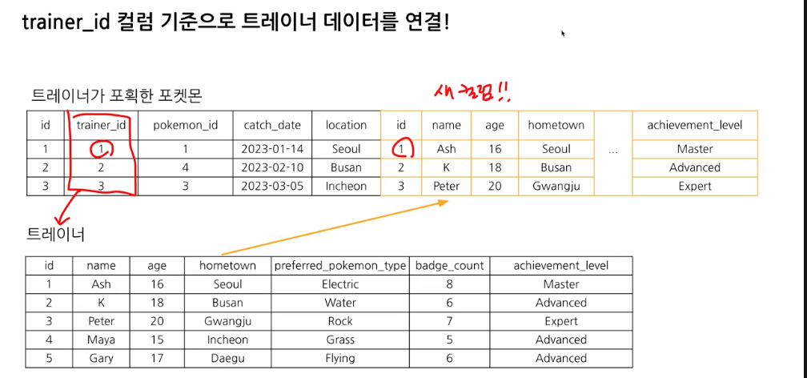
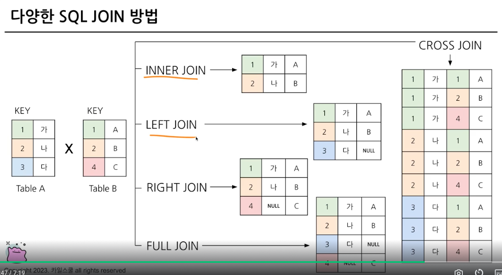
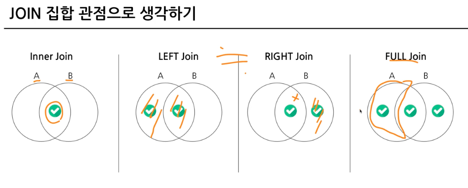
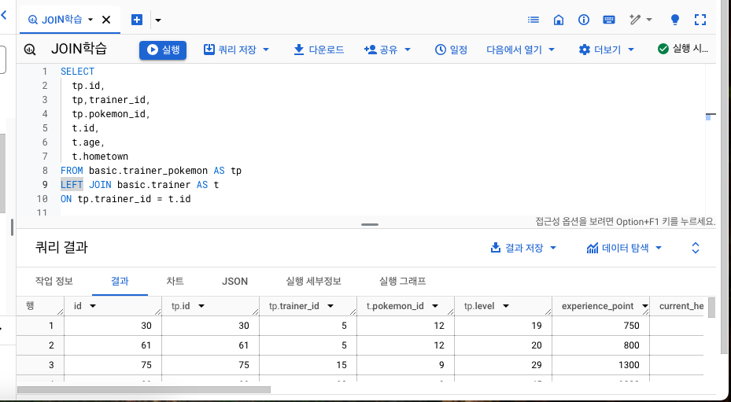
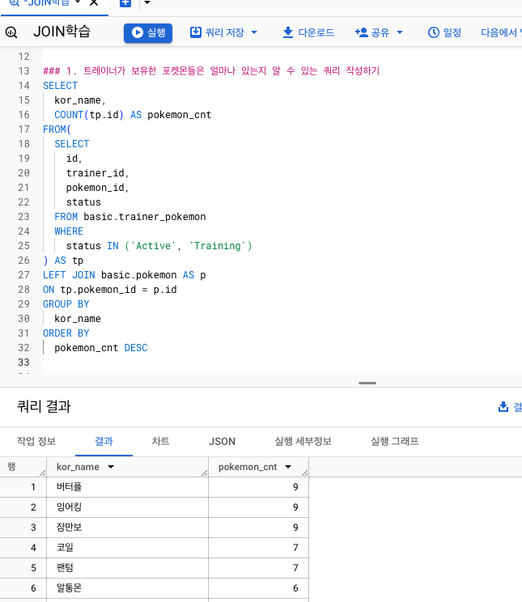
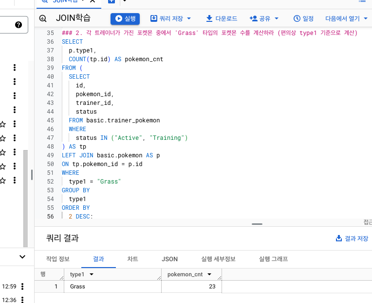
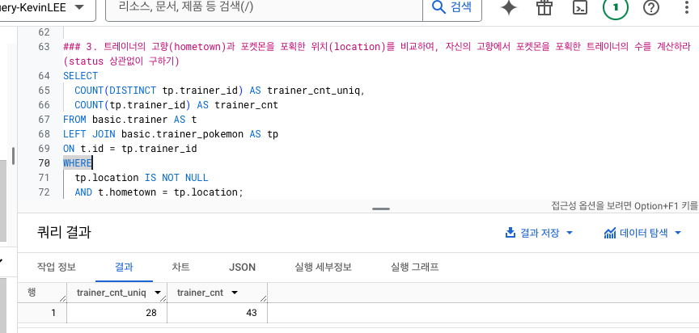
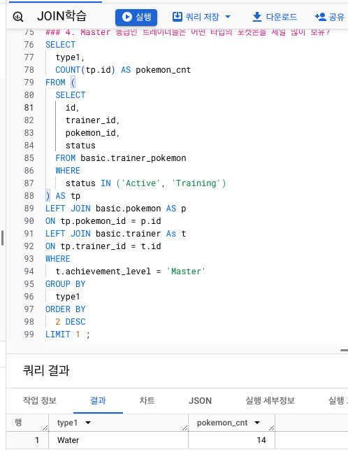
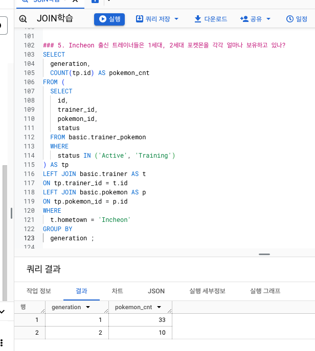

# 5-1 Intro. JOIN 다량의 데이터 연결

# 5-2 JOIN 이해하기
- "서로 다른 데이터 테이블을 연결하는 것"
- 공통적으로 존재하는 칼럼(=key)이 있다면, JOIN 가능
- 보통 id 값을 key로 많이 사용함

### 포켓몬 활용 이해
- 포켓몬 : 다양한 곳에서 나타남
- 트레이너 : 포획한 포켓몬을 육성할 수 있음
- 두 칼럼을 확인해봤을 때, 두 데이터를 연결할 수 있는 공통 값이 없음. -> 다른 테이블을 이용해서 연결시킬 수 있음. "xx_id" 칼럼 등으로.

### JOIN 기본원리


### JOIN을 해야하는 이유 : 데이터 저장되는 형태에 대한 이해
- DBMS 설계 시, 정규화 과정을 거침
    - 중복을 최소화 해서 데이터를 구조화
    - 데이터를 다양한 table에 저장해서 필요할 때 JOIN해서 사용
- 데이터 분석 관점에서는 JOIN된 데이터가 좋을 수 있지만, 개발 관점에서는 분리되어 있는 것이 좋음

# 5-3 다양한 SQL JOIN 방법
- INNER JOIN : 두 테이블의 공통 요소만 연결
- LEFT/RIGHT (OUTER) JOIN : 왼쪽/오른쪽 테이블 기준 연결
- FULL (OUTER) JOIN : 양쪽 기준 연결
- CROSS JOIN : 두 테이블의 곱으로 연결





# 5-4 JOIN 쿼리 작성하기
- 흐름
    1. 테이블 확인 : 테이블에 저장된 데이터, 칼럼 확인
    2. 기준 테이블 정의 : 가장 많이 참고할 기준 테이블 정의
    3. JOIN KEY 찾기 : 여러 테이블과 연결할 key 정리
    4. 결과 예상하기 : 결과 테이블을 예상해서 엑셀 등으로 작성(비교를 위해)
    5. 쿼리 작성/검증 : 예상한 결과와 같은지 검증

### JOIN 문법
```sql
SELECT
    A.col1,
    A.col2,
    B.col1,
    B.col2
FROM table1 AS A
LEFT JOIN table2 AS B
ON A.key = B.key
```
- JOIN은 FROM 아래쪽에 쓰는 것!!!

<br>




# 5-5 JOIN 처음 공부 시, 헷갈렸던 부분
### 어떤 JOIN이 적합한가?
- 교집합 : INNER
- 모두 다 조합 : CROSS
- 그게 아니라면, LEFT 또는 RIGHT

### 어떤 테이블을 왼쪽에 두고, 어떤 테이블을 오른쪽에 두나?
- LEFT JOIN의 경우
    - 기준이 되는 테이블을 왼쪽으로!
- 기준에는 기준값이 존재하고, 우측에 데이터를 계속 추가

### 여러 테이블을 연결해도 되나?
- JOIN의 개수는 한계가 없음
- but, 너무 많이 하면 복잡함 -> 문제가 될 수 있음
- 2, 3개를 만들고 "중간 테이블"을 만들어 활용하기

### 칼럼은 모두 다 선택해야 하나?
- 어떤 데이터 분석을 할 것인가에 따라 다름
- Big Query에서 비용을 줄이기 위해서는 필요한 칼럼만 추출하기
- SELECT 절에 `EXCEPT(칼럼명)`을 활용해 칼럼 제거 가능

### NULL?
- 값이 없음, 알 수 없음
- 0이나 공백과 다르게 값이 아예 없는 것
- JOIN에서는 연결할 값이 없는 경우 발생


# 5-6 JOIN 연습문제

### 1. 트레이너가 보유한 포켓몬들은 얼마나 있는지 알 수 있는 쿼리 작성하기



### 2. 각 트레이너가 가진 포켓몬 중에서 'Grass' 타입의 포켓몬 수를 계산하라 (편의상 type1 기준으로 계산)



### 3. 트레이너의 고향(hometown)과 포켓몬을 포획한 위치(location)를 비교하여, 자신의 고향에서 포켓몬을 포획한 트레이너의 수를 계산하라 (status 상관없이 구하기)



### 4. Master 등급인 트레이너들은 어떤 타입의 포켓몬을 제일 많이 보유?



### 5. Incheon 출신 트레이너들은 1세대, 2세대 포켓몬을 각각 얼마나 보유하고 있나?



# 5-7 JOIN 정리
- JOIN : 여러 테이블을 연결해야 할 때 사용하는 문법
- Key : 공통적으로 가지고 있는 칼럼
- FROM절에서 서브쿼리 사용가능


