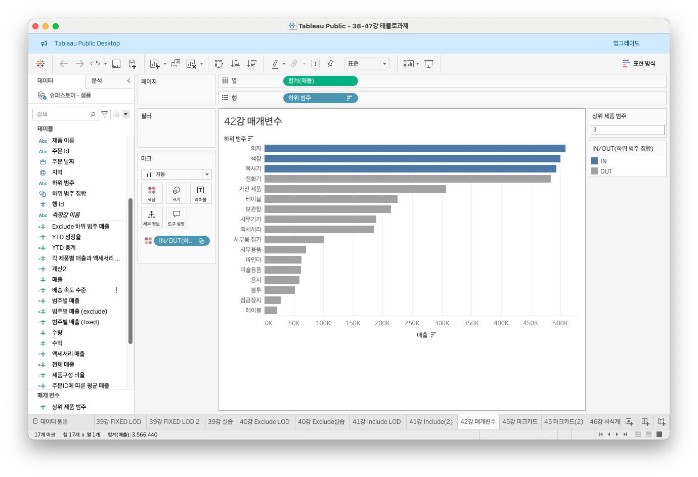
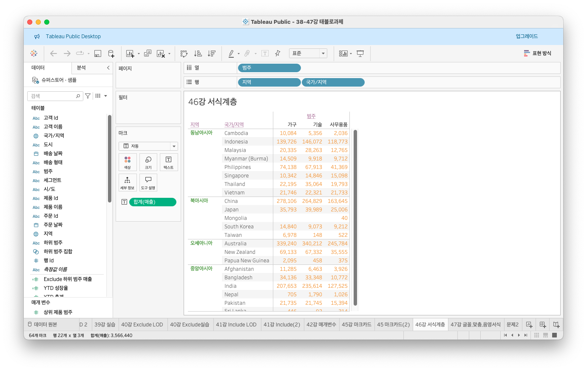
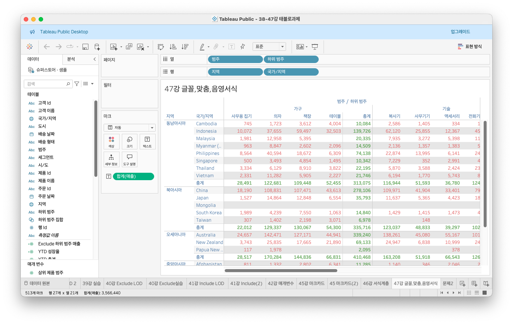
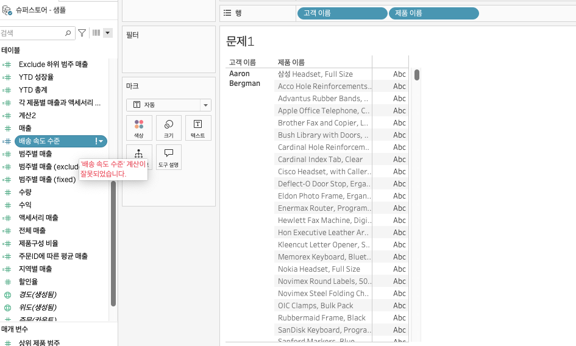

# Fifth Study Week

- 39강: [LOD](#39강-lod)

- 40강: [EXCLUDE](#40-lod-exclude)

- 41강: [INCLUDE](#41-lod-include)

- 42강 : [매개변수](#42-매개변수)

* (43강이 없어 패스합니다)
- 44강: [매개변수 실습](#44-매개변수-실습)

- 45강: [마크카드](#45-워크시트-마크카드)

- 46강: [서식계층](#46-서식-계층)

- 47강: [워크시트](#47-워크시트-서식)

- [문제1](#문제-1)

- [문제2](#문제-2)

- [문제3](#문제-3)

## Study Schedule

| 강의 범위     | 강의 이수 여부 | 링크                                                                                                        |
|--------------|---------|-----------------------------------------------------------------------------------------------------------|
| 1~9강        |  ✅      | [링크](https://www.youtube.com/watch?v=AXkaUrJs-Ko&list=PL87tgIIryGsa5vdz6MsaOEF8PK-YqK3fz&index=84)       |
| 10~19강      | ✅      | [링크](https://www.youtube.com/watch?v=AXkaUrJs-Ko&list=PL87tgIIryGsa5vdz6MsaOEF8PK-YqK3fz&index=75)       |
| 20~29강      | ✅      | [링크](https://www.youtube.com/watch?v=AXkaUrJs-Ko&list=PL87tgIIryGsa5vdz6MsaOEF8PK-YqK3fz&index=65)       |
| 30~38강      | ✅      | [링크](https://www.youtube.com/watch?v=e6J0Ljd6h44&list=PL87tgIIryGsa5vdz6MsaOEF8PK-YqK3fz&index=55)       |
| 39~47강      | ✅      | [링크](https://www.youtube.com/watch?v=AXkaUrJs-Ko&list=PL87tgIIryGsa5vdz6MsaOEF8PK-YqK3fz&index=45)       |
| 50~59강      | 🍽️      | [링크](https://www.youtube.com/watch?v=AXkaUrJs-Ko&list=PL87tgIIryGsa5vdz6MsaOEF8PK-YqK3fz&index=35)       |
| 60~69강      | 🍽️      | [링크](https://www.youtube.com/watch?v=AXkaUrJs-Ko&list=PL87tgIIryGsa5vdz6MsaOEF8PK-YqK3fz&index=25)       |
| 70~79강      | 🍽️      | [링크](https://www.youtube.com/watch?v=AXkaUrJs-Ko&list=PL87tgIIryGsa5vdz6MsaOEF8PK-YqK3fz&index=15)       |
| 80~89강      | 🍽️      | [링크](https://www.youtube.com/watch?v=AXkaUrJs-Ko&list=PL87tgIIryGsa5vdz6MsaOEF8PK-YqK3fz&index=5)        |


<!-- 여기까진 그대로 둬 주세요-->

> **🧞‍♀️ 오늘의 스터디는 지니와 함께합니다.**


## 39강. LOD

LOD : Level fo Detail
- 뷰에 세부수준을 나타냄

<br>

- fixed LOD : 현재 뷰에 있는 차원과 상관없이 계산된 필드에서 원하는 차원에 따라 계산
- 계산된 필드에서, ` { FIXED [지역] : SUM[매출]} `
.png)
.png)


## 40. LOD EXCLUDE


- exclude LOD : 현재 뷰에서 특정 차원을 제외하여 계산할 때 사용
- 예를 들어 각 제품의 하위 범주에 따라 매출을 보고자 할 때
- 계산된 필드에서, ` { EXCLUDE [하위 범주] : SUM[매출]} `
.png)
.png)


> **🧞‍♀️ FIXED와 EXCLUDE을 사용하는 경우의 차이가 무엇인가요?**

```
첫째,
[하위 범주]를 "제조업체" 수준으로 나타내면 FIXED는 값이 변경되지 않지만, EXCLUDE는 값이 변경된다.
EXCLUDE의 경우 [하위 범주] 차원을 무시하고 매출의 합계를 표시하기는 하지만, 현재 뷰의 "제조업체" 차원이 [하위 범주] 보다 세부수준이 낮아서 제조업체 기준으로 관련된 매출을 표시한다.

둘째,
필터카드에서 [하위 범주] 데이터인 "가전제품"을 선택해제 한다고 했을 때, EXCLUDE는 값이 변경되지만, FIXED는 값은 변경되지 않고 고정되어 있음을 확인할 수 있다.
FIXED는 특정 차원에 따라 계산하고, EXCLUDE는 차원 관계없이 현재 뷰의 차원에 따라 계산함

```

> **🧞‍♀️ 왜 ATTR 함수를 사용하나요?**

```
특정 유니크를 기준으로 차이를 비교하기 위해서
```


## 41. LOD INCLUDE
- include LOD : 현재 뷰에서 특정 차원을 추가하여 계산. 차원 필터를 통해 해당 값을 변경할 수 있음(exclude와 공통점)
- 예를 들어, 각 도시의 고객당 평균 매출을 보고자 할 때
- `AVG( {INCLUDE [주문id] : SUM[매출]} )
.png)
.png)


> **🧞‍♀️ 그렇다면 어떤 경우에 각 표현식을 사용하나요? 예시와 함께 적어보아요**

```
- FIXED : 뷰에 표시되는 값이 차원일 때 FIXED만 사용 가능. FIXED는 차원과 측정값을 반환할 수 있음. INCLUDE와 EXCLUDE는 측정값만 반환함.
- INCLUDE & EXCLUDE : 반환한 값이 차원필터의 영향을 받는 경우에 사용. FIXED는 차원필터의 영향을 받지 않지만, INCLUDE와 EXCLUDE는 차원필터의 영향을 받음

```


## 42. 매개변수
- 매개변수 : 고정된 상수값이 아닌 동적인 값으로 변경하기 위해서 활용하는 기능
- 반드시, `계산식`, `필터`, `참조선`과 함께 사용됨
- 방법1 : 필터 사용 : 값 입력 공간에서 드롭다운 > 새 매개변수 만들기 선택
- 방법2 : 필드 위에 우클릭 > 만들기 > 매개변수
- 방법3 : 데이터 패널 클릭 > 매개변수 만들기




> **🧞‍♀️ 집합에도 매개변수를 적용할 수 있나요? 시도해봅시다**
```
집합에도 적용할 수 있다.
```


## 44. 매개변수 실습
(43번 강의가 없어 패스합니다)
- 매개변수에서 참조선 활용
- 분석패널 > 참조선을 뷰로 드래그앤드랍 > 참조선 편집화면 등장
- 참조선 편집화면 > 라인의 값을 매개변수로 설정 > 매개변수 이름을 "목표 매출"로 설정 > 확인 > 매개변수 사용가능
- 추가로 "목표 매출" 달성여부에 따라 색상 넣고싶다면?
- 계산된 필드 만들기 > `IF SUM([매출]) >= [목표 매출] THEN '목표 달성' ELSE '목표 미달' END
- 만들어진 계산된 필드를 마크카드로 드래그앤드랍


## 45. 워크시트 마크카드
- 마크카드 : 마크의 서식들을 변경하기 위해서 활용함
- 마크카드의 드롭다운 > 마크의 표현 방식을 선택 가능

.png>)
.png>)


## 46. 서식 계층
- 서식을 변경하는 방법 중에는 마크카드 뿐만 아니라 다른 방식들도 많음
- 서식 계층 구조 : 워크시트 서식 > 행/열 서식 > 특정 필드 > 필드 레이블 > 도구설명/제목/마크
- 상위 계층에서 서식 변경할 때 하위 계층 것을 변경하면 하위 계층 것도 변경됨



> **🧞‍♀️ 서식계층을 일반적인 것에서 구체적인 것 순서로 기입해보세요**

```
서식 계층 구조
[more general] 워크시트 서식 > 행/열 서식 > 특정 필드 > 필드 레이블 > 도구설명/제목/마크 [more specific]
```


## 47. 워크시트 서식
- 서식 > 글꼴, 맞춤, 음영 서식
- 이 서식 옵션들을 통해 워크시트를 보다 직관적으로 디자인할 수 있음




## 문제 리스트


## 문제 1.

```
가장 많이 주문한 사람들은 물건 배송을 빨리 받았을까요?
조건을 준수하여 아래 이미지를 만들어봆시다.
1) 국가/지역별(이하 '나라'로 통칭), 범주별로 배송일자가 다를 수 있으니 먼저, 나라별/범주별로 평균 배송일자를 설정한 뒤,
2) 각 나라에서 가장 많이 주문한 사람의 이름을 첫 번째 열,
3) 그 사람이 주문한 제품 이름을 2번째 열,
4) 각 상품이 배송까지 걸린 날 수를 표현하고
5) 그리고 만약 배송이 각 나라/범주별 평균보다 빨랐다면 '빠름', 같다면 '평균', 느리다면 '느림' 으로 print 해주세요. 
```
### ㅠ.ㅠ



<!-- 여기까지 오는 과정 중 알게 된 점을 기입하고, 결과는 시트 명을 본인 이름으로 바꾸어 표시해주세요.-->

## 문제 2.

```
채원이는 태블로를 쓰실 수 없는 상사분께 보고하기 위한 대시보드를 만들고 싶어요. 

제품 중분류별로 구분하되 매개변수로써 수익, 매출, 수량을 입력하면 저절로 각각 지표에 해당하는 그래프로 바뀌도록 설계하고자 해요.

 어떤 값이 각 지표의 평균보다 낮은 값을 갖고 있다면 색깔을 주황색으로, 그것보다 높다면 파란색으로 표시하고 싶어요. 그 평균값은 각 지표별로 달라야 해요.
```
