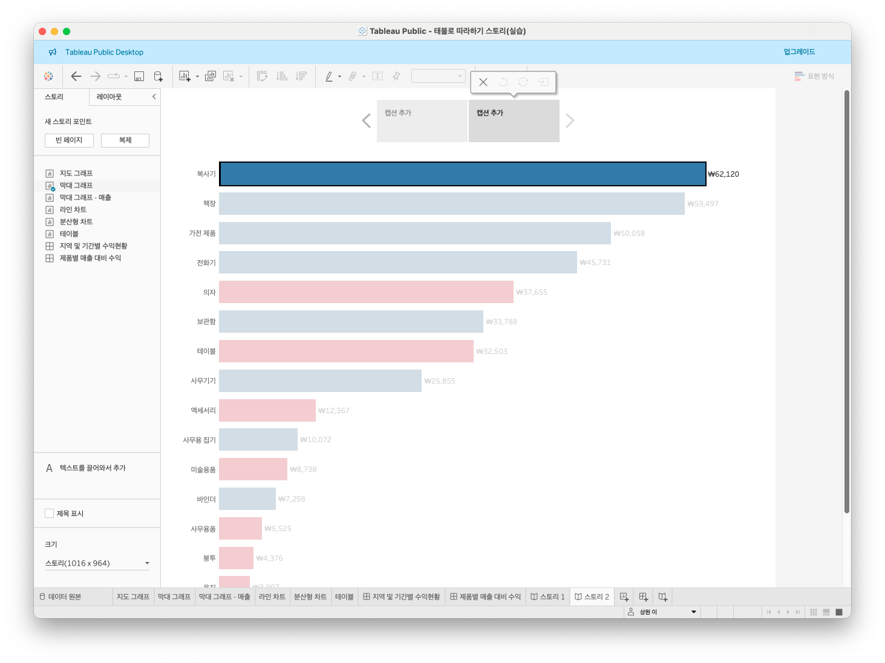
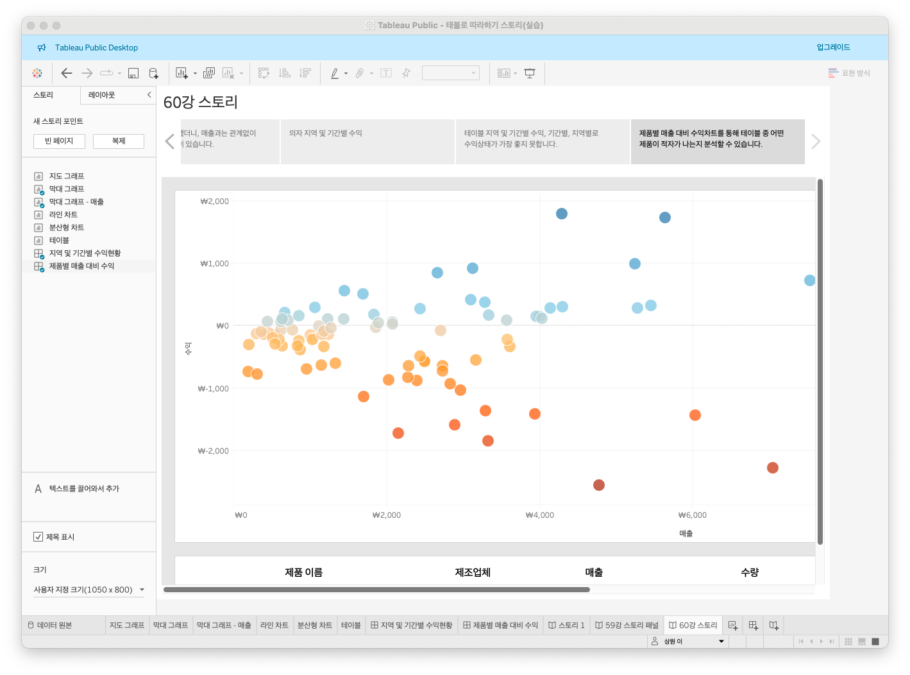
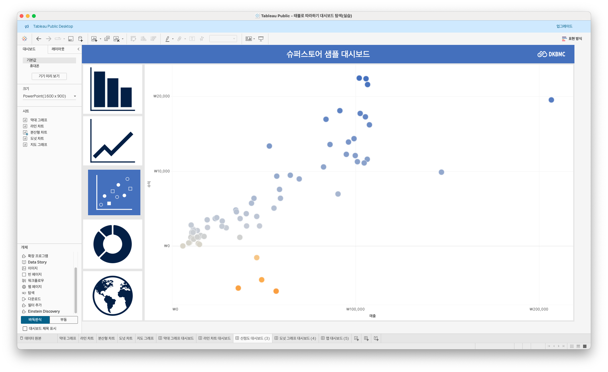
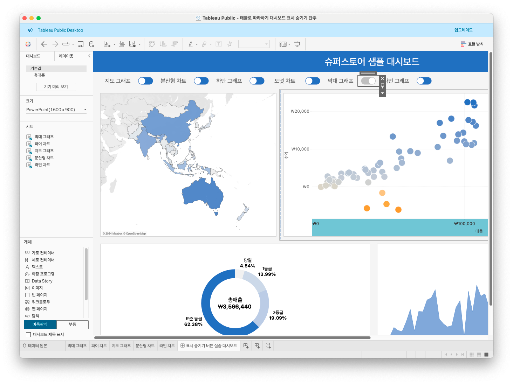
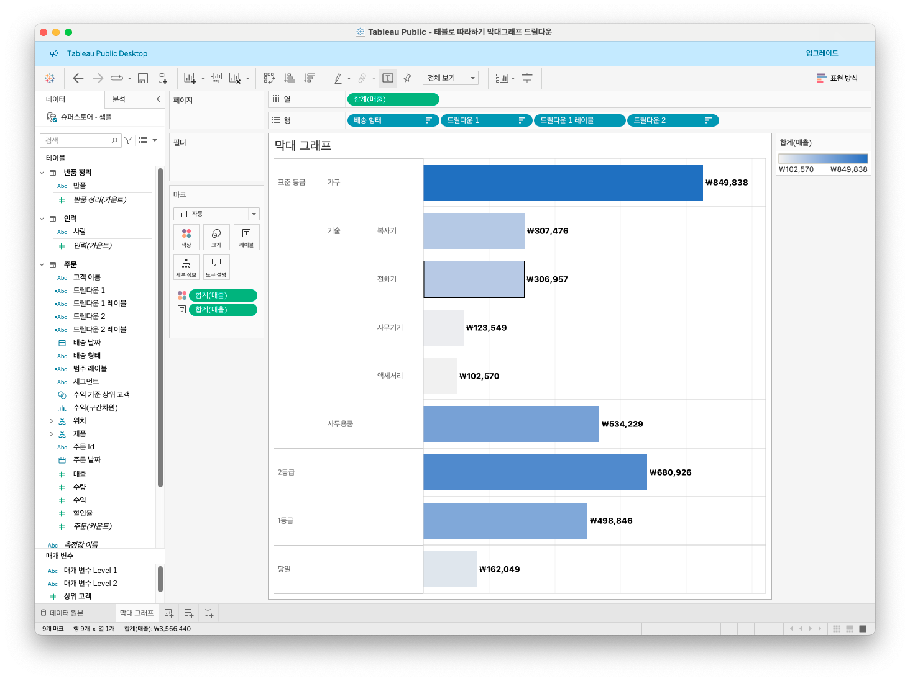
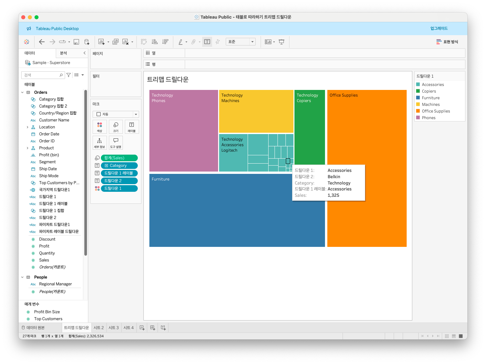

# 7th Study Week

## Study Schedule
 

| 회차 | 강의 범위   | 강의 이수 여부 | 링크                                                                                                     |
|------|-------------|----------------|--------------------------------------------------------------------------------------------------------|
| 1    | 1~7강       | ✅              | [링크](https://www.youtube.com/watch?v=AXkaUrJs-Ko&list=PL87tgIIryGsa5vdz6MsaOEF8PK-YqK3fz&index=84)    |
| 2    | 8~17강      | ✅              | [링크](https://www.youtube.com/watch?v=AXkaUrJs-Ko&list=PL87tgIIryGsa5vdz6MsaOEF8PK-YqK3fz&index=75)    |
| 3    | 18~27강     | ✅              | [링크](https://www.youtube.com/watch?v=AXkaUrJs-Ko&list=PL87tgIIryGsa5vdz6MsaOEF8PK-YqK3fz&index=65)    |
| 4    | 28~37강     | ✅              | [링크](https://www.youtube.com/watch?v=e6J0Ljd6h44&list=PL87tgIIryGsa5vdz6MsaOEF8PK-YqK3fz&index=55)    |
| 5    | 38~47강     | ✅              | [링크](https://www.youtube.com/watch?v=AXkaUrJs-Ko&list=PL87tgIIryGsa5vdz6MsaOEF8PK-YqK3fz&index=45)    |
| 6    | 48~57강     | ✅              | [링크](https://www.youtube.com/watch?v=AXkaUrJs-Ko&list=PL87tgIIryGsa5vdz6MsaOEF8PK-YqK3fz&index=35)    |
| 7    | 58~66강     | ✅             | [링크](https://www.youtube.com/watch?v=AXkaUrJs-Ko&list=PL87tgIIryGsa5vdz6MsaOEF8PK-YqK3fz&index=25)    |
| 8    | 67~77강     | 🍽️             | [링크](https://www.youtube.com/watch?v=AXkaUrJs-Ko&list=PL87tgIIryGsa5vdz6MsaOEF8PK-YqK3fz&index=15)    |
| 9    | 78~85강     | 🍽️             | [링크](https://www.youtube.com/watch?v=AXkaUrJs-Ko&list=PL87tgIIryGsa5vdz6MsaOEF8PK-YqK3fz&index=5)     |
---

 

> **🧞‍♀️ 오늘은 강의보다 실습과 대시보드 직접 만들기가 더 중요하니, 기록보다는 사고하며 강의를 들어주세요.**

## 58. 집합값 변경

<!-- 집합값 변경 강의에서 알게 된 점을 적어주세요 -->

- 새로운 대시보드 만들기
    - 세로 컨테이너 드래그
    - 빈 페이지
    - 제품 막대그래프 배치
- 선택한 제품 하위 범주에서 제조 없체를 보여주는 `집합값 변경 동작` 만들기
    - 대시보드 > 동작 > 동작추가 > 집합 값 변경
    - 이름 : 집합 동작
    - 우리가 변경하는 집합은 "하위 범주 집합" 이므로
    - '대상 집합'에 해당 집합을 선택
    - 동작 실행결과 > 집합에 값 할당
    - 선택 해제할 경우 결과 > 집합에서 모든 값 제거
    - 즉, 하위 범주를 선택하면 하위 범주 집합의 유일한 값으로 설정되며, 선택을 취소하면 해당 집합에서 모든 값이 제거됨
- 현재 대시보드와 "수익성 대시보드" 연결하기
    - 먼저, "수익성 대시보드"에 "제품 매출과 수익 대시보드"로 '시트로 이동 동작'을 설정
    - 수익성 대시보드 > 대시보드 > 동작 > 동작 추가 > 시트로 이동 > 원본시트 전부 체크 해제 후 막대 그래프만 선택 > 대상시트는 제품 매출과 수익 대시보드 > 동작 실행 조건은 메뉴 > 이름 설정 : 제품에 대해 더 알아보기
- "수익성 대시보드"로 돌아가는 버튼 만들기
    - `탐색` 개체를 대시보드 상단에 드래그 하기
    - 개체 우클릭 > 편집단추 > 이동할 위치 : 수익성 대시보드 > 제목 : 수익성 대시보드로 돌아가기 > 서식 : 원하는 색상 선택
    - 빈페이지 개체로 단추 아래에 라인 만들기 > 높이 10으로 편집 > 백그라운드 설정 > 단추 아래에 배치

 

## 59강. 스토리패널

<!-- 스토리패널 강의에서 알게 된 점을 적어주세요 -->
#### 워크시트와 대시보드에 설명을 더해, 스토리텔링 기능을 구현하고, 의사결정에 도움을 주고 설득력 있는 사례를 구성하는 등의 가능을 구현할 수 있는 `스토리`를 살펴보자.
- 스토리 생성 : 책 모양 아이콘 "새 스토리" 클릭
- 왼쪽 : 스토리 패널
- 오른쪽 : 워크시트 페이지
- 스토리 워크시트 페이지는 각 시트를 추가함으로써 스토리 포인트를 생성할 수 있는 공간
- 스토리 각각의 개별 시트 = 스토리 포인트
- 새 스토리 포인트는 말 그대로, 새 스토리 포인트를 추가하기 위한 옵션임. > 빈 페이지 선택 > 새 스토리 포인트 추가
- 스토리 패널은 대시보드, 시트, 텍스트 설명을 스토리 시트로 가져올 수 있음. 여기서 스토리 크기를 설정, 제목 표시하거나 숨기기 기능
- "크기" 항목 : 스토리 패널 하단에 위치. 대시보드처럼 스토리 크기를 설정할 수 있음
- [막대그래프] 시트 더블클릭(드래그)
- 상단 '스토리' 메뉴 : 데스크탑 버전에서만 사용가능.. > '스토리' 메뉴 > 스토리 제목 체크 해제
- "스토리 툴바" : 마우스 올리면 나타남 : 변경된 내용 되돌리기, 스토리 포인트 업데이트내용 적용, 삭제, 생성 가능
- 현재 스토리 포인트의 막대 그래프 중 임의로 한 개의 막대를 선택한 후, 스토리 툴바의 "새 이름으로 저장"을 선택 > 선택한 내용이 저장된 상태로 새 스토리 포인트에 그대로 복제되어 작업을 할 수 있음
- 탐색기(화살표시<>) : 스토리 포인트를 편집하고 구성할 수 있음. 사용자가 탐색기를 이용해서 스토리 단계 이동이 가능함. 탐색기 스타일은 레이아웃 패널에서 변경 가능

 

## 60. 스토리

<!-- 알게 된 점을 적고, 아래 질문에 답해보세요 :) -->
- 새 스토리 생성 > 크기 적절히 설정
- [막대 그래프 - 매출] 드래그 (=스토리 포인트 생성)
- 상단 탐색기 : 티폴트 값인 캡션상자로 설정 > 이를 늘린 다음, 스토리 포인트에 대한 설명 기술
- [막대 그래프]를 드래그하여 스토리포인트 추가 > 캡션상자에 설명 기술
- [지역 및 기간별 수익현황] 대시보드를 더블클릭 해 스토리포인트 생성 > 삽입한 대시보드 막대 그래프의 "의자" 항목을 클릭하여 지도와 라인차트를 필터링해줌 > 스토리포인트 캡션상자에 "업데이트" 버튼 클릭 > 현재까지의 작업상태 저장 > 이번에는 "테이블" 항목 클륵해 필터링 > 스토리포인트 켭션상자 "새 이름으로 저장"(=새 스토리포인트 생성) 
    - 두 시트를 비교해보면, 작업상태의 시점이 다른 것을 확인
- [제품별 매출 대비 수익] 더블클릭 > 새 스토리포인트 생성 > 캡션상자에 설명 기술

 

## 61. 대시보드 탐색

<!-- 대시보드 탐색 강의에서 알게 된 점을 적어주세요 -->
- 이미지 개체 > 좌측 세로 컨테이너에 드래그 > 이미지 파일 선택 > 이미지 불러오기 > 옵션 > 이미지 맞추기, 가운데 맞추기 > 이미지 선택한 상태에서 > 레이아웃 패널 > 백그라운드 색상 설정 > 여백 설정..
- 탐색 개체 > 좌측 세로 컨테이너에 드래그 > 맨 아리 빈페이지 제거 > 편집 단추 > 이미지 선택, 불러오기 > 탐색 개체 선택 상테에서 > 레이아웃 패널 > 각종 서식 설정
- 대시보드를 4번 복제한 후, 대시보드 이름을 변경 > 해당 대시보드에 해당하는 시트를 드래그 하고, 기존 시트와 제목, 범례 등을 제거
- 탐색 버튼의 이동할 위치를 지정하여 활성화하기 > [막대그래프 대시보드] 선택 > 라인 차트 탐색 버튼을 더블클릭 > 이동할 위치 : 라인차트 대시보드 > 확인

 

## 62. 태블로 단추

<!-- 태블로 단추 강의에서 알게 된 점을 적어주세요 -->

- 가로컨테이너에 텍스트 개체 드래그 > 이름 설정 > 너비 설정 > 이제 각 텍스트에 해당하는 "표시/숨기기" 단추를 텍스트 오른쪽에 추가해보자
- 지도그래프 선택 > 기타옵션 클릭 > [표시/숨기기 단추 추가] 선택 > 그러면 부동형태로 X자 표시 단추 생성됨 > alt+클릭 > 가로세줄 형태로 바뀌면서 지도 그래프가 사라지는 것을 확인 > 부동상태의 표시/숨기기 단추 우클릭 > 부동 해제 > 지도그래프 텍스트 오른쪽으로 옯기기 > 같은 방식으로 각각 다 만들어줌
- 표시/숨기기 단추 우클릭 > 기타옵션 > 편집 단추 > 단추 모양 편집해서 > 이미지 선택

 

## 63. 막대그래프 드릴다운

<!-- 막대그래프 드릴다운에 대해 알게 된 점을 적어주세요 -->

- 드릴 다운이 [배송형태]-[범주]-[하위범주] 순으로 이루어지는 막대그래프를 생성해보자
- 매출 > 열선반, 배송형태 > 행선반
- 매출 > 색상, 레이블
- 전체보기
- 드릴다운 구현하기 위해 "매개변수" 생성 > 이름 : 매개변수 level1 > 데이터유형 : 문자열 > 확인
- 계산된 필드 생성 > if문 사용해 드릴다운 생성
- 상단 워크시트 탭 > 동작 > 동작 추가 > 매개변수 변경 > 이름 : 배송형태 : 범주 드릴다운 > 대상매개변수 : 매개변수 level1 > 원본필드 : 배송형태 > 선택해제시,,: 다음 값으로 설정(공백) > 확인
- 드릴다운1 > 행선반
- 이제 막대그래프 막대 클릭하면 > 배송형태에서 범주로 드릴다운 됨
- 정렬 설정 : 행선반의 드릴다운1 우클릭 > 정렬 > 정렬기준:필드 > 정렬기준:내림차순 > 필드명:매출

 

## 64. 트리맵 드릴다운

<!-- 트리맵 드릴다운에 대해 알게 된 점을 적어주세요 -->

- [카테고리]-[서브카테고리]-[제조사] 순서로 이어지는 트리맵을 생성해보자
- 카테고리, 매출 더블클릭 > 트리맵 선택
- 기본 트리맵에 드릴다운 구현하기 위해서 집합 생성 > (지난 시간 막대그래프 드릴다운은 매개변수 사용하였으나) 이번에는 집합을 통해 드릴다운 구현해보겠음
- 좌측 사이드바 > 카테고리 우클릭 > 만들기-집합 > 확인
- 계산된 필드 만들기 > `if [카테고리 집합] then [서브카테고리] else [카테고리] end` > 이름 : 드릴다운1
- 상단 워크시트 탭 > 동작 > 동작추가 > 집합값 변경 > 이름:카테고리>서브카테고리 > 실행조건:선택 > 대상집합:카테고리 > 동작실행결과:집합에 값 할당 > 선택해제시,,:집합에서 모든값 제거 > 확인
- 드릴다운1 > 마크카드의 레이블로 드래그 > 마크카드 가장 아래쪽에 배치
- 서브카테고리에서 제조사로 드릴다운 되는 동작 : 앞과 똑같은 방식으로 진행
- 트리맵에 레이블이 중복되는 것을 막기 위한 조치 > 드릴다운1에 대한 레이블 필드 추가 > 좌측 사이드바에서 드릴다운1 복사 > 복사본 계산편집 > else문 뒤에 오는 필드를 카테고리에서 ""로 변경 후 필드명을 드릴다운1레이블로 수정 > 해당 필드를 마크카드 레이블에 추가 > 드릴다운1을 [색상]마크인 [매출]필드를 덮어줌

 

## 65. 파이 차트 드릴다운

<!-- 파이 차트 드릴다운에 대해 알게 된 점을 적어주세요 -->
- 카테고리, 매출 더블클릭 > 표현방식:파이차트
- 드릴다운 구현을 위한 집합 생성 > 사이드바에서 카테고리 우클릭 > 만들기-집합 > 확인
- 계산된필드 생성 > `if 카테고리 집합 then 서브카테고리 else 카테고리 end > 이름:드릴다운1
- 상단 워크시트 탭 > 동작 > 동작추가 > 집합값 변경 > 이름:카테고리>서브카테고리 > 실행조건: 선택 > 대상집합:카테고리 > 동작실행결과:집합에 값 할당 > 선택해제시,,:집합에서 모든값 제거 > 확인
- 마크선반에서 크기 제거 > 드릴다운1을 세부정보로 드래그 > 유형을 색상으로 변경
- 마크선반의 카테고리 필드 우클릭 > 정렬 > 정렬기준:필드 > 정렬순서:내림차순 > 필드명:매출 > 닫기
- 마크선반의 드릴다운1 필드 우클릭 > 정렬 > 정렬기준:필드 > 정렬순서:내림차순 > 필드명:매출 > 닫기
- 뚜렷한 시각화를 위해 > 마크선반의 색상마크 클릭 > 테두리 색상:흰색 > 행선반 빈공간 더블클릭 > `0` > 하나더 복제
- 첫번째 축을 선택하여 마크선반의 드릴다운1을 제거, 크기를 조정
- 두번째 축도 선택하여 첫번째 축보다 조금 작게 크기를 조정
- 상단 행선반 오른쪽 것을 우클릭 > 이중축 > 두 파이차트 크기 적절히 조정 > 범례 색상 조정

 

## 66. 지도 드릴다운

<!-- 지도 드릴다운에 대해 알게 된 점을 적어주세요 -->
- 드릴다운이 [국가/지역]-[시/도] 순서로 이어지는 지도 그래프를 생성해보자.
- 국가/지역 더블클릭, 표현방식:맵
- 드릴다운 구현을 위한 집합 생성 > 사이드바에서 카테고리 우클릭 > 만들기-집합 > 확인
- 계산된필드 생성 > `if 국가/지역 집합 then 시/도 else 국가/지역 end > 이름:드릴다운1
- 드릴다운1 우클릭 > 지리적역할 > 우편번호 > 시/도
- 상단 워크시트 탭 > 동작 > 동작추가 > 집합값 변경 > 이름:국가/지역>시/도 > 실행조건: 선택 > 대상집합:국가/지역 집합 > 동작실행결과:집합에 값 할당 > 선택해제시,,:집합에서 모든값 제거 > 확인
- 드릴다운1 > 마크카드 색상으로 드래그
- 드릴다운 뿐만 아니라 매개변수를 이용해, 드릴다운과 선택한 국가/지역만 필터링 되는 작업이 동시에 진행되는 방법 > 필터링을 위한 매개변수 생성 > 매개변수 만들기 > 이름:매개변수 국가/지역 > 데이터유형:문자열 > 허용가능값:목록 > 다음에서 값추가:국가/지역 > 맨 밑 칸에 all 값을 추가한 뒤, 목록 맨 위로 올려줌
- 계산될 필드 생성 > `if 매개변수 국가/지역 = 국가/지역 then TRUE elif 매개변수 국가/지역 = 'all' then TRUE else FALSE end` > 이름:선택된 국가/지역
- 매개변수 국가/지역 우클릭 > 매개변수 표시 선택 > all
- 선택된 국가/지역 > 필터 선반으로 드래그
- 상단 워크시트 탭 > 동작 > 동작추가 > 매개변수 변경 > 이름:선택된 국가/지역 > 동작실행조건:실행 > 대상 매개변수:매개변수 국가/지역 > 원본필드:국가/지역 > 선택을해제시,,:다음값으로설정 all > 확인
- 도구설명 마크 클릭 > 설명란에 드릴다운1만 남겨두고 모두 지운 후 확인

 

---

## 문제

오늘은 별도의 문제가 없습니다.

저번 주와 마찬가지로 여러 대시보드를 참고하시어, 학술제 주제 관련 데이터(없을 경우, 본인 관심 데이터)를 사용해 나만의 대시보드를 제작해주세요.

**단, 워크시트 3개 이상의 그래프를 표시해야 하며 각 시트 간 상호작용성 필터 or 하이라이트 동작은 꼭 추가되어야 합니다**

어떤 부분에 가중을 두었는지, 어떤 사용자 편의성을 고려하였는지에 대한 설명이 필요합니다.