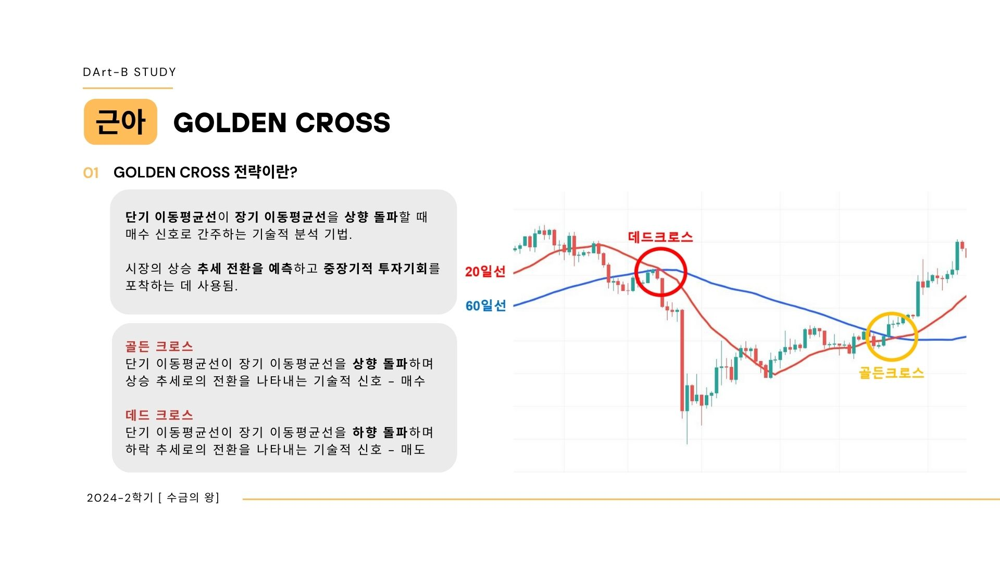

# 금융데이터 분석 스터디

### 스터디명: 수금의왕

### 내용
- 금융 도메인 지식을 확장하고, 1) 알고리즘 트레이딩 2) 주식포트폴리오 투자. 두 가지의 스터디를 진행함
- 주식포트폴리오 구축을 위해 매크로와 포트폴리오 이론에 대해 학습함
- 자산별 상관분석, 마코위츠의 최소분산포트폴리오 이론을 활용해 효율적프론티어 상 최적 자산비중을 구하여 포트폴리오를 구축함
- SPY, 영구포트폴리오, 올웨더포트폴리오를 벤치마크로 사용하여 2015년~2024년 현재까지 백테스팅을 진행해 생성한 포트폴리오의 성능을 비교분석해보는 경험을 함
- 기술적인 분석 또는 주가와 거래량만 가지고 분석하는 것은 한계가 있음을 느꼈고, 급변하는 글로벌 상황과 정치적, 경제 조건을 따져 가치있는 투자가 필요함을 느낌
- 스터디장을 맡아 스터디가 원활히 진행될 수 있게 커리큘럼 구축, 출석체크, 팀플룸 대여 등 업무를 맡음

### 활용한 금융 데이터
- 야후파이낸스에서 제공하는 각 종목별 주가, 거래량 데이터를 활용함
- KRX 한국거래소의 개별종목을 크롤링하여 사용함

### 결과물

#### 이하부터 관여한 부분

