# 프로젝트명 : 이커머스 이탈위험군 분석

### 내용
- "이탈 고객의 특징을 분석해 이탈을 막기 위한 솔루션 제공"을 주제로 분석을 진행함
- `고객이탈률`은 이커머스에서 가장 중요한 지표 중 하나임. 신규 사용자를 확보하는 비용보다 기존 사용자를 유지시키는 비용이 훨씬 효과적이기 때문임
- 데이터셋 EDA, 가설검정, 전처리, 모델링을 진행함
- 랜덤포레스트 모델로 이탈 고객 예측을 실시한 후, 혼돈행렬 상, "실제로 이탈하지 않았는데 이탈 고객으로 예측된 고객들"을 **이탈 위험군**으로 정의하고, 그들을 클러스터링을 진행함
- 6개의 클러스터로 분류했고, 각 클러스터의 특징을 분석하여 해당 클러스터에 적합한 솔루션을 제시함

### 데이터셋 소개
- Kaggle - Ecommercee Customer Churn Analysis and Prediction
- 이탈여부(target), 성별, 가입기간, 배송거리, 만족도, 컴플레인횟수, 결혼여부, 캐시백금액, 쿠폰사용횟수 등 고객이탈에 주요하게 영향을 미칠 것으로 예상되는 피처들로 구성되어 있음

### 결과물

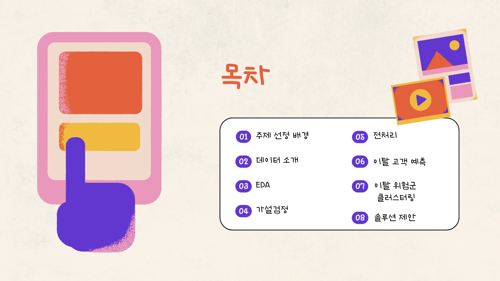

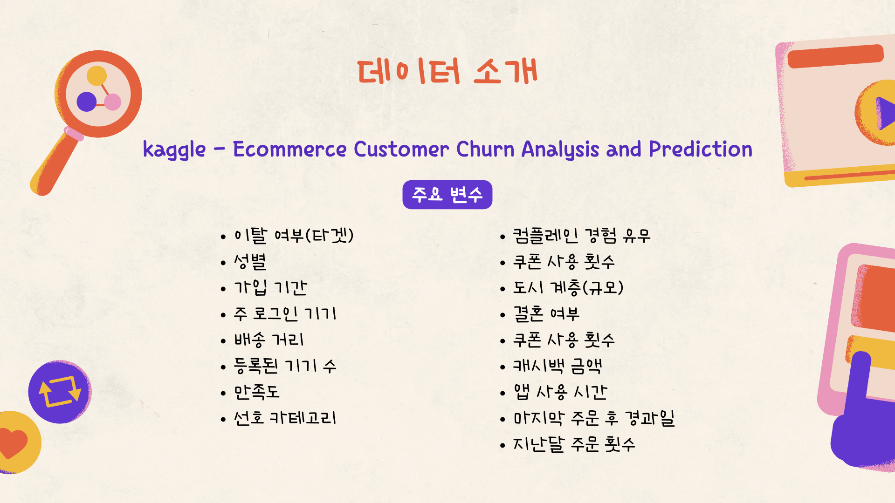
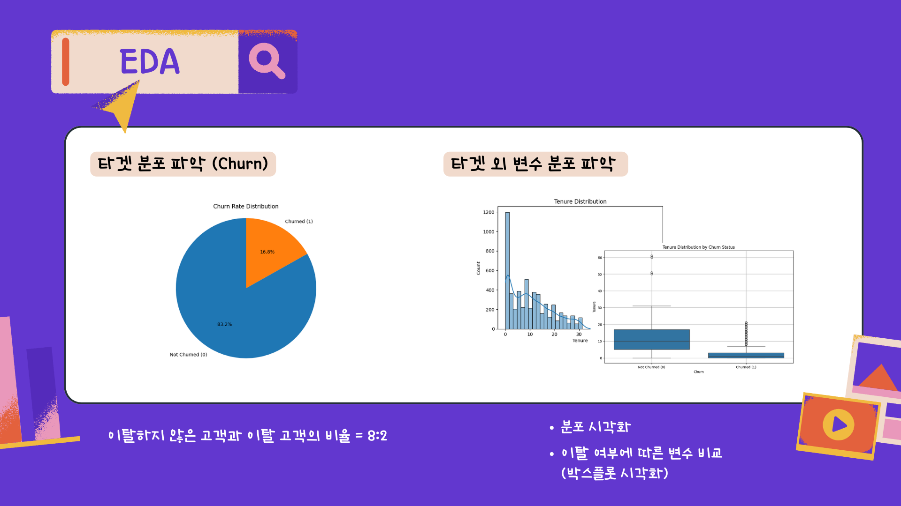
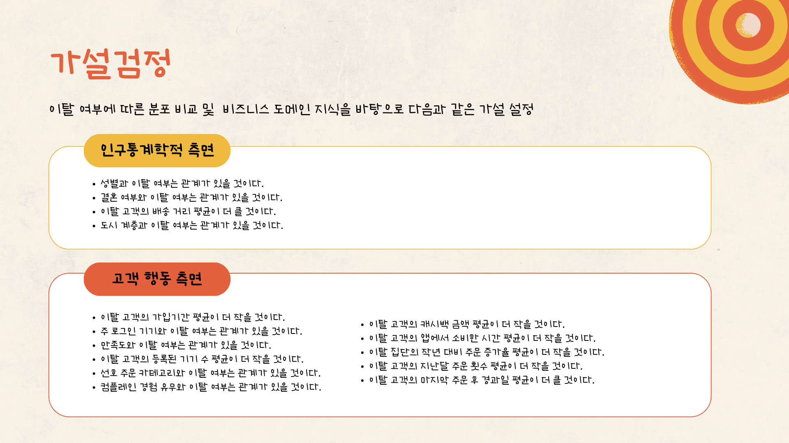
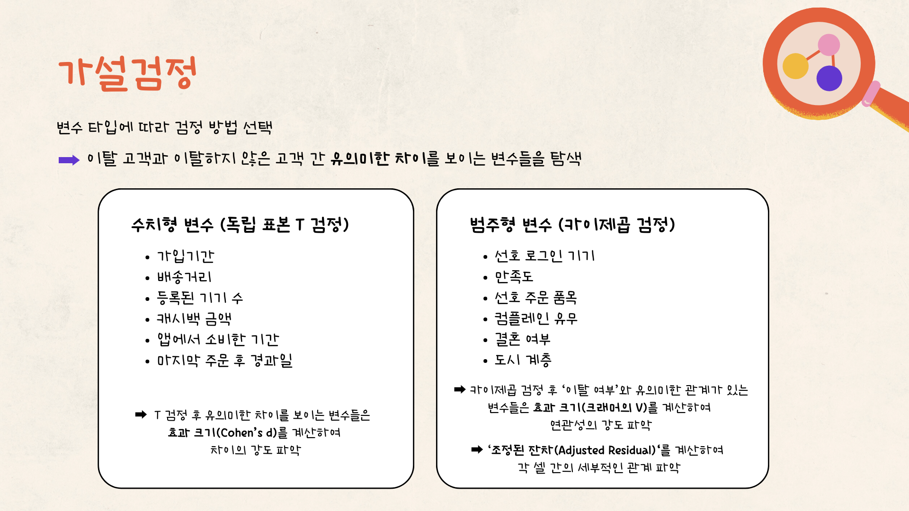
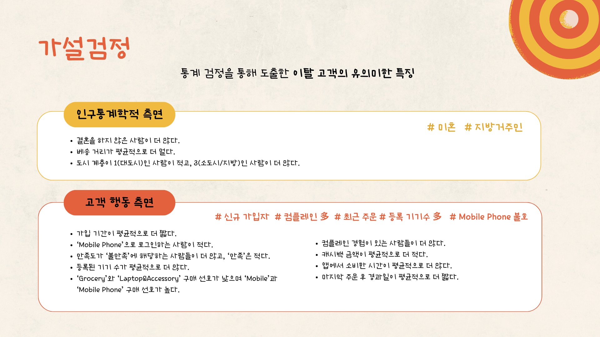
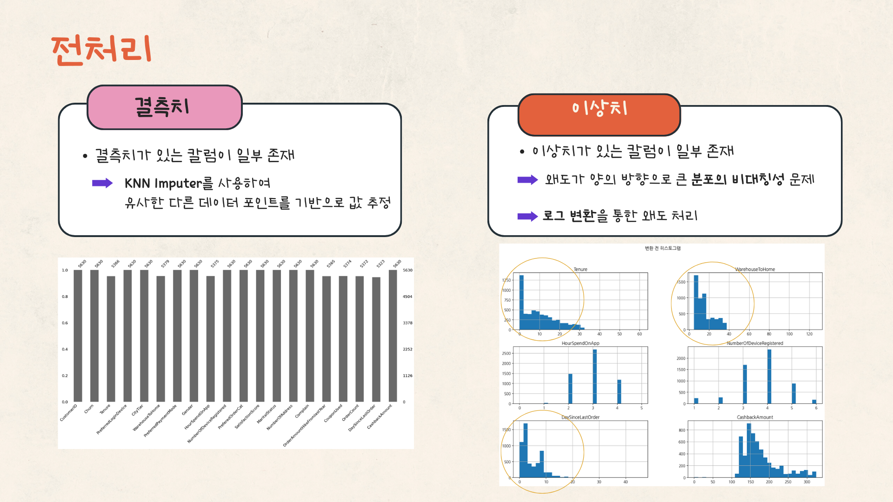
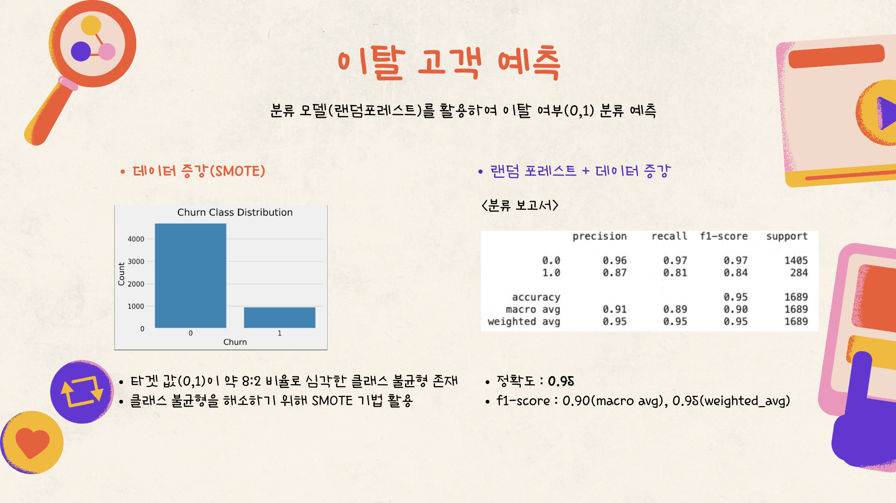
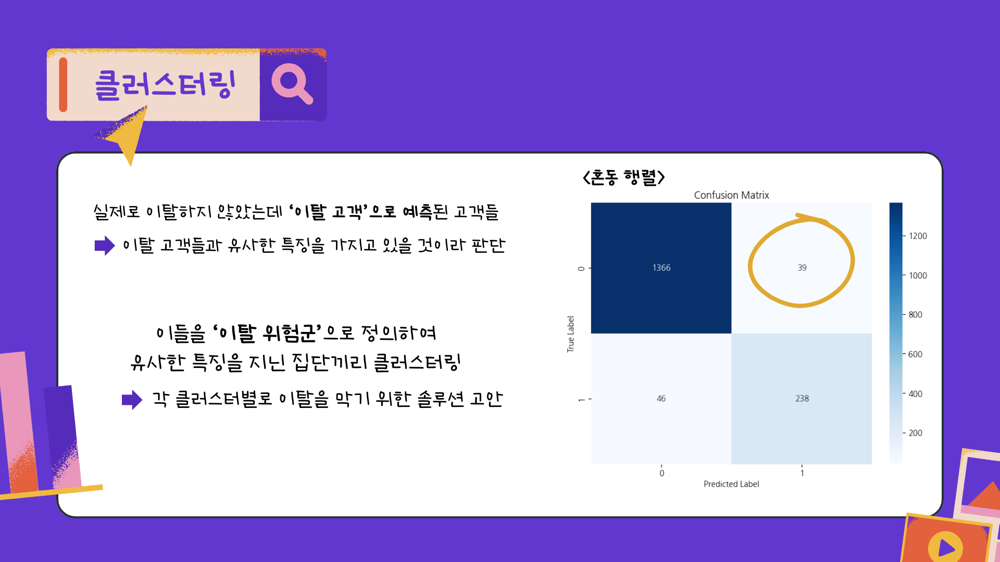
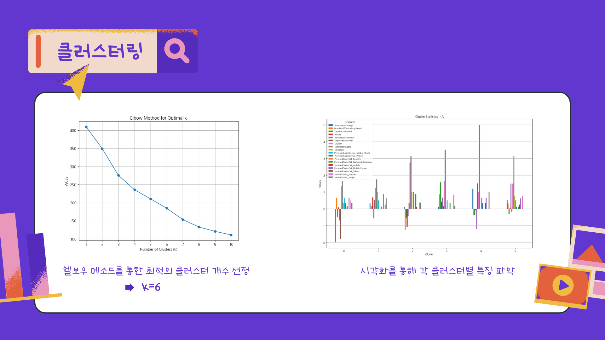
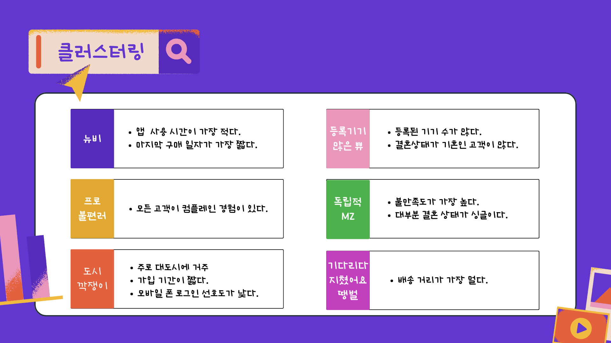
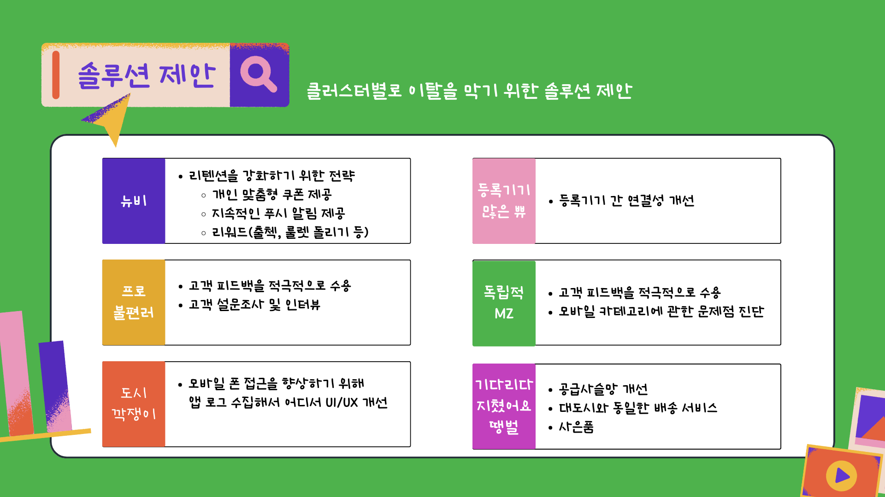

