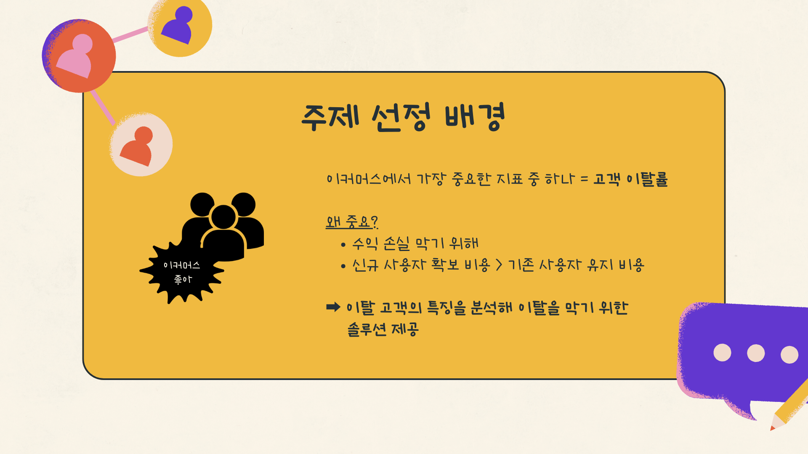

# 프로젝트명 : 이커머스 이탈위험군 분석

```
종합 기여도: ●●○
```

**[ 나의 주요 역할 ]**  
: k-means 클러스터링. 랜덤포레스트로 집단을 분류한 후, FP에 대해 클러스터링을 진행했다. 엘보우매서드로 최적의 k를 시각화했으나 뚜렷한 포인트는 없었다. k의 크기가 너무 크거나 작으면 클러스터링의 효과성이 떨어지는 점을 고려해 6개로 설정했다.
**[ 성과 ]**  
: 클러스터별 특징을 분석한 결과, 데이터가 효과적으로 분류됨을 확인했다. 이후 엘보우매서드 외에도 실루엣 분석과 PCA의 활용 가능성을 깨달았고 분석 방식을 확장할 수 있었다.

---

### 문제정의 및 주제
이커머스에서 이탈하는 고객의 특징이 무엇일까?  
&rarr; **이커머스 이탈 고객의 특징을 분석하여 이탈위험군의 이탈을 막기 위한 솔루션 제시**

### 문제해결 과정
1. 목표하는 분석을 진행하기 위해 주어진 데이터셋에 대하여 EDA를 실시했다.
2. 각 피처들의 특징을 파악하기 위해 인구통계학적 칼럼과 고객행동 측면의 칼럼으로 구분한 뒤, 변수형태에 맞게 독립표본T검정 및 카이제곱 검정을 진행했다.
3. Knn Imputer를 사용해 결측치를 보간했고, 로그변환을 통해 왜도가 심한 이상치를 처리해주었다.
4. 랜덤포레스트 모델을 사용해 이탈고객 예측을 실시했는데, 클래스 불균형을 해소하기 위해서 SMOTE 기법으로 데이터를 증강한 뒤 진행했다. 정확도 95%, F1-score 0.9의 우수한 성능을 보였다.
5. 모델링 결과의 "실제로 이탈하지 않았는데 이탈했다고 예측한 집단(FP)"을 `이탈 위험군`으로 정의하고, k-means 클러스터링을 진행했다.
6. 엘보우매서드로 k를 6으로 정했으나, 이 과정에서 뚜렷한 포인트각 시각적으로 식별되지는 못했다.
7. 시각화를 통해 각 클러스터별 특징을 분석했고, 직관적인 이해가 되도록 각 클러스터별 별칭을 붙여주었다.
8. 각 클러스터의 특징에 알맞은 솔루션을 제시했다. 특히 "뉴비" 클러스터는 1) 앱 사용시간이 적다는 특징, 2) 마지막 구매일자가 짧다는 특징이 있었다. 솔루션으로, 개인 맞춤형 쿠폰 제공, 지속적인 푸시 알림, 리워드 등을 통해 서비스를 지속적으로 사용하도록 만드는 전략을 제안했다.

### 프로젝트 인사이트 · 결론
**클러스터별로 이탈을 막기 위한 솔루션 제안**
- `뉴비` 클러스터
    - 특징: 앱 사용시간이 적음, 마지막 구매일자가 짧음
    - 제안: 개인 맞춤형 쿠폰 제공 등 리텐션을 강화하기 위한 전략 강화
- `프로 불편러` 클러스터
    - 특징: 모든 고객이 컴플레인 경험이 있음
    - 제안: 고객 피드백을 적극적으로 수용, 고객 설문조사 및 인터뷰
- `도시 깍쟁이` 클러스터
    - 특징: 주로 대도시에 거주, 가입 기간이 짦음, 모바일 폰 로그인 선호도가 낮음
    - 제안: 앱 로그 수집 후 UI/UX 개선하여 모바일 폰 접근을 향상하기
- `등록기기 많은 부부` 클러스터
    - 특징: 등록된 기기 수가 많음, 기혼 고객이 많음
    - 제안: 등록기기 간 연결성 개선
- `독립적 MZ` 클러스터
    - 특징: 불만족도가 가장 높음, 미혼 싱글 고객이 많음
    - 제안: 고객 피드백 적극 수용, 모바일 카테고리에 관한 문제점 진단
- `기다리다 지쳤어요 땡벌` 클러스터
    - 특징: 배송 거리가 멂
    - 제안: 공급사슬망 개선, 대도시와 동일한 배송 서비스, 사은품 제공


### 깨달은 점 · 배운 점
- 프로젝트 당시 도메인 지식을 쌓는 과정에서, 이커머스의 고객이탈을 막는 것이 비용절감, 매출증대, 브랜드 경쟁력 확보와 직결되며, 핵심적인 부분임을 알게 되었다.
- k-means의 k 개수를 정할 때, 엘보우매서드로 뚜렷한 지점을 파악할 수 없을 때, 주성분 분석(PCA) 등을 통해 유의미한 피처를 선택하는 방식을 적용할 수 있다는 것을 깨달았다.
- SMOTE 데이터증강 기법을 사용해 클래스 불균형을 해소하여 모델 성능을 높을 수 있었다.
- 프로젝트가 끝난 후 복기과정 시 느낀 점: 클러스터의 특징을 파악할 때 소비자행동적 측면의 전문성 있는 배경지식과 근거를 녹여냈다면 더욱 완성도 높고 설득력 있는 결론이었으리라 생각되었다.


### 데이터셋 소개
- Kaggle - Ecommercee Customer Churn Analysis and Prediction
- 이탈여부(target), 성별, 가입기간, 배송거리, 만족도, 컴플레인횟수, 결혼여부, 캐시백금액, 쿠폰사용횟수 등 고객이탈에 주요하게 영향을 미칠 것으로 예상되는 피처들로 구성되어 있음


<br>

---

### 결과물





