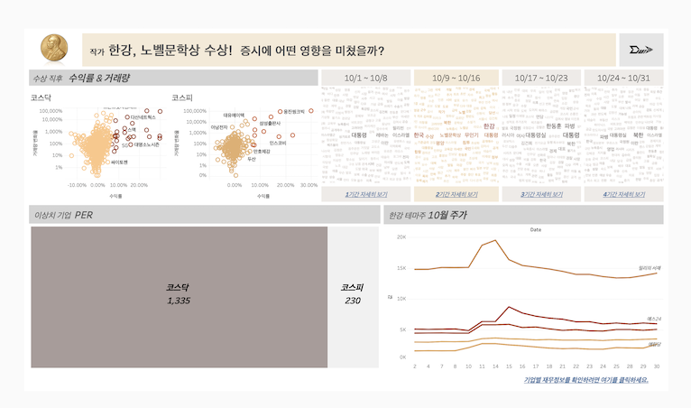

# 프로젝트명 : 한강의 기적, 수익률의 기적으로 이어질까?

```
종합 기여도: ●●●

[ 나의 주요 역할 ]  
: Selenium과 ChromeDriver를 활용해 네이버 뉴스의 일별 데이터를 동적 크롤링
방식으로 자동화하여 수집했다. 해당 작업은 최근 주요 이슈를 파악하기 위한 목적으로 수행했다.  
[ 성과 ]  
: 초기에는 개별 기사들의 전체 내용을 크롤링하려 했으나 동적 크롤링의 한계와 시간적 제약으로 실행하지 못했다. 하지만 기사 제목에 담긴 자연어만으로도 LDA 및 워드클라우드 시각화를 문제없이 수행할 수 있었다.
```

---


### 문제정의 및 주제
테마주에 대한 투기성 투자로 인한 "개인투자자"의 손실이 발생하고 있음.  
&rarr; **테마주의 변동성 위험과 재무제표에 기반한 논리적 투자의 중요성을 제시**

### 문제해결 과정
0. 우리의 연구주제와 관련한 선행연구를 찾아본 결과, 기업 규모나 가치가 아닌 근거 없는 연관성에 의한 주가 상승은 투기성 반응임을 알 수 있었다.
1. 이벤트 선정을 위해 Selenuim 및 ChromeDriver를 사용해 2024년 10월 "[속보]" 단어를 포함한 네이버 뉴스의 제목, 날짜, 기사내용 일부를 크롤링하여 데이터프레임화 했다.
2. 10월 한 달을 4개의 기간으로 나누고 기간별 주요 이벤트(이슈)가 무엇인지 파악했다. 이 과정에서 태블로의 버블차트와 워드클라우드, LDA 토픽 분류 모델을 사용했다. `한강 작가의 노벨문학상 수상`을 최종 이벤트로 선정했다.
3. 한강 작가가 수상한 직후, 한국증시에 어떤 영향을 미쳤는지 파악했다. Q3+IQR*1.5를 기준으로 주가수익률과 거래량변화율이 폭등한 상위 이상치 종목 66개를 선정했다.
4. 이 기업들은 한강 작가가 수상한 직후 주가가 폭등했다가 다시 회귀하는 경향이 있다. LSTM 시계열 예측 모델을 사용해 한강 수상 이벤트가 반영되지 않은 예측주가와 실제주가의 차이를 비교했다. *(LSTM 예측성능 : 한세예스24홀딩스 기준 R2 0.58, MAE 67.9 등)*
5. 66개 종목 중 Wilcoxon signed-rank, Permutation 비모수 가설검정을 통해 실제주가가 예측주가보다 상회하는지 하회하는지 라밸링을 진행했다. 그 결과, 실제주가 예측주가보다 상회하는 종목은 19개, 그 외 47개였다.
6. 66개 종목 중 일반에 알려진 한강 관련 테마주는 무엇인지 파악한 결과, 13개가 존재했다.
7. `한강 관련 테마주`이면서 `예측주가보다 상회하는` 종목은 3개 뿐이었는데, 주가 반응 분석 결과, 그 중 2개 종목은 다른 이벤트가 주가에 영향을 준 것으로 확인되었다. 이를 한강 관련 테마주로 착각하고 투자하는 개인투자자들이 있었음을 확인했다.
8. `한강 관련 테마주` 중 예측주가보다 `상회한 종목`과 `하회한 종목`의 재무분석을 진행한 결과, `하회한 종목`의 재무상태가 좋지 않았다.
9. 이를 종합해보면, `한강 관련 테마주` 중 논리적인 투자였던 종목은 "예스24" 단 하나였고, 나머지 종목은 폭등했던 주가의 가치가 거품이었으며 재무상태 마저도 부실했음을 밝혀냈다.

### 프로젝트 인사이트 · 결론
**한강 작가 수상 이벤트에서 비롯된 테마주 위험의 연구한 결과, 테마 사건에 따라 투자하는 것은 도박과 같은 일이고, 기업의 가치와 재무상태 분석을 통해 논리적인 투자를 해야 한다.**  
- 한강 수상 당시 주가와 거래량이 폭등한 종목은 66개였는데 그중 한강 테마주는 11개, 그중 논리적 투자였던 종목은 "예스24" 단 하나였다.
- `1) 한강 관련 주식으로 착각하여 투자하는 경우`, `2) 기업 재무상태가 좋지 않음에도 단순 연관성에 의존해 투기성 투자를 하는 경우`로 인해 개인투자자가 테마주의 변동성 위험에 노출된다는 점을 확인했고, 본 연구의 목적을 뒷받침하는 근거를 제시했다.


### 깨달은 점 · 배운 점
- 자연어를 전처리하는 과정에서 기계가 할 수 없는, 인간의 판단력이 필수적이라는 점을 깨달았다.
- 태블로를 사용해 효과적인 데이터 시각화를 구현할 수 있었다.
- LDA 토픽 분류 모델을 통해 글의 맥락과 주제 파악에 유용하게 사용할 수 있었다.
- 주가를 예측하는 데에 있어서 다양한 요인이 존재하지만 예측모델에 모두 담지 못한다는 한계가 있었다. 또한, LSTM 딥러닝 모델의 복잡성과 높은 정확성 대비 낮은 설명력의 특징을 알게 되었다.
- 테마주 투자의 변동성 위험을 알 수 있었고, 재무상태에 기반한 가치투자의 필요성 느꼈다.


### 데이터 수집 방식
- 야후파이낸스에서 제공하는 주가 및 거래량 데이터
- Selenium, Chrome Driver를 사용해 네이버 뉴스 크롤링


<br>

---

### 결과물
- 태블로 대시보드  
      
    https://public.tableau.com/views/____17339214527720/sheet9?:language=ko-KR&:sid=&:redirect=auth&:display_count=n&:origin=viz_share_link  

<br>
<br>

- 발표 자료


