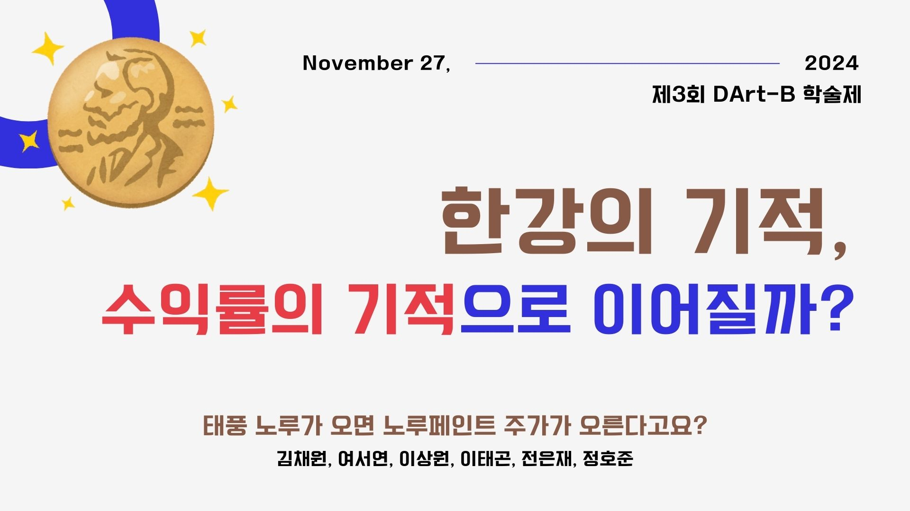
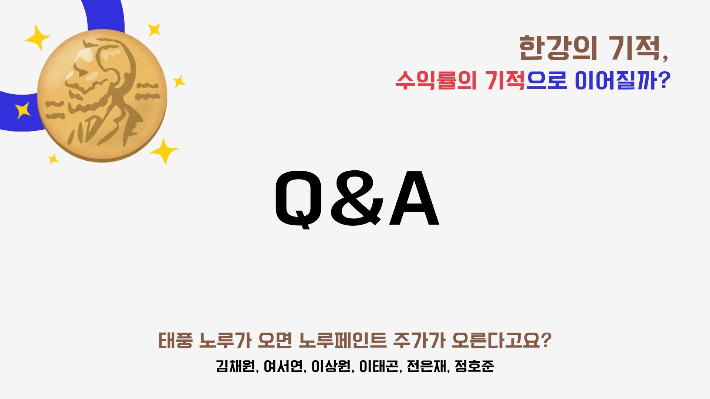

# 프로젝트명 : 한강의 기적, 수익률의 기적으로 이어질까?

### 내용
- 기업의 규모나 가치가 아닌, 근거없는 연관성에 의한 주가 상승은 투기성 반응임을 암시함
- 문제정의 : 테마주의 변동성 위험과 재무제표에 기반한 논리적 투자의 중요성을 강조함
- 네이버 뉴스 기사 크롤링 및 LDA 토픽 분류 모델을 사용하여 "한강 작가의 노벨문학상 수상"을 특정 이벤트(테마)로 선정함
- 태블로(tableau) 툴을 사용하여 한강 작가 수상 당시, 주식시장에 미친 영향을 보기좋게 시각화 함
- 한강 테마주를 선정하여 시계열 예측모델 LSTM을 활용하여 예측주가를 설정하고, 한강 테마주가 실제로 가치가 있었는지를 wilcoxon sighed-rank 비모수 가설검정을 통해 기업들을 라벨링함
- 이 과정에서 1) 한강 수상이 아닌 다른 이벤트에 영향을 미쳤는데, 이를 오인하는 사례를 찾을 수 있었고, 2) 한강 테마주이지만 재무상태가 부실한 기업들이 많음을 찾아냄
- 결론적으로 "테마 사건에 따라 투자하는 것은 도박과 같은 것이고, 기업의 가치와 재무상태 분석을 통해 논리적 투자를 해야한다"는 결론을 제시함

### 사용한 데이터
- 야후파이낸스에서 제공하는 주가 및 거래량 데이터
- 네이버 뉴스 selenium 동적 크롤링하여 사용

### 결과물

