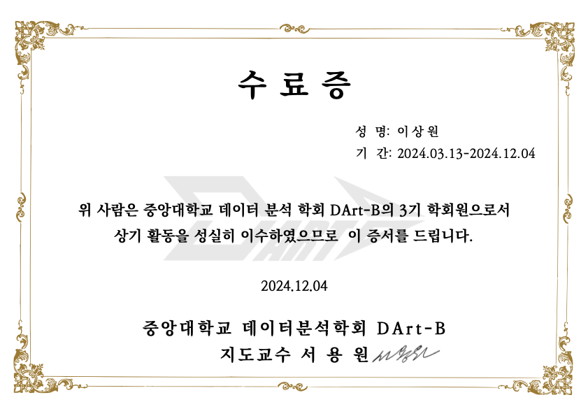
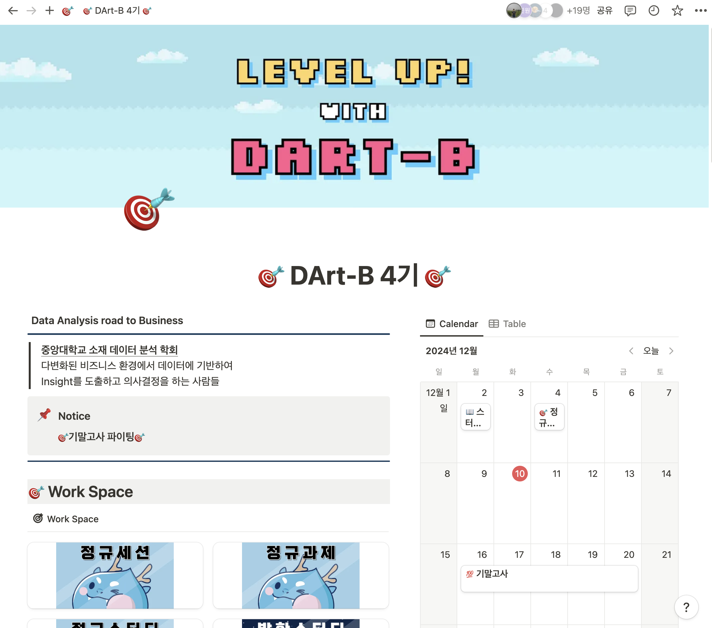

# DartB_Academy

### **중앙대학교 데이터분석 학회(학술동아리)**

*다변화된 비즈니스 환경에서 데이터에 기반하여 Insight를 도출하고 의사결정을 하는 사람들의 모임*

- 정규세선(토이프로젝트, 학술제, 스터디공유회 등 정기 진행)
- 정규과제(통계학, SQL, Tableau 등 매주 수행)
- 정규스터디(SQL, 통계학, 코딩테스트, 금융데이터분석 스터디 등 15여개의 스터디 운영)
- 타 학교와 연합하여 연합 세미나 진행
- 각종 소모임으로 인적 네트워킹 수행

### 관련 개인사항
- 4기 운영진(운영팀장)의 직책을 수행함
    - 매주 운영진 회의를 통해 학회가 원활히 진행될 수 있도록 노력함
    - 신입 학회원 리크루팅, 스터디 관리, 정규세션 제반사항 준비, 소모임, Notion 관려 등의 업무를 수행함
    - 바쁘고 고단한 때도 있었지만, 성공적으로 마무리할 수 있게 되어 무척 기쁘고 뿌듯했다. 팀워크의 중요성을 깨달았고, **팀은 개인이 혼자서 할 수 없는 것을 시너지를 발휘하여 최고의 의사결정과 결과물을 창출해낼 수 있음**을 직접 알 수 있었음.
- Tableau의 강력함을 절실히 알 수 있었음
- SQL에 대해 깊이 학습할 수 있었음
- 다양한 인적 네트워킹을 통해 유익한 정보와 자산을 얻을 수 있었음
- python을 활용한 효과적인 데이터분석 방식을 배울 수 있었음
- Github, Notion 등 협업 툴에 능숙해지는 기회가 됨
- 금융데이터분석 스터디, 데이터안심구역 스터디, 그로스해킹 스터디를 통해 관련 지식을 쌓고 직접 실습해볼 수 있었으며, 다른 학회원들이 수행한 스터디공유회 시간을 가지며 넓은 지식을 쌓을 수 있었음

 

### 수료증

### 활동 데이터베이스 notion 페이지 일부

